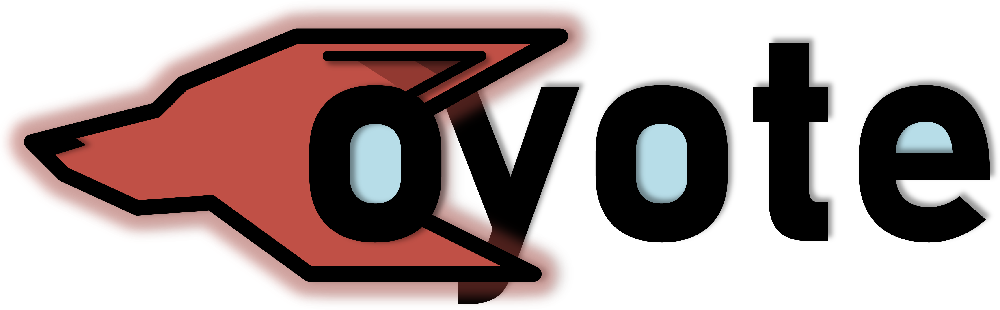
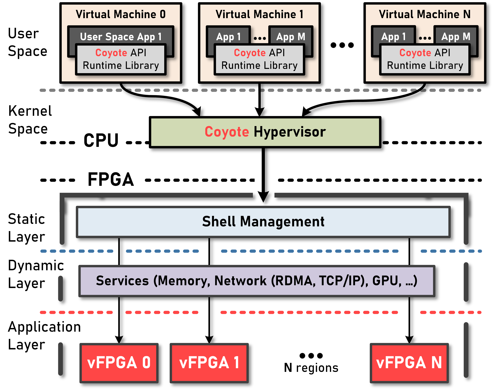

<picture>
  <source media="(prefers-color-scheme: dark)" srcset="img/cyt_logo_dark.png" width = 220>
  <source media="(prefers-color-scheme: light)" srcset="img/cyt_logo_light.png" width = 220>
  
</picture>

[](https://github.com/fpgasystems/Coyote/actions/workflows/build_static.yml)
[](https://fpgasystems.github.io/Coyote/)
[](https://opensource.org/licenses/MIT)

# _OS for FPGAs_

**Coyote** is a framework that offers operating system abstractions and a variety of shared networking (*RDMA*, *TCP/IP*), memory (*DRAM*, *HBM*)
and accelerator (*GPU*) services for modern heterogeneous platforms with FPGAs, targeting data centers and cloud environments.

Some of **Coyote's** features:
 * Multiple isolated virtualized vFPGA regions (with individual VMs)
 * Nested dynamic reconfiguration (independently reconfigurable layers: *Static*, *Service* and *Application*)
 * RTL and HLS user logic support
 * Unified host and FPGA memory with striping across virtualized DRAM/HBM channels
 * TCP/IP service
 * RDMA RoCEv2 service (compliant with Mellanox NICs)
 * GPU service
 * Runtime scheduler for different host user processes
 * Multithreading support

 <picture>
  <source media="(prefers-color-scheme: dark)" srcset="img/cyt_ov_dark.png" width = 620>
  <source media="(prefers-color-scheme: light)" srcset="img/cyt_ov_light.png" width = 620>
  
</picture>

## [For more detailed information, check out the documentation](https://fpgasystems.github.io/Coyote/)

## Prerequisites

Full `Vivado/Vitis` suite is needed to build the hardware side of things. Hardware server will be enough for deployment only scenarios. Coyote runs with `Vivado 2022.1`. Previous versions can be used at one's own peril.  

We are currently only actively supporting the AMD `Alveo u55c` accelerator card. Our codebase offers some legacy-support for the following platforms: `vcu118`, `Alveo u50`, `Alveo u200`, `Alveo u250` and `Alveo u280`, but we are not actively working with these cards anymore. Coyote is currently being developed on the HACC cluster at ETH Zurich. For more information and possible external access check out the following link: https://systems.ethz.ch/research/data-processing-on-modern-hardware/hacc.html


`CMake` is used for project creation. Additionally `Jinja2` template engine for Python is used for some of the code generation. The API is writen in `C++`, 17 should suffice (for now).

If networking services are used, to generate the design you will need a valid [UltraScale+ Integrated 100G Ethernet Subsystem](https://www.xilinx.com/products/intellectual-property/cmac_usplus.html) license set up in `Vivado`/`Vitis`.

To run the virtual machines on top of individual *vFPGAs* the following packages are needed: `qemu-kvm`, `build-essential` and `kmod`.

## Quick Start

Initialize the repo and all submodules:

~~~~
$ git clone --recurse-submodules https://github.com/fpgasystems/Coyote
~~~~

### Build `HW`

To build an example hardware project (generate a *shell* image):

~~~~
$ mkdir build_hw && cd build_hw
$ cmake <path_to_cmake_config> -DFDEV_NAME=<target_device>  -DEXAMPLE=<target_example>
~~~~

It's a good practice to generate the hardware-build in a subfolder of the `examples_hw`, since this already contains the cmake that needs to be referenced. In this case, the procedure would look like this: 

~~~~
$ mkdir examples_hw/build_hw && cd examples_hw/build_hw 
$ cmake ../ -DFDEV_NAME=<target_device>  -DEXAMPLE=<target_example>
~~~~

Already implemented target-examples are specified in `examples_hw/CMakeLists.txt` and allow to build a variety of interesting design constellations, i.e. `rdma_perf` will create a RDMA-capable Coyote-NIC. 

Generate all projects and compile all bitstreams:

~~~~
$ make project 
$ make bitgen
~~~~

The bitstreams will be generated under `bitstreams` directory. 
This initial bitstream can be loaded via JTAG.
Further custom shell bitstreams can all be loaded dynamically. 

Netlist with the *official* static layer image is already provided under `hw/checkpoints`. We suggest you build your shells on top of this image.
This default image is built with `-DEXAMPLE=static`.

### Build `SW`

After the bitstream is loaded, the driver can be inserted once for the initial static image.

~~~~
$ cd driver && make
$ insmod coyote_drv.ko <any_additional_args>
~~~~

Provided software applications (as well as any other) can be built with the following commands:

~~~~
$ mkdir build_sw && cd build_sw
$ cmake <path_to_cmake_config>
$ make
~~~~

## Publication

#### If you use Coyote, cite us :

```bibtex
@inproceedings{coyote,
    author = {Dario Korolija and Timothy Roscoe and Gustavo Alonso},
    title = {Do {OS} abstractions make sense on FPGAs?},
    booktitle = {14th {USENIX} Symposium on Operating Systems Design and Implementation ({OSDI} 20)},
    year = {2020},
    pages = {991--1010},
    url = {https://www.usenix.org/conference/osdi20/presentation/roscoe},
    publisher = {{USENIX} Association}
}
```

## License

Copyright (c) 2023 FPGA @ Systems Group, ETH Zurich

Permission is hereby granted, free of charge, to any person obtaining a copy
of this software and associated documentation files (the "Software"), to deal
in the Software without restriction, including without limitation the rights
to use, copy, modify, merge, publish, distribute, sublicense, and/or sell
copies of the Software, and to permit persons to whom the Software is
furnished to do so, subject to the following conditions:

The above copyright notice and this permission notice shall be included in all
copies or substantial portions of the Software.

THE SOFTWARE IS PROVIDED "AS IS", WITHOUT WARRANTY OF ANY KIND, EXPRESS OR
IMPLIED, INCLUDING BUT NOT LIMITED TO THE WARRANTIES OF MERCHANTABILITY,
FITNESS FOR A PARTICULAR PURPOSE AND NONINFRINGEMENT. IN NO EVENT SHALL THE
AUTHORS OR COPYRIGHT HOLDERS BE LIABLE FOR ANY CLAIM, DAMAGES OR OTHER
LIABILITY, WHETHER IN AN ACTION OF CONTRACT, TORT OR OTHERWISE, ARISING FROM,
OUT OF OR IN CONNECTION WITH THE SOFTWARE OR THE USE OR OTHER DEALINGS IN THE
SOFTWARE.

