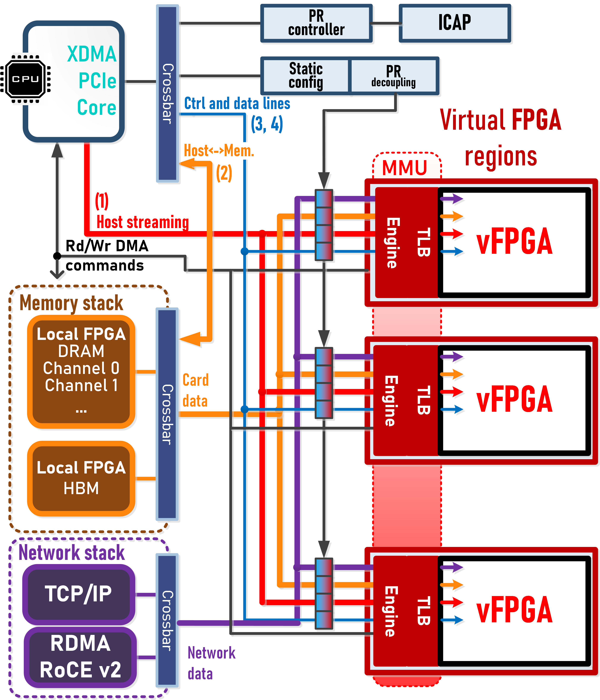
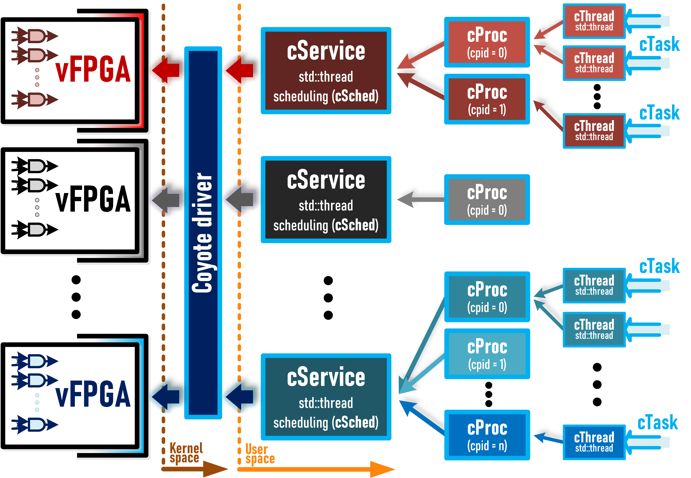

<picture>
  <source media="(prefers-color-scheme: dark)" srcset="img/cyt_logo_dark.png" width = 220>
  <source media="(prefers-color-scheme: light)" srcset="img/cyt_logo_light.png" width = 220>
  
</picture>

[](https://github.com/fpgasystems/Coyote/actions/workflows/build_base.yml)
[](https://github.com/fpgasystems/Coyote/actions/workflows/build_net.yml)
[](https://github.com/fpgasystems/Coyote/actions/workflows/build_mem.yml)
[](https://github.com/fpgasystems/Coyote/actions/workflows/build_pr.yml)

## _OS for FPGAs_

Framework providing operating system abstractions and a range of shared networking (*RDMA*, *TCP/IP*) and memory services to common modern heterogeneous platforms.

Some of Coyote's features:
 * Multiple isolated virtualized vFPGA regions
 * Dynamic reconfiguration 
 * RTL and HLS user logic coding support
 * Unified host and FPGA memory with striping across virtualized DRAM channels
 * TCP/IP service
 * RDMA service
 * HBM support
 * Runtime scheduler for different host user processes

## Prerequisites

Full `Vivado/Vitis` suite is needed to build the hardware side of things. Hardware server will be enough for deployment only scenarios. Coyote runs with `Vivado 2022.1`. Previous versions can be used at one's own peril.  

Following AMD platforms are supported: `vcu118`, `Alveo u50`, `Alveo u55c`, `Alveo u200`, `Alveo u250` and `Alveo u280`. Coyote is currently being developed on the HACC cluster at ETH Zurich. For more information and possible external access check out the following link: https://systems.ethz.ch/research/data-processing-on-modern-hardware/hacc.html


`CMake` is used for project creation. Additionally `Jinja2` template engine for Python is used for some of the code generation. The API is writen in `C++`, 17 should suffice (for now).

## System `HW`

The following picture shows the high level overview of Coyote's hardware architecture.

<picture>
  <source media="(prefers-color-scheme: dark)" srcset="img/cyt_hw_dark.png" width = 500>
  <source media="(prefers-color-scheme: light)" srcset="img/cyt_hw_light.png" width = 500>
  
</picture>

## System `SW`

Coyote contains the following software layers, each adding higher level of abstraction and parallelisation potential:

1. **cService** - Coyote daemon, targets a single *vFPGA*. Library of loadable functions and scheduler for submitted user tasks.
1. **cProc** - Coyote process, targets a single *vFPGA*. Multiple *cProc* objects can run within a single *vFPGA*.
2. **cThread** - Coyote thread, running on top of *cProc*. Allows the exploration of task level parallelisation.
3. **cTask** - Coyote task, arbitrary user variadic function with arbitrary parameters executed by *cThreads*.

<picture>
  <source media="(prefers-color-scheme: dark)" srcset="img/cyt_sw_dark.png" width = 600>
  <source media="(prefers-color-scheme: light)" srcset="img/cyt_sw_light.png" width = 600>
  
</picture>

## Init
~~~~
$ git clone https://github.com/fpgasystems/Coyote.git
~~~~

## Build `HW`
#### Create a build directory :
~~~~
$ cd hw && mkdir build && cd build
~~~~
#### Enter a valid system configuration :
~~~~
$ cmake .. -DFDEV_NAME=u250 <params...>
~~~~

Following configuration options are provided:

| Name       | Values                   | Desription                                    |
| ---------- | ------------------------ | --------------------------------------------- |
| FDEV_NAME  | <**u250**, u280, u200, u50, u55c, vcu118> | Supported devices                  |
| EN_HLS     | <**0**,1>                | HLS (*High Level Synthesis*) wrappers         |
| N_REGIONS  | <**1**:16>               | Number of independent regions (vFPGAs)        |
| EN_STRM    | <0, **1**>               | Enable direct host-fpga streaming channels    |
| EN_DDR     | <**0**, 1>               | Enable local FPGA (DRAM) memory stack         |
| EN_HBM     | <**0**, 1>               | Enable local FPGA (HBM) memory stack          |
| EN_PR      | <**0**, 1>               | Enable partial reconfiguration of the regions |
| N_CONFIG   | <**1**:>                 | Number of different configurations for each PR region (can be expanded at any point) |
| N_OUTSTANDING | <**8**:>              | Supported number of outstanding rd/wr request packets |
| N_DDR_CHAN | <0:4>                    | Number of memory channels in striping mode    |
| EN_BPSS    | <0,**1**>                | Bypass descriptors in user logic (transfer init without CPU involvement) |
| EN_AVX     | <0,**1**>                | AVX support                                   |
| EN_TLBF    | <0,**1**>                | Fast TLB mapping via dedicated DMA channels   |
| EN_WB      | <0,**1**>                | Status writeback (polling on host memory)     |
| EN_RDMA_0  | <**0**,1>                | RDMA network stack on *QSFP-0* port           |
| EN_RDMA_1  | <**0**,1>                | RDMA network stack on *QSFP-1* port           |
| EN_TCP_0   | <**0**,1>                | TCP/IP network stack on *QSFP-0* port         |
| EN_TCP_1   | <**0**,1>                | TCP/IP network stack on *QSFP-1* port         |
| EN_RPC     | <**0**,1>                | Enables receive queues for RPC invocations over the network stack |
| EXAMPLE    | <**0**:>                 | Build one of the existing example designs     |
| PMTU_BYTES | <:**4096**:>             | System wide packet size (bytes)               |
| COMP_CORES | <:**4**:>                | Number of compilation cores                   |
| PROBE_ID   | <:**1**:>                | Deployment ID                                 |
| EN_ACLK    | <0,**1**:>               | Separate shell clock (def: 250 MHz)           |
| EN_NCLK    | <0,**1**:>               | Separate network clock (def: 250 MHz)         |
| EN_UCLK    | <0,**1**:>               | Separate user logic clock (def: 300 MHz)      |
| ACLK_F     | <**250**:>               | Shell clock frequency                         |
| NCLK_F     | <**250**:>               | Network clock frequency                       |
| UCLK_F     | <**300**:>               | User logic clock frequency                    |
| TLBS_S     | <**10**:>                | TLB (small) size (2 to the power of)          | 
| TLBS_A     | <**4**:>                 | TLB (small) associativity                     | 
| TLBL_S     | <**9**:>                 | TLB (huge) (2 to the power of)                |
| TLBL_A     | <**2**:>                 | TLB (huge) associativity                      |
| TLBL_BITS  | <**21**:>                | TLB (huge) page order (2 MB def.)             |
| EN_NRU     | <**0**:1>                | NRU policy                                    |

#### Create the shell and the project :
~~~~
$ make shell
~~~~

The project is created once the above command completes. Arbitrary user logic can then be inserted. If any of the existing examples are chosen, nothing needs to be done at this step.

User logic wrappers can be found under build project directory in the **hdl/config_X** where **X** represents the chosen PR configuration. Both HLS and HDL wrappers are placed in the same directories.

If multiple PR configurations are present it is advisable to put the most complex configuration in the initial one (**config_0**). Additional configurations can always be created with `make dynamic`. Explicit floorplanning should be done manually after synthesis (providing default floorplanning generally makes little sense).

Project can always be managed from Vivado GUI, for those more experienced with FPGA design flows.


#### When the user design is ready, compilation can be started with the following command :
~~~~
$ make compile
~~~~
Once the compilation finishes the initial bitstream with the static region can be loaded to the FPGA via JTAG. All compiled bitstreams, including partial ones, can be found in the build directory under **bitstreams**.

#### User logic can be simulated by creating the testbench project :
~~~~
$ make sim
~~~~
The logic integration, stimulus generation and scoreboard checking should be adapted for each individual DUT.

## Driver

#### After the bitstream has been loaded, the driver can be compiled on the target host machine :
~~~~
$ cd driver && make
~~~~

#### Insert the driver into the kernel (don't forget privileges) :
~~~~
$ insmod fpga_drv.ko
~~~~
Restart of the machine might be necessary after this step if the `util/hot_reset.sh` script is not working (as is usually the case).

## Build `SW`

Available `sw` projects (as well as any other) can be built with the following commands :
~~~~
$ cd sw && mkdir build && cd build
$ cmake ../ -DTARGET_DIR=<example_path>
$ make
~~~~

## Publication

#### If you use Coyote, cite us :

```bibtex
@inproceedings{coyote,
    author = {Dario Korolija and Timothy Roscoe and Gustavo Alonso},
    title = {Do {OS} abstractions make sense on FPGAs?},
    booktitle = {14th {USENIX} Symposium on Operating Systems Design and Implementation ({OSDI} 20)},
    year = {2020},
    pages = {991--1010},
    url = {https://www.usenix.org/conference/osdi20/presentation/roscoe},
    publisher = {{USENIX} Association}
}
```

## Repository structure

~~~
├── driver
│   └── eci
│   └── pci
├── hw
│   └── ext/network
│   └── ext/eci
│   └── hdl
│   └── ip
│   └── scripts
│   └── sim
├── sw
│   └── examples
│   └── include
│   └── src
├── util
├── img
~~~

## Additional requirements

If networking services are used, to generate the design you will need a valid [UltraScale+ Integrated 100G Ethernet Subsystem](https://www.xilinx.com/products/intellectual-property/cmac_usplus.html) license set up in `Vivado`/`Vitis`.
