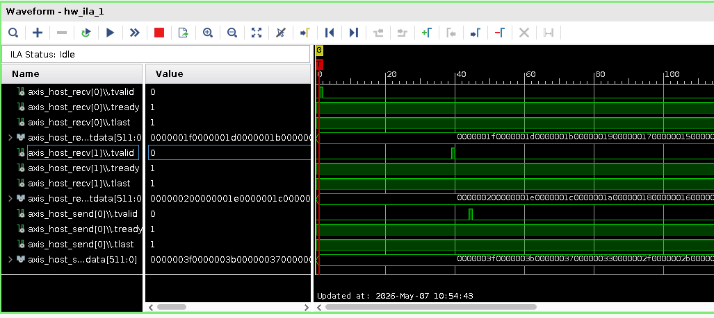
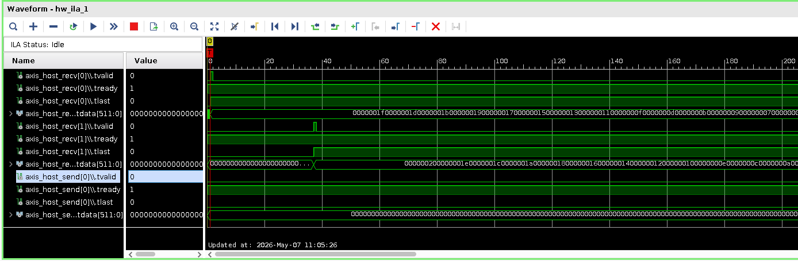

# Bug Report: `reduce_ops` HLS Kernel Fails to Produce Output in Vivado 2024.2+

## Table of Contents

1. [Overview](#overview)
2. [Module Description](#module-description)
3. [HLS Source](#hls-source)
4. [Hardware Observation — ILA Capture](#hardware-observation--ila-capture)
5. [Reproducing the Bug](#reproducing-the-bug)
6. [Folder Structure](#folder-structure)

---

## Overview

This repository documents a regression in Vitis HLS / Vivado. The `reduce_ops` kernel — a `do-while` loop with `#pragma HLS PIPELINE II=1 style=frp` and an `ap_ctrl_none` control interface — receives valid data on both AXI-Stream inputs but **never asserts `TVALID` on its output**, effectively hanging the datapath. The root cause has not been isolated (candidate constructs are `style=frp`, the `do-while` loop termination condition, `ap_ctrl_none`, or a combination thereof). The failure is silent — synthesis, implementation and DRC all complete without errors or relevant warnings.

- **Working**: Vitis HLS / Vivado ≤ 2024.1
- **Broken**: Vitis HLS / Vivado ≥ 2024.2 (confirmed also in latest version of Vivado/Vitis HLS 2025.2)

Importantly, **C simulation (`csim`) and co-simulation (`cosim`) both pass** in all tested tool versions, making the regression invisible without hardware testing.

This repository contains source code, logs, ILA captures, design checkpoints from Vivado 2023.2 (working) and Vivado 2025.2 (the latest available Vivado version, for which the code doesn't work).

**N.B.:** This bug was first observed in ACCL: https://github.com/Xilinx/ACCL. Since building ACCL is generally more involved (larger design --> longer synthesis, harder timing closure, no support for Vitis 2025.x due to the migration to vitis-run etc.), the problematic module was isolated and added as an application to Coyote, the open-source FPGA shell. This folder contains the minimum working example, containing the problematic HLS code, the Verilog wrapper, a testbench and some C++ code to run the test. All the relavant details are explained in this README.

---

## Module Description

The kernel under test is `reduce_ops`, taken from the open-source [ACCL project](https://github.com/Xilinx/ACCL). It performs element-wise reduction (addition or max) over two 512-bit AXI-Stream operands, selecting the data type from the `TDEST` field of the incoming stream:

| `TDEST` | Operation |
|---------|-----------|
| 0 | fp32 add |
| 1 | fp64 add |
| 2 | int32 add |
| 3 | int64 add |
| 5 | fp32 max  |
| 6 | fp64 max  |
| 7 | int32 max |
| 8 | int64 max |

The kernel processes words in a `do-while` loop, terminating when `TLAST` is asserted. The loop body is pipelined with `#pragma HLS PIPELINE II=1 style=frp`:

```cpp
void reduce_ops(STREAM<stream_word> &in0, STREAM<stream_word> &in1, STREAM<stream_word> &out) {
#pragma HLS INTERFACE axis register both port=in0
#pragma HLS INTERFACE axis register both port=in1
#pragma HLS INTERFACE axis register both port=out
#pragma HLS INTERFACE ap_ctrl_none port=return
    stream_word op0, op1, wword;
    ap_uint<DATA_WIDTH> res;

    do {
#pragma HLS PIPELINE II=1 style=frp
        op0 = STREAM_READ(in0);
        op1 = STREAM_READ(in1);

        if      (op0.dest == 0) res = stream_add<DATA_WIDTH, DEST_WIDTH, float>  (op0.data, op1.data);
        else if (op0.dest == 1) res = stream_add<DATA_WIDTH, DEST_WIDTH, double>  (op0.data, op1.data);
        // ... (further cases omitted for brevity)
        else                    res = stream_add<DATA_WIDTH, DEST_WIDTH, float>  (op0.data, op1.data);

        wword.data = res;
        wword.last = op0.last;
        wword.keep = op0.keep;
        wword.dest = 0;
        STREAM_WRITE(out, wword);

    } while(op0.last != 1);
}
```

The notable constructs in this kernel are the combination of `ap_ctrl_none`, a `do-while` loop whose exit condition reads a stream-derived signal (`op0.last`), and `style=frp` on the pipeline. The root cause of the regression has not been isolated — it is unclear which of these (or their combination) changed behaviour between tool versions.

In the test setup, `TDEST` is hardwired to `2` (int32 add) in the vFPGA top, and the host sends one 512-bit beat (16 × 32-bit integers) per operand stream.

---

## HLS Source

The full HLS source, testbench, and standalone simulation script are in `source/hw/src/hls/reduce_ops/`:

| File | Description |
|------|-------------|
| `reduce_ops.h` | Types, constants (`DATA_WIDTH=512`, `DEST_WIDTH=8`), stream macros |
| `reduce_ops.cpp` | Full kernel — template helpers `stream_add`/`stream_max` + `reduce_ops` top |
| `reduce_ops_tb.cpp` | HLS C testbench: one beat of 16 int32 values, checks output |
| `run_tb.tcl` | Standalone Vitis HLS script: runs csim → csynth → cosim |

To run the standalone HLS simulation (reproduces the csim/cosim pass):

```bash
cd source/hw/src/hls/reduce_ops
vitis_hls -f run_tb.tcl                       # Vitis HLS 2022.x – 2024.x
vitis-run --tcl run_tb.tcl --mode hls         # Vitis HLS 2025.x+
```

The complete Coyote hardware and software projects are in `source/hw/` and `source/sw/` respectively.

---

## Hardware Observation — ILA Capture

The ILA probes all three AXI-Stream interfaces at the vFPGA boundary (`axis_host_recv[0]`, `axis_host_recv[1]`, `axis_host_send[0]`).

### Vivado 2023.2 — Working

Both operand streams arrive, and the output stream fires correctly on the same transaction:



- `axis_host_recv[0].tvalid` and `axis_host_recv[1].tvalid` pulse high as data is transferred.
- `axis_host_send[0].tvalid` asserts in the same window, delivering the result.
- Sample values confirm correct int32 addition: `recv[0]` carries odd integers (1 – 31), `recv[1]` carries even integers (2 – 32), and `send[0]` carries their element-wise sums (3 – 63).

### Vivado 2025.2 — Broken

The operand streams arrive identically, but **the output stream never asserts `TVALID`**:



- `axis_host_recv[0].tvalid` and `axis_host_recv[1].tvalid` pulse high as before — the kernel receives data correctly.
- `axis_host_send[0].tvalid` **remains 0** throughout; `tdata` is all zeros.
- The kernel consumes its inputs and stalls without producing any output.

There are no AXI protocol violations, handshake errors, or DRC failures in either build. The regression is entirely in the kernel's output behaviour.

---

## Reproducing the Bug

### Prerequisites

- Alveo U55C (or U250 / U280)
- Vivado + Vitis HLS (test with ≥ 2024.2 to observe the bug; ≤ 2024.1 for the working reference)
- [Coyote](https://github.com/fpgasystems/Coyote) — with current branch

Pre-built bitstreams, ILA probe files, routed checkpoints, and all build logs for both 2023.2 and 2025.2 are included in this repository so the bug can be observed without re-synthesising.

### Using the pre-built bitstreams

1. **Program the FPGA** using Vivado Hardware Manager, loading the bitstream and probe file from `bitstreams/<version>/`.
2. **Rescan PCIe** or perform a warm reboot to re-enumerate the device.
3. **Insert the Coyote driver**:
   ```bash
   sudo insmod coyote_driver.ko
   ```
4. **Build and run the software test**:
   ```bash
   cd source/sw && mkdir build && cd build
   cmake .. -DFDEV_NAME=u55c
   make && sudo ./test
   ```
   On a working build the test prints the expected sums and exits with "Validation passed!". On a broken build the `checkCompleted` poll never returns, as no write completion is signalled.

### Re-synthesising from source

```bash
# Hardware synth
cd source/hw && mkdir build && cd build
cmake .. -DFDEV_NAME=u55c
make project && make bitgen

# Software compilation
cd source/hw && mkdir build && cd build
cmake .. 
make
```
Then, follow the steps from above to program the FPGA, insert the driver and run the test.

---

## Folder Structure

Artifacts are split by `<vivado-version>` (`2023.2` or `2025.2`) for direct side-by-side comparison.

```
.
├── source/
│   ├── hw/                         # Coyote hardware project
│   │   ├── CMakeLists.txt
│   │   └── src/
│   │       ├── vfpga_top.svh       # vFPGA top: instantiates reduce_ops_hls_ip + ILA
│   │       ├── init_ip.tcl         # Creates ila_reduce Vivado IP
│   │       └── hls/reduce_ops/
│   │           ├── reduce_ops.h    # Types, constants, stream macros
│   │           ├── reduce_ops.cpp  # Kernel source (stream_add, stream_max, reduce_ops)
│   │           ├── tb.cpp          # C testbench
│   │           └── tb_hls.tcl      # Standalone HLS sim script (csim/csynth/cosim)
│   └── sw/                         # Coyote software project
│       ├── CMakeLists.txt
│       └── src/main.cpp            # Host software: sends 16 int32 operands to the FPGA, waits for completion, checks result
│
├── images/
│   ├── waveform_23_2.png           # ILA capture — Vivado 2023.2 (working)
│   └── waveform_25_2.png           # ILA capture — Vivado 2025.2 (broken)
│
├── bitstreams/
│   └── <vivado-version>/
│       ├── cyt_top_<ver>.bit       # Loadable bitstream
│       └── cyt_top_<ver>.ltx       # ILA probe file
│
├── checkpoints/
│   └── <vivado-version>/
│       └── shell_routed_<ver>.dcp  # Post-PnR routed checkpoint
│
├── ila-data/
│   └── <vivado-version>/
│       ├── ila_capture_<ver>.ila   # Native Vivado ILA capture
│       └── ila_csv_<ver>.csv       # Exported ILA capture (CSV)
│
├── logs/
│   └── <vivado-version>/
│       ├── vitis_hls_reduce_ops_<ver>.log    # Vitis HLS synthesis log
│       ├── vivado_synth_reduce_ops_<ver>.log # Vivado OOC synth log (reduce_ops IP)
│       ├── vivado_synth_top_<ver>.log        # Vivado top-level synthesis log (containing the reduce_ops)
│       └── vivado_pnr_<ver>.log              # Place-and-route log
│
└── reports/
    └── <vivado-version>/
        ├── route_status_<ver>.rpt           # Post-PnR route status
        ├── timing_summary_<ver>.rpt         # Timing summary
        └── drc_bitstream_checks_<ver>.rpt   # DRC checks (no critical errors)
```
