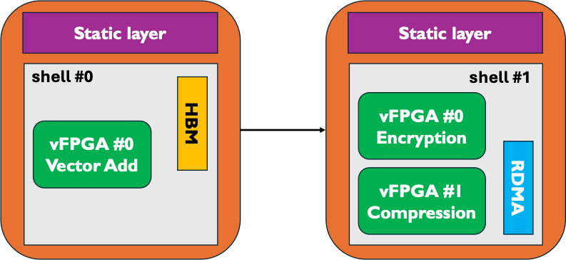

Frequently asked questions
=====================================

Coyote concepts
-----------------------------

**What is Coyote?** 

Coyote is a hardware and software abstraction layer for FPGAs — which we call a shell.
Coyote's objective is to facilitate and simplify the deployment of applications on FPGAs, by providing a set of unified interfaces and abstractions to the host, network and other accelerators (GPUs).
On the hardware side, Coyote implements memory accesses to CPU main memory and on-board FPGA memory (HBM & DDR), network communication (TCP/IP & RDMA), memory virtualization and caching, interrupts and the ability to deploy multiple accelerated applications through standardized, portable AXI4 interfaces. 
On the software side, Coyote implements a driver and a software library that can be used to move data between CPU memory, FPGA memory and the accelerator logic, establish network connections, and write/read configuration registers on the FPGA. 

**How does multi-tenancy work in Coyote?**

Coyote has the notion of so-called vFPGAs - virtual FPGAs. These are sections of reconfigurable fabric that can be used for user applications, while using the common shared infrastructure for data movement and management - most importantly access to host and card memory as well as to the networking stacks. vFPGAs allow for multi-tenancy in two ways: 

* To begin with, multiple vFPGAs can exist in parallel at the same time, allowing for parallel execution of multiple applications at the same time, hence space-division multi-tenancy. 

* Furthermore, these vFPGAs can be reconfigured, at run-time, to allow for partial reconfiguration, thus changing the application logic during runtime. Hence, this allows for time-division multi-tenancy. Additionally, Coyote provides a rich set of arbiters, schedulers and memory protection mechanisms, ensuring no vFPGA occupies available services (memory, network bandwidth) and data separation through memory virtualization.

**Can I have more than one vFPGA? How do I achieve that?**

As stated above: Yes, indeed! Having multiple vFPGAs is a core idea of Coyote that allows the sharing the available services between multiple applications running in parallel. The number of vFPGAs can be set with the parameter ``N_REGIONS`` in the build configuration ``CMakeLists.txt``.
For example, one could have a set-up where two vFPGAs are used for e.g., encryption and compression. The build-description would look like the following: 

.. code-block:: CMake

    set(N_REGIONS 2)

    validation_checks_hw()
    load_apps (
        VFPGA_C0_0 "apps/encryption"
        VFPGA_C0_1 "apps/compression"
    )

    create_hw()

**What is the difference between partial reconfiguration and shell reconfiguration? What are the different types of run-time reconfiguration?**

Recall, Coyote's hardware stack consists of the static layer and the shell (dynamic layer + application layer). The primary purpose of the static layer is facilitate communication and data movement between the host CPU and the FPGA. 
For the same chip, the static layer always remains the same; that is, it cannot be reconfigured. 
The shell includes all of Coyote's services (networking stacks, memory controllers, TLBs etc.) and user applications (vFPGAs). 

Shell reconfiguration refers to the reconfiguration of the entire shell: both the services (dynamic layer) and the user applications (application layer) are reconfigured. 
For example, in the figure below, the first shell is built with HBM, no networking and includes one vFPGA for vector addition.
The new shell includes no HBM controller, but instead has RDMA enabled with two vFPGAs (encryption, compression). 
Importantly, the two shells are completely different: the first one has no networking and one user application, the other one includes networking and two user applications.
Shell reconfiguration can be done at any time from the software, provided the two shells were linked against the same static layer. 
In most cases, this is true, as users seldom resynthesize Coyote's static layer. 
For more details on the nuances of shell reconfiguration, see *Example 5: Shell reconfiguration*.

On the other hand, partial reconfiguration (PR) refers to the reconfiguration of user applications (vFPGAs). The services (networking stacks, memory controllers, TLBs) and the number of vFPGAs stays the same. Below, we consider an example of partial reconfiguration with two configurations, each with two vFPGAs:

.. code-block:: CMake

    # Shell parameters
    set(EN_MEM 1)
    set(EN_RDMA 1)

    # Enable partial reconfiguration
    set(EN_PR 1)
    
    # Two combinations with two vFPGAs each
    set(N_REGIONS 2)
    set(N_CONFIG 2)

    # Manual floorplanning for PR
    set(FPLAN_PATH "${CMAKE_SOURCE_DIR}/floorplans/streaming_fplan_u55c.xdc")
    
    validation_checks_hw()

    load_apps (
        # First configuration, of 2 vFPGAs
        VFPGA_C0_0 "apps/encryption"
        VFPGA_C0_1 "apps/vector_add"

        # Second configuration, of 2 vFPGAs
        VFPGA_C0_0 "apps/compression"
        VFPGA_C0_1 "apps/vector_multiply"
    )

    create_hw()

In the example above, Coyote is initially loaded with two applications: encryption and a vector addition module. Later, these two apps can be swapped out for compression and vector multiplication logic. 
However, in both configurations, memory and RDMA remain enabled.
Unlike shell reconfiguration, which can be done at any time from software, PR must be enabled before hardware synthesis and requires a manual floorplan for each vFPGA.
For more details on the nuances of partial reconfiguration, see *Example 9: Partial reconfiguration*.

**What happens when an application is too big for a vFPGA?**

There is a common misconception that needs to be clarified before answering this question: vFPGAs with strict physical boundaries only exist if Coyote is built with partial reconfiguration (PR) (see above for more details).
If this is not the case (:code:`EN_PR = 0`), Coyote's dynamic layer will contain the services and user applications (vFPGAs). All user applications will be placed in the dynamic layer, and with no need for reconfiguration of them, they are only limited by the available resources on the FPGA. 
There are no strictly enforced limites per vFGPAs in this case. 

The situation is different when partial reconfiguration is enabled. In this case, every vFPGA must be forced into a restricted area of the FPGA, drawn by the user (also known as floorplanning in Vivado). 
This is required, since general run-time reconfiguration of FPGAs assumes the boundaries and connections of the swapped out logic doesn't change. 
Therefore, when using Coyote with PR, you should ensure your floorplan can accomodate the various vFPGAs.

**Can my application have more than one input stream?** 

Yes, the number of streams from/to the host and card memory can be configured with the cmake parameters ``N_STRM_AXI`` and ``N_CARD_AXI`` respectively. Like the configuration of multiple vFGPAs, this goes into ``CMakeLists.txt``.

.. code-block:: CMake

    set(N_REGIONS 1)
    set(N_STRM_AXI 4)
    validation_checks_hw()

    load_apps (
        VFPGA_C0_0 "apps/encryption"
    )

    create_hw()

A good example for an application with more than one input stream to host memory is Example 3: Multi-threaded AES Encryption.

**What kind of memory allocation does Coyote support? Are there any restrictions on the buffer type used for data transfers in Coyote?**

To allocate memory in Coyote, there are two options:

* Using Coyote's internal method, ``getMem(type, size)`` which allocates the appopriate memory (regular, huge-page, GPU etc.) and maps it to the TLB. Under the hood, Coyote uses standard C/C++ methods, such as ``memalign`` and ``hsa_allocate_memory``, to allocate the memory. 
* Using standard Linux methods, such as ``memalign`` Importantly, this method does not pre-populates the internal TLB; therefore, there will be a page fault on these buffers when first used. 

.. warning:: If using the second approach, the chosen method must ensure alligned memory allocation. Coyote is built around 512-bit AXI Streams, and therefore, data must be alligned to 64B. Therefore, it's not possible to use ``malloc`` as it has no guarantees on data alignment: instead methods such as ``mmap``, ``memalign`` or ``alligned_alloc`` should be used. 

**Where can I find the resource and timing reports?**

The resource utilization and timing reports can be found in the build/reports directory after bitstream generation.

System set-up & compatibility 
------------------------------

**What are the system requirements for Coyote?**

Three type of system requirements exist for Coyote: 

* Software and OS: 
    
    * For the basic Coyote functionality, a Linux kernel with version >= 5 is sufficient. We have extensively tested Coyote with Linux 5.4, Linux 5.15, Linux 6.2 and Linux 6.8. 
    
    * For GPU peer-to-peer (P2P), a Linux version >= 6.2 is required. 
    
    * Hugepages should be enabled in the system. 
    
    * For compiling the Coyote software stack, CMake >= 3.5 with support for C++17 is required. 

* FPGAs & Vivado: 
    
    * The main target platform for the current Coyote release is the AMD Alveo U55C accelerator card. Some support and testing exists for the older U250 and U280 platforms. 
    
    * Coyote has to be built with Vivado design suite, including Vitis HLS. Coyote supports Vivado/Vitis HLS >= 2022.1. We have conducted extensive testing with Vivado 2022.1 and recommend this version for synthesizing Coyote (but others should work as well).
    
    * All network-related Coyote configurations are built using the UltraScale+ Integrated 100G Ethernet Subsystem, for which a valid license must be obtained. 

* GPUs: Coyote currently supports AMD Instinct Accelerator cards, which require the ROCm driver with a version newer than 6.0. 

**Does Coyote work with Intel FPGAs?** 

No. While large amounts of Coyote's hardware stack are written in Verilog and as such are vendor-agnostic, some modules are specific to AMD Alveo cards due to the underlying hardware. 
These include the static layer for host interaction, networking stacks and reconfiguration module. Therefore, as of now, there is no support for Intel FPGAs.

**Does Coyote work with NVIDIA GPUs?**

At this time, Coyote has no support for P2P with NVIDIA GPUs. However, a `similar project <https://www.usenix.org/conference/atc22/presentation/wang-zeke>`_ has been realized in the past in our research group, making it very realistic that this feature will one day be part of Coyote. 
Additionally, we are always happy to see community contributions to Coyote, including such a compatibility (see also "How can I contribute to Coyote?"). 

Common pitfalls
-----------------------------

**Data transfers larger than 256MB?**

Due to bitwidth restrictions in the memory control interfaces used in Coyote, no single transfer larger than 256MB is possible. 
Instead, we recommend to divide your transfers into multiple chunks of this maximum size. 
For such large transfers, the performance overhead of this partitioning is negligible and can be completely hidden by previous transfers due to the asynchronous nature of Coyote transfers.

**I got the following error message: "A LUT3 cell in the design is missing a connection on input pin I0, which is used by the LUT equation. This pin has either been left unconnected in the design or the connection was removed due to the trimming of unused logic...". What should I do now?**

Unused interfaces must be tied off in hardware designs. Coyote includes a pre-defined function for this, as seen below: 

.. code-block:: verilog

    always_comb axi_ctrl.tie_off_s();
    always_comb notify.tie_off_m();
    always_comb cq_rd.tie_off_s();
    always_comb cq_wr.tie_off_s();

When designing your application logic, think about the always-present interfaces (as seen in the Coyote examples) that remain unused and thus have to be tied off. 

**Help, my HLS module canot be found during Coyote synthesis!**

Make sure your HLS module and vFPGA have the following folder structure and naming convention:

.. code-block:: bash

    ├ vfpga_top.svh
    ├ init_ip.tcl
    └ hls
        ├ hls-kernel-1
            └ hls-kernel-1.cpp 
            └ hls-kernel-1.hpp 

.. note:: The same folder and .cpp/.hpp file name. 

An example of deploying HLS kernels in Coyote can be seen in *Example 2: HLS Vector Addition*.

**Help, my software for GPU P2P is failing to compile!**

When compiling the Coyote software with GPU P2P it's important to use the correct compiler. Under the hood, Coyote uses AMD's standard GPU libraries and run-time, included in the ROCm software stack. 
However, when compiling code using the ROCm software stack, it's important to set the compiler to hipcc, which can be achieved using:

.. code-block:: bash

    export CXX=hipcc

Additionally, the Coyote software must be compiled with GPU support; to do so make sure you are passing ``-DEN_GPU=1`` when running cmake.

**Help, shell reconfiguration doesn't complete and the system is stuck!**

Chances are, the current and new shell were not linked against the same static layer netlist.
As explained before, Coyote consists of a static layer and a shell layer, which are linked together before the final Place-and-Route.
Since the static layer seldom changes Coyote provides a pre-routed and locked static layer checkpoint to enable a faster building process, which is used in the *shell* build flow (``BUILD_SHELL = 1``, ``BUILD_STATIC = 0``, ``BUILD_APP = 0``). 
Now, recall that Place-and-Route is not deterministic; therefore, even if we used the same static layer module, its routed checkpoint can differ from one Vivado run to another.
This can cause issues in shell reconfiguration as there is no guarantee that the connections from the two shells (which are linked against different static layers) are in the same place.
Therefore, if both the shells where built using the *shell* build flow, they can be reconfigured at run-time. 
But, if we tried to program the FPGA with the bitstream from *Example 1: Static HW Design & Data Movement Initiated by the CPU* (built using *static* flow, routing the static layer from scratch) and then reconfigure with the shell from *Example 2: HLS Vector Addition* (built using *shell* flow and linked using the pre-provided design checkpoint), it would not work.

If you tried reconfiguring and your system is stuck, a full system reboot is often required. At the very least, terminating the program, re-programming the FPGA and re-inserting the driver are a must.

**Help, socket can't bind during RDMA set-up**
If you get the following error:

.. code-block:: bash
    
    terminate called after throwing an instance of 'std::runtime_error'
        what():  ERROR: Could not bind a socket
    Aborted

It means that the socket for out-of-band QP exchange has not been cleaned up by the OS. 
When a socket is released, it typically enters a TIME_WAIT state in which it can still process some connections before being fully released by the OS. 
There are many ways around this, the simplest of which is to simply wait (sockets are typically fully released within a minute). 
Alternatively, one can try passing a different port to the initRDMA(...) function. 
Advanced users may choose to modify the function by setting socket properties to reuse sockets that are in TIME_WAIT state.

Debugging tips
-----------------------------

**I have a bug and I am not sure where to start!** 

To debug in Coyote, there are several options:

* You can compile your software with various verbosity flags, ``VERBOSE_DEBUG_1``, ``VERBOSE_DEBUG_2``, ``VERBOSE_DEBUG_3``, which will add significant run-time printouts.

* You can check the driver logs. The driver, actings the middle layer between the software and hardware, handles all the data movement, memory mapping, reconfiguration etc. To check driver printouts, run **dmesg**, which will (hopefully) help pinpoint at what point the design fails.

* Query run-time statistics, as explained below.

* For a hardware bug, add an ILA to your design.

**How can I query run-time statistics?** 

Coyote provides a set of run-time statistics as files in Linux, that also allow for conclusions in case of bugs. If the driver is inserted, the following files can be found in ``/sys/kernel/coyote_sysfs_0``: 

* ``cyt_attr_cnfg``: Provides an overview of the current Coyote configuration, including number vFPGAs, streams, RDMA, network capabilities and memory set-up. 

* ``cyt_attr_ip``: Provides the IP address of the Coyote network stack. 

* ``cyt_attr_mac``: Provides the MAC address of the FPGA where Coyote is running on. 

* ``cyt_attr_nstats``: Provides a full overview of the current network statistics, including sent and received packets, dopped packets and retransmissions for both TCP and RDMA. A major sign for failure is the *STRM down* entry, that, if set, indicates a serious failure of the entire networking stack. 

* ``cyt_attr_xstats``: Provides information on Coyote memory and command transactions between host and the card (via XDMA). 

**I have a hardware bug; how should I debug it?** 

*Integrated Logic Analyzers* (ILAs), also referred to as *ChipScopes*, are a built-in utility that Vivado provides for FPGA debugging. Generally, these IP cores can be placed anywhere in a digital design and connected to signals of interest for debugging. 
Based on triggering rules, these probed signals are then recorded and written to BRAM. Additionally, Vivado offers a GUI interface to examine recorded signals. 
It is a very powerful tool to trace FPGA behaviour in the wild, during run-time, and especially useful if you are dealing with a major source of external non-determinism that can't be simulated (for example: networks). 
Placing and using an ILA in your Coyote set-up is a multi-step process that requires action both during build- and run-time: 

1. First, an ILA needs to be instantiated in the suspicious Verilog module, where it can be connected to all interesting signals via probes. 
   A typical example where an ILA is connected an AXI Stream could look like the following: 

.. code-block:: verilog

    ila_axi_check inst_ila_axi_check (
        .clk(aclk),                         // Connection to system clock
        .probe0(axis_host_recv[0].tvalid),  // Bit-width: 1 
        .probe1(axis_host_recv[0].tready),  // Bit-width: 1 
        .probe2(axis_host_recv[0].tdata),   // Bit-width: 512
        .probe3(axis_host_recv[0].tkeep),   // Bit-width: 64
        .probe4(axis_host_recv[0].tlast)    // Bit-width: 1
    ); 

2. Next, this ILA needs to be instantiated before starting the Coyote build process. In general, there are two ways of doing this: 

    *   **Vivado GUI:** For this purpose, open your design in Vivado and then:
            1. Select ``IP Catalog`` in the ``Project Manager`` tab and search for "ILA" and double click on ``ILA (Integrated Logic Analyzer)``. 
            2. Set the correct ``Component Name`` according to your instantiation; in the example above, *ila_axi_check*. 
            3. Then, enter the correct ``Number of Probes``; in the example above, 5. 
            4. After that, you have to decide on your choice of ``Sample Data Depth``. The higher the value here, the more data you will be able to trace later, at the expense of BRAM utilization. 
            5. Lastly, click through the tabs with ``Probe_Ports(X..Y)`` and enter the correct bit-width for every port according to your setup (1, 1, 512, 64, 1 accordingly in our example). 
            6. Click OK and wait for the next context window. Here, you should select ``Out of context per IP`` as ``Synthesis Option`` and then click on ``Generate``. The ILA IP will be built in the next few minutes and should then appear as properly instantiated and existing module in the ``Sources`` overview.

    * **TCL script** In this case, the entry should be added to *common_infrastructure.tcl*. An example TCL script for above ILA is: 

        .. code-block:: tcl

            create_ip -name ila -vendor xilinx.com -library ip -module_name ila_axi_check

            set_property -dict [list
                CONFIG.C_NUM_OF_PROBES {5}
                CONFIG.C_DATA_DEPTH {2048}
                CONFIG.C_INPUT_PIPE_STAGES {2} 
                CONFIG.C_PROBE0_WIDTH {1}
                CONFIG.C_PROBE1_WIDTH {1} 
                CONFIG.C_PROBE2_WIDTH {512} 
                CONFIG.C_PROBE3_WIDTH {64} 
                CONFIG.C_PROBE4_WIDTH {1} 
            ] [get_ips ila_axi_check]

3. Start the Coyote build process to get a new bitstream that includes the ILA.

4. Flash the bitstream onto your FPGA, insert the driver and sure make the system is ready to run your experiments. 

5.  Open the Vivado hardware manager for the FPGA in question.
    First, the probe file has to be selected from the trigger window. The probe file for Coyote is called *cyt_top.ltx* and located in the same folder as the bitstream. 
    Then, a selection of the trigger conditions - corresponding the logic constellation of signals in the ILA that is required to start a recording of these signals - can be made in the bottom right window. 
    Furthermore, the settings window on the left allows to control the windowing of the signal tracing: windowing means to split the available signal buffer in equal-sized partitions. For every such partition, the pre-defined trigger condition has to be met again. 
    Windowing allows to maximize utilization of the ILA buffer by recording only significant parts of signals that are repeated multiple times. 

6. Before starting the actual experiment that involves the FPGA, the ILA recording has to be started by clicking on the **Play** button in the status window in the bottom left. 

**My device is stuck, now what?**

If your application is stuck, you should always reprogram the FPGA to avoid potentially 'stuck' data in the hardware or driver. 
Also the driver should be removed and then reinserted. Before doing this, ``htop`` should be checked to ensure that all previously running application are terminated and don't depend on the driver anymore. 
Otherwise, the driver removal leads to an error that is only recoverable by a reboot of the entire system. 

Miscellaneous
-----------------------------

**Should I *really* use an FPGA for my application?**

This is one of the core questions for the entire FPGA research community. We find that a system like Coyote is especially suitable for certain types of applications, while in other cases it might be a better idea to use GPUs or CPUs: 

* *Data-stream processing*: If data is streamed and can be processed in a pipeline directly on the datapath, it's a perfect fit for FPGAs. Even more so, for Coyote: by providing a comprehensive 100G RDMA stack, Coyote gives you the chance to work on data directly coming from the network, e.g., for performing preprocessing in distributed ML jobs. 

* *Low latency requirements*: Offloading certain system functions to hardware rather than CPU-hosted software allows the use of highly specialized hardware, customized bit precisions and deep pipelining that can achieve highe throughput and low latency for some applications.

* *Enery-efficient computing*: By providing an application-specific hardware architecture, FPGAs can very often run on much smaller energy budgets than other pieces of hardware. 

Very large problems with forms of parallelism that can be mapped easy to the existing architecture are still better suited for GPUs. 
However, our examples for FPGA-GPU P2P should inspire you to think about the distribution of computing jobs between the two platforms to utilize the benefits of both. We're excited to hear about your experiences in this field! 

Finally, since we are part of the ETH Zurich `Systems Group <https://systems.ethz.ch/>`_, we'd like to make a case for using Coyote for computer systems research! 
Already today, Coyote has many abstractions that are typical for ASIC-based systems: memory management, network stacks and multi-tenancy. 
However, it is reconfigurable and completely open-sourced, thus giving you the chance to explore novel approaches to systems management - from ML for Systems to yet crazier ideas on how to deal with bits and bytes.
After all, Coyote should be what the white canvas is for a painter: a space to express your creative inspiration and put your ideas to test! 

**Do you have some inspiration for what can be done with Coyote?**

``Coyote v2`` as introduced here is a new project; however, the different bits and pieces of infrastructure used in here have been used extensively in the past. Check out the overview of `publications <https://systems.ethz.ch/publications.html>`_ of the Systems Group at ETH Zurich: 
For some more direct inspiration, a short, but in no way complete, list of recent Coyote-related projects and publications from our group: 

* *Machine Learning-based Deep Packet Inspection at Line Rate for RDMA on FPGAs* (EuroMLSys 2025, M. Heer, B. Ramhorst, G. Alonso): Deploying an ultra-low latency ML model to perform line-rate Deep Packet Inspection for the 100G RDMA stack in Coyote to check incoming packets for potentially malicious executables. 

* *ACCL+: an FPGA-Based Collective Engine for Distributed Applications* (OSDI 2024, Z. He, D. Korolija, Y. Zhu, B. Ramhorst, T. Laan, L. Petrica, M. Blott, G. Alonso): Advanced collective communications between FPGAs in high-performance networks as required for distributed ML jobs, using an earlier version of Coyote with the 100G RDMA stack as one possible backend. 

* *Farview: Disaggregated Memory with Operator Off-loading for Database Engines* (CIDR 2022, D. Korolija, D. Koutsoukos, K. Keeton, K. Taranov, D. Milojicic, G. Alonso): A demonstration of how systems abstractions on FPGAs (as included in Coyote) can be used to accelerate database engines. 

**How can I contribute to Coyote?**

Coyote was built in the spirit of other successful open-source projects. Thus, community interaction and contribution is very important to us. There are multiple ways to contribute to Coyote: 

* | If you start to use Coyote and come across some unexpected bug - for example the RDMA stack transmitting everything but your payload or the memory management unit storing your stream contents somewhere in the nirvana - don't hesitate to open an `Issue <https://github.com/fpgasystems/Coyote/issues>`_! 
     Make sure to include as much information as possible (i.e. your system setup, code snippets, experimental conditions etc.), so that your bug is reproducible. We're trying our best to follow up on issues in a timely manner, and see the threads as an extremely valuable platform for community interaction. 

* If you found an solution to a problem another user described, please share your knowledge with the Coyote community! 

* If you have a more high-level question or general remarks about the future of the project, open a `Discussion <https://github.com/fpgasystems/Coyote/discussions>`_. 

* Whether you developed something completely new or picked up an issue and solved it, share it with us and the Coyote community through a `Pull Request <https://github.com/fpgasystems/Coyote/pulls>`_, making sure to follow the CONTRIBUTING.md guide. 
