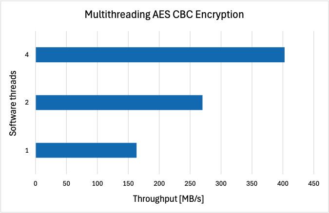

.. _features:

Features
=====================================

In this section, we delve into some of the most importand abstractions and features provided by Coyote.

Unified application interface
------------------------------
One of the core goals of Coyote is to make hardware acceleration accessible even for users with little to none FPGA experience, the simplicity of the user interfaces in vFPGAs is a must. 
The user interface is the sole point of contact between the user-supplied application logic (vFPGA) and the abstraction mechanisms included in Coyote.
The interfaces serve as entry and exit points for both data and control flow to and from the vFPGAs. 
Generally, Coyote exposes the following interfaces to vFPGAs:

* ``axis_host_recv|send``: AXI4 Stream interface for receiving/sending data from/to the host memory. The number of parallel streams from host memory to the vFPGA can be determined by the user.

* ``axis_card_recv|send``: AXI4 Stream interface for receiving/sending data from the FPGA-attached memory (HBM or DDR). The number of parallel streams from the memory to the vFPGA can be determined by the user.

* ``cq_rd|wr``: Completion queues for reads/writes: a streaming interface to receive completion events for finished transactions that originated in the vFPGA.

* ``sq_rd|wr``: Send queues for reads/writes: a streaming interface for incoming operations accompanying a data transaction on the data busses, targeting the vFPGA.

* ``axi_ctrl``: AXI4 Lite interface used for setting control registers within the vFPGA. This allows an interaction between host and vFPGA via PCIe through which the vFPGA becomes the origin of the control flow. The use of this interface is demonstrated in Examples 3 and 7.

* ``notify``: A stream interface which allows the vFPGA to send notifications to the software program running on the host, leading to an interrupt. Obviously, this is useful for exception handling and system control messages.

Network specific interfaces: if the user specifies a network stack (TCP/IP or RDMA) in the build parameters, the corresponding AXI4 Stream interfaces will be exposed in the vFPGA. For RDMA, these interfaces are:

* ``axis_rreq_send|recv``: This interface is used for transporting locally requested data from/to the vFPGA to/from the RDMA stack as payload for outgoing RDMA_WRITE operations.

* ``axis_rrsp_send|recv``: This interface is used for transporting remotely requested data from/to the vFPGA to/from the RDMA stack as payload for outgoing RDMA_READ_RESPONSE operations.

Similar to the hardware interfaces, Coyote also provides a generic and unified software handle to users, allowing them to efficiently control the vFPGAs from host software. 
The core concept here is the Coyote Thread (``cThread``), which maps to a single vFPGA. As shown in Example 1, data movements can be invoked from such a thread, and the completion of such operations be checked by polling the respective status registers associated with this thread.

Multi-tenancy and multi-threading
---------------------------------

One of the key advantages of using Coyote in a datacenter or cloud computing environment is its wide-ranging support for multi-tenancy and multi-threading, allowing to utilize the reconfigurable fabric more efficiently. Multi-tenancy is realized in Coyote in two ways:

* Spatial multi-tenancy: Coyote allows for multiple vFPGAs in the application layer. All core system abstractions and services: host interaction via PCIe, access to the card-attached HBM and the networking stack are provided equally to all vFPGAs through sophisticated arbitration and scheduling mechanisms.

* Temporal multi-tenancy: Coyote supports partial reconfiguration on the vFPGA level, meaning that single applications residing in vFPGAs can be swapped in and out during run-time. The once configured and built system abstractions can thus be used sequentially by different applications while avoiding the lengthy process of generating a full application-specific bitstream.

Besides these concepts of multi-tenancy, Coyote also supports the concept of multi-threading. One of the great strengths of FPGAs is their ability to implement deep logic pipelines taking full advantage of pipeline parallelism. 
Coyote caters to this design feature by its support for multiple parallel data streams in the user interface. This allows to intertwine computation on multiple sources of data in subsequent pipeline stages in the user logic, leaving no part of the user design unused. 
A demonstration of this concept and its benefits can be found in *Example 3: Multi-threaded AES CBC encryption*. The figure below also depicts the perofrmance scaling with the number of software threads for one vFPGA, clearly show-casing the benefits of multi-threading.

Memory
-----------------------------

In Coyote, all memory resources, including those on the host system and the FPGA card, are virtualized. 
This approach abstracts the physical memory details, allowing vFPGAs to access memory seamlessly without direct concern for its physical location. 
Additionally, virtualized memory is a mechanism for data protection and process isolation, as different vFPGAs can only access their own memory; akin to the virtual memory model in a typical OS.
Similar to conventional virtual memory models, Coyote incorporates translation lookaside buffers (TLBs) within its memory management unit (MMU) for efficient virtual-to-physical address look-ups. 
The TLBs are highly configurable through synthesis parameters and are implemented using on-chip RAM (BRAM), therefore acheiving very fast look-ups.

Coyote facilitates direct access to host memory from the FPGA through the ``axis_host_recv|send`` interface. 
This capability allows the vFPGA accelerators to directly access host memory, with no intermediate copies to card memory. 
On the card, Coyote automatically instantiates the necessary controllers for High Bandwidth Memory (HBM) or Double Data Rate (DDR) memory on the card. 
Additionally, Coyote implements striping, ensuring that the data buffer is equally partitioned accorss all the HBM banks, thus maximising bandwidth and reducing pipeline stalls.
This simplifies the development effort, enabling the developers to focus on application implementation and performance tuning. 
The data from card memory is through the ``axis_card_recv|send`` interface.

Networking
-----------------------------

Coyote comes with two different full-fledged networking stacks: 100G TCP/IP and 100G RoCE v2. 
TCP/IP is the backbone protocol of the Internet, and for a long time, the main protocol in datacenters. 
TCP is connection-oriented and works with reliable in-order data streams, including mechanisms handshakes, congestion control and error detection. Overall, TCP/IP puts stability and reliability over maximum performance. 
In traditional systems, TCP/IP is implemented in software running on the host CPU, which requires frequent software and kernel interactions and multiple buffer copies before a transmitted payload reaches the targeted application.

Remote Direct Memory Access (RDMA) via Converged Ethernet (RoCE v2) was designed for a single purpose: achieving the highest possible performance in terms of throughput and latency for datacenter applications. 
Therefore, it builds on the notion of host-bypassing by offloading most of the network processing to dedicated Network Interface Cards (NICs). 
These NICs have direct memory access to application buffers, allowing for zero-copy payload transfers as a second crucial guarantee for low latency. 
On the network side, RoCE v2 expects reliable transmission via lossless networks and implements features for retransmission and flow control. 
Because of its many advantages for data-intensive applications, RoCE v2 has become the de-facto standard for high-performance computing and datacenter networking, accounting for up to 70% of all datacenter network traffic.

The fact that Coyote supports both TCP/IP and RoCE v2 through fully protocol-conformant and FPGA-offloaded networking stacks opens tremendous research possibilities for hardware and systems researchers alike.
Notably, these stacks allow to place the FPGA as an equal-class citizen in the datacenter and scale out acceleration jobs beyond the boundaries of a single FPGA board. 
More specifically, Coyote promises to be an outstanding platform for building SmartNICs and SmartHubs by offering application offload right on the network datapaths via deeply pipelined processing logic. 
For many stream-based data preprocessing tasks, such as data preparation for ML inference, this seems to be hugely beneficial compared to off-datapath processing cores as available in many state-of-the-art commercial SmartNICs and Data Processing Units.
Another benefit of Coyote compared to commercial platforms lies in the fact that both of the network stacks are completely open-source and can therefore be customized and modified in any possible way to test new concepts of high-performance networking. 

GPU integration
-----------------------------
Recognising the importance of heteregenous computing in the era of big data and AI, Coyote aims simplify the integration of FPGAs with other accelerators and NICs. As stated above, Coyote's RDMA stack is fully RoCEv2-compliant, meaning it can interface directly with off-the-shelf commodity NICs.
Additionally, Coyote includes support for DMA with AMD Instinct GPUs, by exporting GPU memory as a DMABuf. By doing so, data transfers between the GPU and FPGA can completely bypass CPU memory, minimising latency and reducing CPU utilization.
For more details on how to use Coyote with GPU support, check out *Example 6: GPU P2P* Below is a figure showcasing the throughput of data movement between a GPU and an FPGA.

.. figure:: img/gpu_bw.png

Dynamic reconfiguration
-----------------------------
Coyote supports two types of reconfiguration: shell and partial (application) reconfiguration.
Recall, Coyote's hardware stack consists of the static layer and the shell (dynamic layer + application layer). 
The primary purpose of the static layer is facilitate communication and data movement between the host CPU and the FPGA. For the same chip, the static layer always remains the same; that is, it cannot be reconfigured. 
The shell includes all of Coyote's services (networking stacks, memory controllers, TLBs etc.) and user applications (vFPGAs).

Shell reconfiguration refers to the reconfiguration of the entire shell: both the services (dynamic layer) and the user applications (application layer) are reconfigured. 
For example, in the figure below, the first shell is built with HBM, no networking and includes one vFPGA for vector addition. 
The new shell includes no HBM controller, but instead has RDMA enabled with two vFPGAs (encryption, compression). 
Importantly, the two shells are completely different: the first one has no networking and one user application, the other one includes networking and two user applications. 
Shell reconfiguration can be done at any time from the software, provided the two shells were linked against the same static layer. For more details on the nuances of shell reconfiguration, see *Example 5: Shell reconfiguration*.

.. figure:: img/shell_reconfigure.png

On the other hand, partial reconfiguration (PR) refers to the reconfiguration of user applications (vFPGAs). 
The services (networking stacks, memory controllers, TLBs) and the number of vFPGAs stays the same, but the application logic changes.
For more details on the nuances of partial reconfiguration, see *Example 9: Partial reconfiguration*.