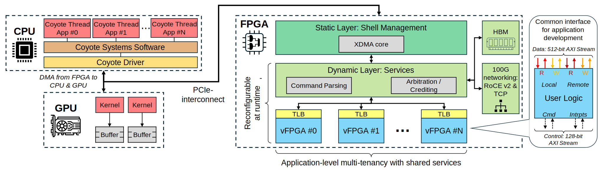

System overview
=====================================

In this section, we will give a high-level overview of Coyote, which is required fully understand Coyote's :ref:`features`. 
For a more in-depth description of Coyote's system architecture, refer to *System architecture* in the documentation. Broadly speaking, Coyote consists of a:

* Hardware stack

* Driver

* User-facing software API

Coyote's hardware stack is further split into the static layer, the dynamic layer and the application layer. 
The primary purpose of the static layer is to facilitate data movement and control flow between the FPGA and CPU over PCIe.
Coyote's dynamic layer is another name for the OS-like libraries (networking stacks, memory controllers) Coyote provides, which we also call services.
Coyote's application layer is the place for deploying user logic and we call each application a virtual FPGA (vFPGA).
Each vFPGA includes a standard set of interfaces to host and card memory, networking stacks (if enabled), control and interrupt signals, facilitating easy deployment of user logic into a larger computer system.
Akin to multi-tasking in a traditional OS, Coyote allows the deployment of multiple, independent vFPGAs, each of which can use all the above-mentioned services.
Additionally, Coyote ensures fair access to shared, bandwidth-constrained resources (memory, network) to all vFPGAs, through on-chip arbiters and schedulers.
Together, we refer to the dynamic and application layers as the Coyote shell.

Coyote user-facing software API facilitate seamless interaction with the FPGA from a high-level programming language (C++).
Using the software API, it is possible to launch applications residing in vFPGAs, trigger data movement, capture interrupts and dynamically reconfigure specific parts of the shell.
The driver acts as the middle layer between the software API and the hardware, "capturing" user requests from the software and translating them to low-level hardware operations on the FPGA.