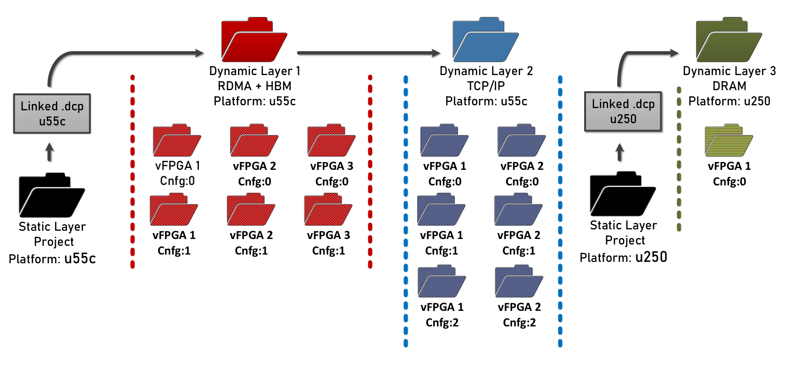

Quick start
==============

This is a brief introductory section outlining the steps to run Coyote and the essential prerequisites for its setup.

Prerequisites
-----------------------

Coyote system requirements: 

* Software & OS:
    
    * **Linux**: For the basic Coyote functionality, Linux >= 5 is sufficient. We have extensively tested Coyote with Linux 5.4, Linux 5.15, Linux 6.2 and Linux 6.8. 
        
    * **CMake**: *CMake* >= 3.5 with support for *C++17*
    
    * **Vivado/Vitis**: Coyote has to be built with the full Vivado suite, including Vitis HLS. Coyote supports Vivado/Vitis HLS >= 2022.1. We have conducted extensive testing with Vivado 2024.1 and 2022.1, though other versions should work as well.
      All network-related Coyote configurations are built using the UltraScale+ Integrated 100G Ethernet Subsystem, for which a valid license must be obtained. 

    * **Hugepages enabled**

    * **Additional information**: For GPU peer-to-peer (P2P) support, Linux >= 6.2 is required with AMD ROCm >= 6.0. If using Coyote's Python run-time, pyCoyote, Python >= 3.8 is required with pip installed.

* Hardware:

    * **FPGA**: The main target platform for the current Coyote release is the AMD Alveo U55C accelerator card. We also include suppport for the AMD Alveo U250 and U280 accelerator cards.
    
    * **GPU**: For GPU peer-to-peer (P2P) support, Coyote currently supports AMD Instinct Accelerator cards. We extensively tested P2P functionality on AMD Instinc MI100 and MI210.

Download
-----------------------
To get started with Coyote, cloning the repository making sure to check out all the submodules:

.. code-block:: bash

    git clone --recurse-submodules https://github.com/fpgasystems/Coyote

Getting started examples
------------------------

Coyote currently includes ten examples, covering the following concepts:

**Example 1: Hello World!:** How to synthesize the Coyote hardware, as well as the various configurations and flags. On the software side, concepts such as data movement and *Coyote threads* are covered, which enable easy integration from a high-level language (C++) with the FPGA.

**Example 2: HLS vector addition:** How to deploy high-level synthesis (HLS) kernels with Coyote and enable multiple data streams at once.

**Example 3: Multiple, parallel AES encryption blocks:** How to set control registers on the FPGA from C++ and deploy multiple, parallel and indendent applications (vFPGAs) on hardware.

**Example 4: User interrupts:** How to issue interrupts from hardware and pick them up in host software.

**Example 5: Shell reconfiguration:** How to perform run-time reconfiguration of the Coyote shell, enabling the swapping out of various services (networking stack, memory type, user application etc.)

**Example 6: FPGA-GPU peer-to-peer (P2P) data movement:** How to enable interaction of the FPGA with a GPU, completely bypassing host memory when performing data movement. A particularly interesting example for building heterogeneous ML systems.

**Example 7: Data movement initiated by the FPGA:** How to perform data movement using the FPGA, independently from the CPU, by using Coyote's internal *send* and *completion* queues.

**Example 8: Multi-threaded AES encryption [ADVANCED]:** How to improve performance by re-using the same hardware with multiple software threads.

**Example 9: Using the FPGA as a SmartNIC for Remote Direct Memory Access:** How to do networking with Coyote's internal, 100G, fully RoCEv2-compliant networking stack.

**Example 10: Application reconfiguration and background services [ADVANCED]:** How to dynamically load Coyote applications to a system-wide service, which automatically schedules tasks and reconfigures the FPGA with the corrects bitstream, based on client requests. 

Be sure to check out the accompanying README.md, in **Coyote/examples**, to get started with these examples and deploy them on your FPGA set-up.

The above-mentioned examples include software examples in C++ as well as hardware examples in HLS and RTL. However, Coyote can also be used with Python via the pyCoyote library.
The same examples, implement with Python instead of C++, can be found in the `pyCoyote repository <https://github.com/fpgasystems/pyCoyote>`_.

Building the hardware
-----------------------

Hardware configuration
_______________________
Coyote uses *CMake* with Vivado to synthesize the target hardware.
This flow provides the capability to synthesize individual application projects, that are loaded in different virtual FPGAs (vFPGAs), independently and subsequently merge them into a single overarching project.
This is the basis for the **nested synthesis** in Coyote.
The following layers, each represented by an independent Vivado project, exist: 

#. **Static layer**: This is the static portion of the system. It is always the same for every project (for the same chip). It provides the bare essential functionality to support the rest of the system, including data movement and interaction with the host CPU.

#. **Dynamic layer**: This layer holds all the services (networking, memory etc.) offered by Coyote which are shared among all applications. It is the first dynamic layer that can be swapped during runtime and represents the current shell configuration.

#. **Application layer**: This layer holds user projects, each representing a separate user application. The number of overall projects depends on two factors:  
    
    * The number of virtual FPGAs (vFPGAs) within the dynamic layer (``N_REGIONS``), and 

    * The number of different configurations of these vFPGAs in the overarching shell (``N_CONFIG``).

To build the hardware, one should provide a configuration via *CMake*. The following is an example project configuration: 

.. code-block:: cmake
    
    cmake_minimum_required(VERSION 3.5)
    project(example_prj)

     # Path to Coyote directory
    set(CYT_DIR ${CMAKE_SOURCE_DIR}/)

    # Path to Coyote's internal CMake, which defines the custom build targets
    set(CMAKE_MODULE_PATH ${CMAKE_MODULE_PATH} ${CYT_DIR}/cmake)
    find_package(CoyoteHW REQUIRED)

    # Shell configuration
    set(FDEV_NAME "u55c")   # Compile for Alveo U55C
    set(N_REGIONS 2)        # Number of vFPGAs in this specific shell
    set(EN_PR 1)            # Enable partial reconfiguration
    set(N_CONFIG 2)         # Number of PR configurations
    set(EN_STRM 1)          # Interface to host memory
    set(EN_MEM 1)           # Interface to FPGA (HBM/DRAM)

    # Validate the configuration
    validation_checks_hw() 

    # Load arbitrary user applications for all configs
    load_apps ( 
        VFPGA_C0_0 "<some_path_to_the_cores>/vector_add"
        VFPGA_C0_1 "<some_path_to_the_cores>/shifter"
        VFPGA_C1_0 "<some_path_to_the_cores>/neural_network"
        VFPGA_C1_1 "<some_path_to_the_cores>/hyper_log_log <some_path_to_a_library>/library"
    )

    # Generate all targets
    create_hw() 

Since the static part never changes and is not configurable, Coyote provides a pre-routed and locked static layer checkpoint which is used for linking.
In this example, Coyote will link to the existing static design floorplanned for the Alveo U55C chip with the above shell configuration.

After indicating the path to Coyote repository, the shell configuration is chosen. In this example, we enable two distinct vFPGAs. 
Each of these functions as an *independent hardware process*, accommodating one user application (*user process*) at a time. 
Applications in these vFPGAs can also be swapped during runtime without disrupting the surrounding shell operations (``EN_PR`` flag). 
Multiple dynamic configurations can be compiled within one project (``N_CONFIG``).
Additional flags can then be provided. All these will define the exact configuration of the shell.
Be sure to include the ``validation_checks_hw()`` and ``create_hw()`` functions, necessary for properly setting up the environment.

The ``load_apps()`` function facilitates the automatic loading of user hardware applications into the corresponding vFPGAs. 
This process also performs any essential high-level synthesis compilations, if needed. 
When utilized, users must explicitly provide path to all configurations (``N_CONFIG x N_REGIONS``). 
The hardware applications (in the provided path) should be structured as follows:

.. code-block:: bash
    
    ├ CMakeLists.txt
    └ <PATH-TO-YOUR-HARDWARE-PROJECT>
        ├ vfpga_top.svh     
        ├ init_ip.tcl       
        └ hls              
            ├ kernel_1
                └ kernel_1.cpp  
                └ other_files.cpp
            ├ kernel_2
                └ kernel_2.cpp
                └ other_files.cpp
        └ hdl
            └ all RTL cores and files that might be used (.v, .sv, .svh, .vhd, ...) 

.. note:: Be sure to create the ``vfpga_top.svh``. This is the main integration header file. It is used to connect your circuits to the interfaces exposed by each vFPGA.

If you want to use hardware libraries as shared code in a vFPGA configuration from other folders, you can add them to the configuration as shown for ``VFGPA_C1_1``. The library folder is assumed to have the same folder structure as the base source folder of the vFPGA config. However, only the base source folder has to have a ``vfpga_top.svh`` file.

It is not necessary to use the ``load_apps()`` function. You can also integrate your circuits manually into the provided wrappers (available after the project creation step).

Build process
_______________________
The projects can be built after configuration and directories have been setup. First, the build directory can be created: 

.. code-block:: bash
    
    mkdir build_hw && cd build_hw

The *CMake* configuration can then be invoked:

.. code-block:: bash
    
    cmake <path-to-cmake-config> <additional-flags>

If all validation checks pass without errors, all the necessary build files will be generated after this step.
Project creation can be then be invoked with the following command: 

.. code-block:: bash

    # Performs code generation, since source files are parameterized
    # Additionally, performs HLS compilation
    make project

This will create the following projects: 

.. code-block:: bash
    
    # Static layer, only if (BUILD_STATIC = 1)
    <project_name>_static

    # Dynamic layer
    <project_name>_shell    

    # Application layer
    <project_name>_config_0/<project_name>_user_c0_0    # (vFPGA_C0_0)
    <project_name>_config_0/<project_name>_user_c0_1    # (vFPGA_C0_1)
    ...
    <project_name>_config_1/<project_name>_user_c1_0    # (vFPGA_C1_0)
    ...

If ``load_apps()`` was used, there is nothing else that users need to do after this command. 
Otherwise each of the user projects (``vFPGA_CX_Y``) will contain wrappers under the *project/hdl* directory where
users can instantiate their circuits as they please.

Compilation can then be executed. 
To generate all bitstreams straight away, one can run:

.. code-block:: bash
    
    make bitgen

The command consists of the following incremental steps:

.. code-block:: bash
    
    # Synthesize all layers (1x dynamic, N_REGIONS x N_CONFIG app and 1x static, if BUILD_STATIC = 1)
    make synth    

    # Link the layers (static + dynamic + app) into a single Vivado project
    make link    

    # Place and route the linked shell (all three layers)
    make shell   

    # Compile the application layer (only if EN_PR is enabled)
    make app     

    # Generate bitstreams
    make bitgen   

If ``EN_PR = 1`` floor-planning of the applications (vFPGAs) needs to be done by users explicitly after the *make shell* step. 
This can be done by opening the generated ``shell_subdivided.dcp`` checkpoint. 
Check out the following link for a detailed `floor-planning guide <https://docs.amd.com/r/en-US/ug903-vivado-using-constraints/Floorplanning>`_.
Alternatively, users can provide pre-existing vFPGA floor-plan via the ``FPLAN_PATH`` variable during configuration.

Once the (typically quite lengthy) compilation is done, the bitstreams will be generated for each application and configuration.
The shell bitstream (*the dynamic layer bitstream*) with the initial (config 0) configuration will also be generated. 
This one can be used to load the shell dynamically and swap out other shells during runtime.
All of these will be present in the `bitstreams` directory. 

.. _build_struct:

The overall bitstream structure should roughly resemble the one in the figure above.

Building the driver
-----------------------
The driver can be built by running make within the driver directory:

.. code-block:: bash
    
    cd driver && make

.. note:: Be sure to compile the driver on the target deployment machine.

Building the software
-----------------------

Procedure to build the software is similar to the one for hardware, albeit more simple. 
Again, software build use CMake for compiling the software. For examples of CMakeLists.txt for software builds, refer to **Coyote/examples**.

The steps remain the same as for the hardware build: 

.. code-block:: bash
    
    mkdir build_sw && cd build_sw
    cmake <path-to-cmake-config> <additional-flags>
    make

Deploying Coyote
-----------------------
We cover how to deploy the examples in two set-ups: The Heterogeneous Accelerated Compute Cluster (HACC) at ETH Zurich and on a independent set-up. 

ETH HACC
_____________________

The Heterogeneous Accelerated Compute Clusters (HACC) program is a special initiative to support novel research in adaptive compute acceleration. 
The scope of the program is broad and encompasses systems, architecture, tools and applications. 
You can check out HACC in more details at: `amd-haccs <https://www.amd-haccs.io/>`_.

The ETH HACC provides the ideal environment to run Coyote examples, 
since users can book various compute nodes (Alveo U55C, V80, U250, U280, Instinct GPU etc.) 
which are connected via a high-speed (100G) network.

.. figure:: img/hacc.png

The interaction and deployment of Coyote on the HACC cluster can be simplified by using the ``hdev`` tool. 
It also allows to easily program the FPGA with a Coyote bitstream and insert the driver. 
For this purpose, the script ``util/program_hacc_local.sh`` has been created:

.. code-block:: bash

    bash util/program_hacc_local.sh <path-to-bitstream> <path-to-driver-ko>

.. note:: Bitstreams with ``.bin`` extensions should be used when loading the designs dynamically through Coyote. If bitstreams are being programmed through Vivado programmer, use the ones with ``.bit`` extension.

A successful completion of the FPGA programming and driver insertion can be checked via a call to:

.. code-block:: bash

    dmesg

If the driver insertion and bitstream programming went correctly through, the last printed message should be ``probe returning 0``. 
If you see this, your system is all ready to run the accompanying Coyote software.

Independent set-up
_____________________
The steps to follow when deploying Coyote on an independent set-up are:

1. Program the FPGA using the synthesized bitstream using Vivado Hardware Manager via the GUI or a custom script. 

2. Rescan the PCIe devices and run PCI hot-plug.

3. Insert the driver using (the parameters IP and MAC must only be specified when using networking on the FPGA):

.. code-block:: bash
    
    sudo insmod Coyote/driver/coyote_driver.ko ip_addr=$qsfp_ip mac_addr=$qsfp_mac (; i.e. Example 8)

A successful completion of the FPGA programming and driver insertion can be checked via a call to:

.. code-block:: bash

    dmesg

If the driver insertion and bitstream programming went correctly through, the last printed message should be ``probe returning 0``. 
If you see this, your system is all ready to run the accompanying Coyote software.

Coyote has been successfully deployed on other FPGA clusters (e.g., in the `Open Cloud Testbed <https://octestbed.org/>`_) and independent set-ups.
For some ideas of projects that were based on Coyote, check out the :ref:`publications` page.

Simulating vFPGAs
-----------------------
A more comprehensive documentation for the simulation environment can be found at ``sim/README.md``.
To get started with the simulation target for the software library, execute ``make sim`` after initializing the hardware build directory with ``cmake``.
To include and use the simulation software library, youh should change your CMake
`add_subdirectory` or `find_package`:

.. code-block:: cmake

    add_subdirectory(path/to/coyote/sim/sw coyote) # Changed from add_subdirectory(path/to/coyote/sw coyote)
    # or
    find_package(CoyoteSimulation) # Changed from find_package(Coyote)

After building the software with ``make``, the binary may be executed the same as if a programmed FPGA was available.
You must point the program to the ``build_hw`` directory where you ran ``make sim`` via the ``COYOTE_SIM_DIR`` environment variable.
For example, if our project builds a ``test`` executable, you should run it as:

.. code-block:: bash
   COYOTE_SIM_DIR=path/to/build_hw test <args...>

It will automatically start Vivado in the background and start the testbench environment to simulate the vFPGA.

Besides this simulation target for the Coyote C++ library, a Python unit test framework is available that is documented in detail in ``sim/unit-test/README.md``.
