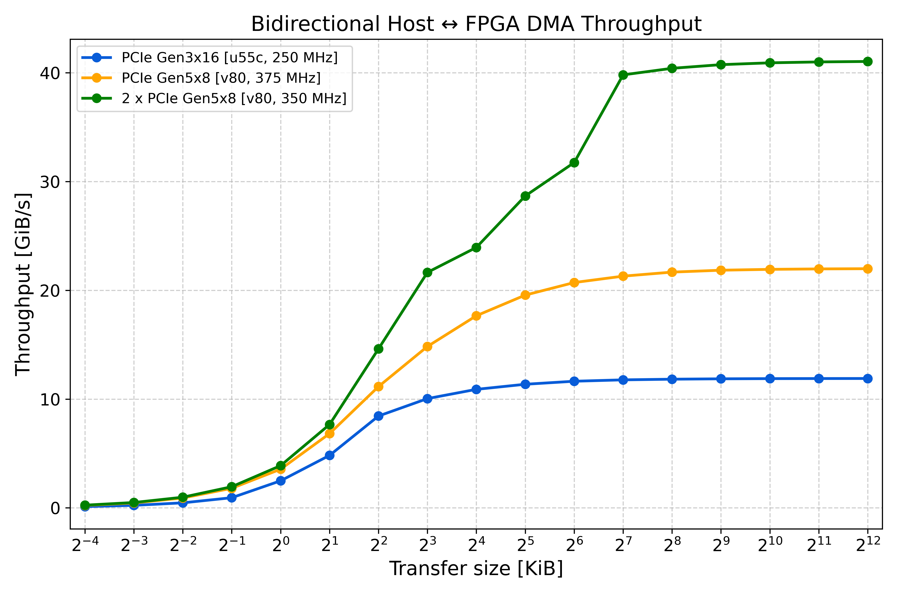

.. _v80-notes:

V80 notes
=====================================

Introduction
------------------------------------------
`PR #193 <https://github.com/fpgasystems/Coyote/pull/193>`_ introduces support for the V80 in Coyote, while maintaining full compatibilty with supported UltraScale+ devices (U55C, U250, U280). 
In short, the new features for the V80 are:

- Data movement via the hardended QDMA, with support for both PCIe Gen 4x16 and PCIe Gen 5x8 configurations. The QDMA is configured in streaming and bypass mode, similar to the XDMA on UltraScale+ devices.
- Support for raising interrupts and reading/writing memory-mapped registers through the QDMA.
- Support for accessing HBM memory, with two implementations of HBM on the V80: "block" and "unified". "block" partitions the memory space into smaller fragments, reducing NoC contention and maximising throughput. "unified" is the closest to the existing implementation from UltraScale+ devices, allowing each stream to access the entire memory space.
- Support for reconfiguration of both the shell and the vFPGAs (see note below on nested DFX). Like on other platforms, the shell is explicitly floor-planned to maximise its available resources while achieving timing closure.

.. note::  Coyote aims to provide a program once, run anywhere environment for supported devices. This means that applications developed and tested on one device (e.g., U55C) can also run on another device, such as the V80, without modifications.

Networking support will be added shortly. Additionally, as needed, a future pull request can also include support for DDR memory (currently, the V80 is only configured to use HBM). 

The following table summarises the examples/features supported on the V80:

============================ ======
Example                      Status
============================ ======
1 Hello World                ✅
2 HLS Vector Add             ✅
3 Multi-tenancy              ✅
4 User interrupts            ✅
5 Shell reconfiguration      ✅
6 GPU P2P                    ✅
7 FPGA-initiated DMA         ✅
8 Multi-threading            ✅
9 RDMA                       ❌
10 vFPGA reconfiguration     ✅
11 Traffic sniffer           ❌
============================ ======

.. tip::  Like on UltraScale+ platforms, user applications (vFPGAs) for the V80 can be written in RTL (e.g., SystemVerilog, VHDL) or Vitis HLS.

.. tip:: Like on UltraScale+ platforms, all non-platform specific features are supported, including: multi-tenancy, GPU-FPGA peer-to-peer data movement, FPGA-initiated DMA etc.

How to use Coyote on a V80 FPGA?
------------------------------------------
To get started with the V80, it is sufficient to pass the correct device to CMake when building the hardware:

.. code-block:: bash

    cmake -DFDEV_NAME=v80

Additionally, with the introduction of the V80, when compiling the driver, the target platform must be specified:

.. code-block:: bash

    make TARGET_PLATFORM=versal             # For Versal devices, i.e. the V80
    make TARGET_PLATFORM=ultrascale_plus    # For UltraScale+ devices, i.e. U55C, U250, U280

Finally, it is important to note the difference in bitstream / programmable image extensions between UltraScale+ and Versal devices:
    - On UltraScale+ devices, full bitstreams have the extension `.bit`, while partial bitstreams for vFPGAs have the extension `.bin`.
    - On Versal devices, both full and partial programmable devices images (PDIs) have the extension `.pdi`.

.. tip::  On the ETHZ HACC, the script `program_hacc_local.sh` can be used to program both Versal and UltraScale+ devices regardless of the extension.

For example, the full flow of synthesising and running the Example 1 on the V80 would be:

.. code-block:: bash

    # Build the hardware for the V80
    cd examples/01_hello_world/hw
    mkdir build && cd build
    cmake -DFDEV_NAME=v80 ../
    make project && make bitgen

    # Build the driver for the V80
    cd driver && make TARGET_PLATFORM=versal

    # Compile software (same for all platforms)
    cd examples/01_hello_world/sw
    mkdir build && cd build
    cmake ../
    make
 
    # Program the FPGA with the bitstream
    # On the ETHZ HACC, the utility script program_hacc_local.sh can be used
    bash util/program_hacc_local.sh examples/01_hello_world/hw/build/bitstreams/cyt_top.pdi driver/build/coyote_driver.ko

    # On custom set-ups, the steps are the same as on UltraScale+ devices
    # 1. Program the FPGA using Vivado Hardware Manager
    # 2. Do a PCIe hot-plug/rescan OR a warm reboot
    # 3. Load the driver using insmod

Vivado version compatibility
------------------------------------------
The V80 is supported out of the box in Coyote with Vivado **2024.2 or newer**. 

While synthesis with Vivado 2024.1 works, the format of design checkpoints in Vivado has changed significantly in Vivado 2024.2, leading to static checkpoints generated in 2024.1 being incompatible with 2024.2 or newer.
Recall, since the static layer is platform-specific and rarely changed, Coyote provides a routed and locked checkpoint of the static layer for each supported platform, speeding up hardware builds.
For the V80, the static checkpoint was generated using Vivado 2024.2, and is thus only compatible with Vivado 2024.2 or newer.

Users wishing to use Vivado 2023.2 or 2024.1 need to regenerate the static checkpoint during by setting:

.. code-block:: bash

    cmake -DFDEV_NAME=v80 -DBUILD_STATIC=1 -DBUILD_SHELL=0

.. important:: We recommend using Vivado 2024.2 or newer, due to various improvements and bug fixes in Vivado for Versal devices (specific details can be found in Vivado release notes).

PCIe configuration & performance
------------------------------------------
In Coyote, the QDMA on the V80 can be condifigured as either PCIe Gen 4x16 or PCIe Gen 5x8, both of which should have the same theoretical throughput of 32 GBps.
The configuration can be changed by setting the `PCIE_GEN` variable in CMake for hardware synthesis:

.. code-block:: bash

    set(PCIE_GEN 4) # for PCIe Gen 4x16
    set(PCIE_GEN 5) # for PCIe Gen 5x8

.. note::  The V80 can be configured to include two QDMAs, with a theoretical bandwidth of 64 GBps. While tested, this feature is not fully supported in Coyote yet. It will be added in a future pull request.

The plot below shows the measured throughput for host-to-device transfers using the QDMA on the V80, configured in PCIe Gen 5x8 mode, compared to the XDMA on the U55C, configured in PCIe Gen 3x16 mode.

.. hint::  Higher throughput can be achieved by increasing the clock frequency. More details can be found in the section on tuning clock frequency and timing closure below.

In case of stalling host-to-device transfers, it is recommended to query the QDMA debug registers from sysfs and compare against the QDMA specification for Versal:

.. code-block:: bash

   cat /sys/kernel/coyte_sysfs_0/cyt_attr_qdma_debug_regs

HBM configuration & performance
------------------------------------------
TODO!

Dynamic reconfiguration
------------------------------------------
TODO!

Tuning clock frequency & timing closure
------------------------------------------

Compared to UltraScale+ platforms, the V80 is a larger device, with hardened blocks (e.g., QDMA, HBM) and an on-chip NoC, all of which simplify timing closure and allow for higher clock frequencies.
Additionally, unlike UltraScale+ platforms, which hardcode the XDMA clock frequency to 250 MHz, the V80 has a configurable QDMA clock frequency. 
As such, achieving high-throughput designs on the V80 can be done by increasing the clock frequency. 

Specifically, on the V80, one can configure:

- Static layer clock frequency (SCLK_F; only applicable to Versal devices; on UltraScale+ devices it always defaults to 250 MHz)

- Shell clock frequency (ACLK_F; also applicable to UltraScale+ devices)

- App (vFPGA) clock frequency (UCLK_F; also applicable to UltraScale+ devices)

.. note::  Since Coyote provides a static checkpoint of the static layer, SCLK_F can only be set during static build flows, which regenerate the static checkpoint (example below). In shell build flows, which link against the provided static checkpoint, it defaults to 333 MHz.

.. note:: To set the user clock frequency (UCLK_F), user clock domain crossing must be enabled by setting EN_UCLK = 1. Otherwise, the user clock frequency will default to the shell clock frequency (ACLK_F).

.. code-block:: bash

    # An example of setting the static and shell clock frequency to 350 MHz
    # Place-route-is done with optimisation directives for better timing closure (BUILD_OPT=1)
    cmake -DFDEV_NAME=v80 -DBUILD_STATIC=1 -DBUILD_SHELL=0 -DSCLK_F=350 -ACLK_F=350 -DBUILD_OPT=1 ../
    make project && make bitgen

.. attention::  When BUILD_OPT is set to 1, Coyote will use advanced Vivado directives for better timing closure. However, starting with Vivado 2024.2 on Versal devices, ML-based placer directives (i.e. `Auto_*` directives) are no longer supported. Instead Coyote defaults to `AggressiveExplore` for placement. In case of timing closure issues, please refer to Vivado documentation for other placement directives to try and modify `scripts/impl/pnr_shell.tcl` accordingly.
    
.. tip:: In most cases, the shell and static layers should use the same clock frequency, as the bottleneck is typically on the lowest frequency path (unless there is data compression). As such, there is rarely advantages in setting one clock frequency higher than the other; in fact, it can lead to timing closure issues. 

Finally, recall that Coyote explicity floorplans the shell and static layer, to enable dynamic reconfiguration of the shell (for more details refer to Example 5 on GitHub).
However, explicit floorplanning can sometimes hinder timing closure. In case shell reconfiguration is not needed, the floorplan (and therefore, shell reconfiguration), can be disabled during a static build flow by setting:

.. code-block:: bash

    cmake -DFDEV_NAME=v80 -DEN_SHELL_PBLOCK=0 -DBUILD_STATIC=1 -DBUILD_SHELL=0  ../
    make project && make bitgen

.. tip:: In addition to disabling the shell floorplan, one case pass the target clock frequencies to CMake (e.g., SCLK_F, ACLK_F) and buid with optimizations.