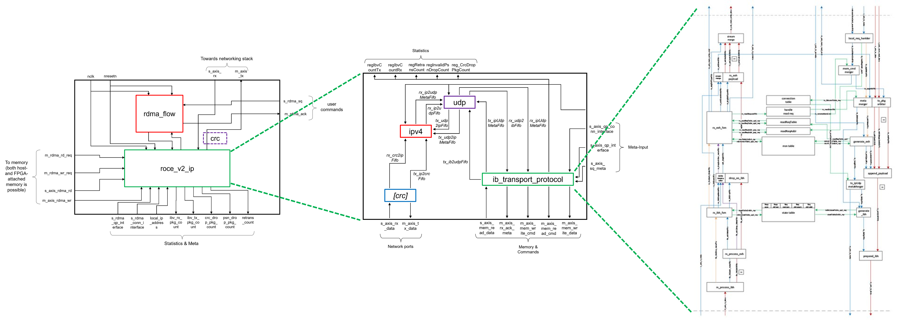

Dynamic layer
====================

Architecture
-----------------------------------

Shared virtual memory
-----------------------------------

Network Services - TCP/IP
-----------------------------------

Network Services - RDMA RoCEv2
-----------------------------------

Coyote comes with a RDMA-stack that is fully compatible to the RoCEv2 networking standard and therefore allows communication with commodity NICs (i.e. tested with Mellanox ConnectX-5 cards.). 
It is proven to run at 100 Gbit / s in a switched network, allowing for low latency and high throughput comparable to ASIC-based NICs such as the aforementioned. 

The architecture of this networking stack is defined in a block diagram as follows: 

The packet processing pipeline is coded in Vitis-HLS and included in "roce_v2_ip", consisting of separate modules for the IPv4-, UDP- and InfiniBand-Headers. In the top-level-module "roce_stack.sv", this pipeline is then combined with HDL-coded ICRC-calculation and RDMA-flow control.

For actual usage besides pure packet processing, this networking stack is integrated into the Coyote-shell to provide access to memory, host streams and the networking datapath from the CMACs. This system design is depicted as following: 

.. figure:: img/Balboa_Stack_Overview-1.png

The actual RDMA-logic as discussed in this part is the blue `roce_stack`. The integration of this part of the design into the rest of the shell is managed via well-defined interfaces: 

**Network Data Path**
The two ports `s_axis_rx` and `m_axis_tx` are 512-bit AXI4-Stream interfaces and used to transfer network traffic from the shell to the RDMA-stack. With the Ethernet-Header already processed in earlier parts of the networking environment, the RDMA-core expects a leading IP-Header, followed by a UDP- and InfiniBand-Header, payload and a final ICRC-checksum.

**Meta Interfaces for Connection Setup**
RDMA operates on so-called Queue Pairs at remote communication nodes. The initial connection between Queues has to be established out-of-band (i.e. via TCP/IP) by the hosts. To exchanged meta-information then needs to be communicated to the RDMA-stack via the two meta-interfaces `s_axis_qp_interface` and `s_axis_qp_conn_interface`. The interface definition in HLS looks like this:
.. code-block:: c++
    
    typedef enum {RESET, INIT, READY_RECV, READY_SEND, SQ_ERROR, ERROR} qpState;

    struct qpContext {
	    qpState		newState;
	    ap_uint<24> qp_num;
	    ap_uint<24> remote_psn;
	    ap_uint<24> local_psn;
	    ap_uint<16> r_key;
	    ap_uint<48> virtual_address;
    };
    
    struct ifConnReq {
	    ap_uint<16> qpn;
        ap_uint<24> remote_qpn;
        ap_uint<128> remote_ip_address;
        ap_uint<16> remote_udp_port;
    };

    hls::stream<qpContext>&	s_axis_qp_interface,
    hls::stream<ifConnReq>&	s_axis_qp_conn_interface,

**Issuing RDMA commands**
The actual RDMA-operations are handled between the shell and the RDMA-core through the interfaces `s_rdma_sq` for initiated RDMA-operations and `m_rdma_ack` to signal automatically generated ACKs from the stack to the shell.

Definition of s_rdma_sq:
* 20 Bit `rsrvd`
* 64 Bit `message_size`
* 64 Bit `local vaddr`
* 64 Bit `remote vaddr`
* 4 Bit `offs`
* 24 Bit `ssn`
* 4 Bit `cmplt`
* 4 Bit `last`
* 4 Bit `mode`
* 4 Bit `host`
* 12 Bit `qpn`
* 8 Bit `opcode` (i.e. RDMA_WRITE, RDMA_READ, RDMA_SEND etc.)

Definition of m_rdma_ack:
* 24 Bit `ssn`
* 4 Bit `vfid`
* 8 Bit `pid`
* 4 Bit `cmplt`
* 4 Bit `rd`

**Memory Interface**
The RDMA stack communicates with the QDMA-core for access to the host memory. Therefore, the memory-control interfaces `m_rdma_rd_req` and `m_rdma_wr_req` are designed to hold all information required for communication with this core. The two data interfaces for transportation of memory content `m_axis_rdma_wr` and `s_axis_rdma_rd` are 512-Bit AXI4-Stream interfaces. 

Definition of `m_rdma_rd_req` / `m_rdma_wr_req`: 
* 4 Bit `vfid`
* 48 Bit `vaddr`
* 4 Bit `sync`
* 4 Bit `stream`
* 8 Bit `pid`
* 28 Bit `len`
* 4 Bit `host`
* 12 Bit `dest`
* 4 Bit `ctl`

**Examples of RDMA WRITE-Flow**
The following flow chart shows an exemplaric RDMA WRITE-exchange between a remote node with an ASIC-based NIC and a local node with a FPGA-NIC implementing the RDMA-stack. It depicts the FPGA-internal communication between RDMA-stack and shell as well as the network data-exchange between the two nodes: 

