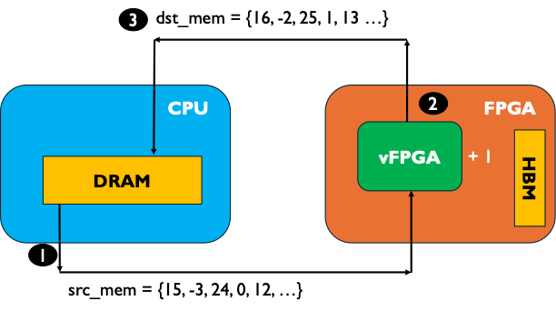
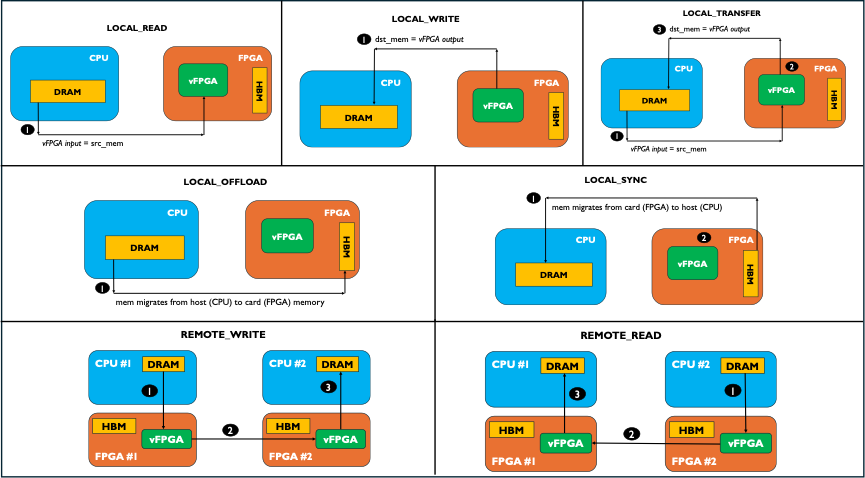
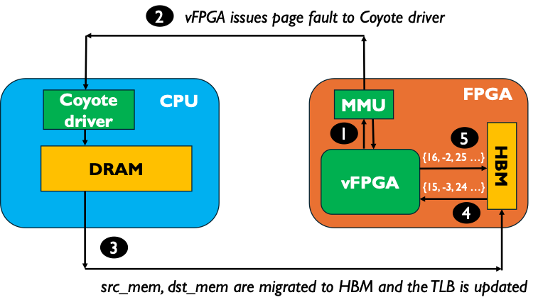

# Coyote Example 1: Hello World!
Welcome to the first Coyote example! In this example we will cover how to build our first hardware design using Coyote and deploy it to do simple data movement between the host CPU and the FPGA. As with all Coyote examples, a brief description of the core Coyote concepts covered in this example are included below. How to synthesize hardware, compile the examples and load the bitstream/driver is explained in the top-level example README in Coyote/examples/README.md. Please refer to that file for general Coyote guidance.

## Table of contents
[Example Overview](#example-overview)

[Hardware Concepts](#hardware-concepts)

[Software Concepts](#software-concepts)

[Additional Information](#additional-information)

## Example overview
This example measures the throughput and latency of CPU-initiated read and write requests. The data is moved from the host CPU to the FPGA, where it is processed by some user logic and written back to the CPU memory. In this example, we only consider a simple processing task: increment every integer in the incoming data buffer by 1. An example of the data-flow is given in the figure below; and as shown in the figure, the steps are:
1) Data is moved from host memory to the vFPGA, completely bypassing FPGA memory. This underlines a key feature of Coyote - the ability to move data straight from host memory to user logic via PCIe with no intermediate copies to FPGA HBM/DDR.
2) Data is processed by the vFPGA, which increments every integer in the incoming stream.
3) Data is written back to the host, again bypassing any intermediate transfers to FPGA HBM/DDR.

<div align="center">
  
</div>

An alternative option is to have the vFPGA data reside in the FPGA's memory (HBM/DDR) and read it from there. Due to Coyote's internal memory management unit (MMU), this is also possible. The data is still allocated on the host, but using a simple run-time flag, we can instruct Coyote to issue a *page fault* and migrate the data to FPGA memory. This will be covered in more details below, under the section *Software Concepts/Coyote Operations*.  

## Hardware concepts
### vFPGA and user interfaces
*Virtual FPGAs*, vFPGAs are the core hardware abstraction in Coyote. They represent a single instance of user logic which can be used for deploying various applications. Each vFPGA has its own internal MMU (more on this below), access to host and card memory, networking stacks etc. To ensure fair sharing between multiple vFPGAs, Coyote also includes creditors and arbiters. vFPGAs rely on a set of data and control interfaces, which are built around industry-standard AXI Stream and Lite interfaces. 

To implement a vFPGA, it is sufficient to have a System Verilog header file called `vfpga_top.svh`. This header file has access to all the necessary control and data streams and can be used to instantiate the user application. Of course for more complex designs, it is advised to have a more modular approach. When using multiple Verilog/VHDL files, they should be stored in the sub-directory `hdl`, as shown in this example. HLS kernels will be covered in the next example. 
```Verilog
// Instantiate an instance of a module perf_local, called inst_host_link
perf_local inst_host_link (
    .axis_sink          (axis_host_recv[0]),
    .axis_src           (axis_host_send[0]),
    .aclk               (aclk),
    .aresetn            (aresetn)
);

// Tie-off the other signals, which are not used by this vFPGA 
always_comb axi_ctrl.tie_off_s();
always_comb notify.tie_off_m();
always_comb sq_rd.tie_off_m();
always_comb sq_wr.tie_off_m();
always_comb cq_rd.tie_off_s();
always_comb cq_wr.tie_off_s();
```

As shown by the CMake for this example, this application can be included in Coyote using the `load_apps(...)` macro. In this example, the important user interfaces are:
- `axis_host_recv` and `axis_host_send`: Data from the host; `..._recv` indicates the data received by the vFPGA, i.e. incoming from the host to the vFPGA and `..._send` indicates data leaving the vFPGA and going to the card. This data is streamed straight from the host through PCIe and the XDMA core with no intermediate stop in card memory (HBM/DDR)
- `axis_card_recv` and `axis_card_send`: Analogous to above, but for card memory (HBM/DDR).

The other interfaces will be covered in subsequent examples, as required. Note, how these interfaces are in fact arrays: to enable parallelization, Coyote allows having multiple streams from the host/card memory. This is controlled by the CMake parameters: `N_STRM_AXI` (host) and `N_CARD_AXI` (card). 

### Adding ILAs for easier debugging
Sometimes, the hardware doesn't quite work as expected. When this happens, a useful tool for debugging can be Integrated Logic Analyzers (ILA), which can probe signals while the hardware is in use. There is a small ILA in the `vfpga_top.svh`, showing how it can be instantiated. Importantly, ILAs also need to be instantiated, indicate the triggering depth, bit-width of certain signals, the numbers of probes etc. An example of this is shown in `init_ip.tcl`. Note, however, that ILAs rely on BRAM to store values; therefore having large ILAs (many signals or large depth) can exceed the available BRAM or cause congestion and routing problems.

### Building the hardware design
The Coyote hardware stack consists of the static layer and the shell. The static layer consists of an XDMA core for communication with the host CPU as well as a few other IP blocks related to partial reconfiguration. For the same chip, the static layer always remains the same; that is, it cannot be reconfigured. The shell includes all of Coyote's services (networking, memory controllers etc.), which we call the dynamic layer, as well as the user application (vFPGAs), which we call the application layer. The shell is reconfigurable at run-time, but more on this in subsequent examples. 

Coyote includes three main ways of building the target hardware design: *static*, *shell* and *application*. The default is shell, which builds the shell as dictated by CMake properties (e.g. `EN_RDMA` to enable RDMA, `EN_MEM` to enable HBM/DDR on the FPGA, `load_apps` to include specific user applications etc.) and links it against a pre-compiled (synthesized, placed and routed) static layer check-point. In doing so, Coyote can produce the target hardware faster, as it does not need to re-synthesize and re-implement the static layer for every shell, which never changes. In these examples, we will always build Coyote using the *shell* flow. 

For more information on the various build steps in Coyote please refer to the [following section of the documentation.](https://fpgasystems.github.io/Coyote/intro/quick-start.html#building-the-hardware)

## Software concepts

### Coyote threads (cThreads)
The core abstraction of vFPGAs in Coyote's software stack are so-called *Coyote Threads* (`cThread`). Each `cThread` is associated with a unique vFPGA, corresponding to some user logic that `cThread` is responsible for. The `cThread` can be used to move data and launch a user kernel residing within a vFPGA. A common way for creating a `cThread` is:

```C++
coyote::cThread coyote_thread(DEFAULT_VFPGA_ID, getpid());
```
This creates an instance of a `cThread`, called `coyote_thread` which is assigned to vFPGA `target_vfpga_id`. Each `cThread` also has a unique ID, which can be obtained from the method `getCtid()`. Furthermore, we also assign the current host (Linux) process ID. Remember, Coyote was meant for data center and cloud deployments, where infrastructure multi-tenancy is a key concept. Then, we can have multiple host applications running and using Coyote at the same time, we need to make sure each `cThread` is associated with the appropriate process. 

### Memory allocation
In order to launch kernels and do useful processing on the FPGA, we first need to allocate some data. In Coyote, memory (both host and card) is virtualized; that is every memory look-up goes through Coyote's internal MMU and frequently accessed memory can be stored in Translation-Lookaside Buffers (TLBs). Each vFPGA has its own internal MMU and TLB, ensuring process and data isolation. 

To allocate memory, there are two options:
1. Using Coyote's internal method, `getMem(type, size)` which allocates the appropriate memory (regular, huge-page, GPU etc.). Under the hood, Coyote uses standard C/C++ methods, such as `memalign(...)` to allocate the memory. Importantly, this method also pre-populates the internal TLB under the assumption that recently allocated buffers will be used soon; therefore, there will be no page faults on these buffers. Oftentimes, this way of allocating memory is called *mapped* and can be configured in this example by passing the `[--mapped | -m]`.  
2. Using standard Linux methods, such as `memalign(...)`. Importantly, this method does not pre-populates the internal TLB; therefore, there will be a page fault on these buffers when used. **IMPORTANT:** If using this method, you have to use an method that ensure aligned memory allocation. Coyote is built around 512-bit AXI streams, and, therefore data must be aligned to 64B. Therefore, it's not possible to use `malloc` as it has no guarantees on data alignment: instead methods such as `mmap`, `memalign` or `alligned_alloc` should be used. See the example for more information on how to allocated both huge-pages and regular pages using this method.

Where possible, it is recommended to use huge-pages for buffers, since regular pages tend to fill up the TLB quite quickly, causing frequent page faults and swaps.

### Coyote operations
Coyote Operations are used to move data and launch kernels residing in vFPGA. Some important operations are; others can be found in the documentation:
- **LOCAL_READ**: Transfer data from CPU or FPGA memory straight to a vFPGA stream (depending on sg_local.stream, more on this in *Page faulting*)
- **LOCAL_WRITE**: Transfer data from vFPGA stream to CPU or FPGA memory (depending on sg_local.stream, more on this in *Page faulting*)
- **LOCAL_TRANSFER**: Two-side local transfer: data is first read (LOCAL_READ) from CPU/FPGA memory, processed by the vFPGA and then written (LOCAL_WRITE) back to CPU/FPGA memory.
- **LOCAL_OFFLOAD**: Transfer data from CPU memory to FPGA memory (HBM/DDR)
- **LOCAL_SYNC**: Transfer data from FPGA memory (HBM/DDR) to CPU memory
- **REMOTE_RDMA_READ**: RDMA READ to remote node
- **REMOTE_RDMA_WRITE**: RDMA WRITE to remote node 

<div align="center">
  
</div>

To invoke a Coyote operation, the example syntax is:
```C++
coyote_thread->invoke(coyote::CoyoteOper::LOCAL_TRANSFER, src_sg, dst_sg);
```
Note, that the function call depends on a pointer to a scatter-gather (SG) entry which we will cover next.

#### Scatter-Gather Entry (sgEntry)
SG entries are used in DMA operations to describe source & dest memory buffers, their addresses, sizes etc. Coyote has its own implementation of SG entries for various data movements, such as local, RDMA, TCP etc., with varying fields. For example, for local data movements (read, write, transfer), the expected fields are:
- `mem`: pointers to the buffer to be moved
- `len`: length (in bytes) of the buffer to be moved
- `stream`: whether the buffer resides on the host CPU or on the FPGA card (more on this below)
- `dest`: destination stream; as explained in *Hardware Concepts/vFPGA and user interfaces* it's possible to configure Coyote to include multiple streams from the host (N_STRM_AXI) and card memory (N_CARD_AXI) to enable parallel data transfer. We will see examples of this in other examples, such as Example 2 (Vector addition) and Example 8 (Multi-threading). The destination streams corresponds to the target stream when there are multiple available.

#### Page faulting & TLB management
As pointed out earlier, memory in Coyote is virtualized which can lead to page faults. As discussed earlier, a common reason for page faults is not allocating memory with `getMem(...)`. Another reason could be the wrong location of the data. In Coyote, all memory entries include information like the associated vFPGA and host PID (similar to the host process for Linux virtual pages), size etc. However, another important entry is the **stream**, which represents the data location: 1 for host memory and 0 for FPGA memory. In our example, the data is allocated with `getMem(...)` and initially, is stored in host memory. However, if we set the `src_sg.stream` and `dst_sg.stram` to 0, it will instruct the vFPGA to look for the data on the card's memory (HBM in the case of the U55C). However, the internal MMU will notice that this data is on the host, which will lead to a *page fault*. This page fault is picked up by the Coyote device driver, which migrates (off-loads) the data to the FPGA's HBM and updates the TLB to reflect the new data location. After that, the example can proceed, repeatedly reading the data from HBM, passing it through the vFPGA and storing the result back to HBM. This process is illustrated in the figure below.

<div align="center">
  
</div>

**IMPORTANT**: This Coyote example doesn't allow distinct source and destination streams; i.e. it's not possible to read the source buffer from host memory and write the result to a buffer into card memory. Inspecting the `vfpga_top.svh`, it immediately becomes clear why this is the case: there is one instance of the vFPGA logic per stream (host to host, and card to card, but no host to card, nor card to host). However, in Coyote it's absolutely possible to have source and destination streams being distinct as long as the vFPGA is implemented to reflect this requirement.

#### Polling 
Finally, Coyote operations are asynchronous - that is, they are launched and the host software proceeds without waiting for the results. In Coyote, multiple operation can be launched and then continuously *polled*, essentially comparing the number of times a given operation was completed against the expected number of completions:
```C++
// Launch a number of local transfers in parallel
for (int i = 0; i < transfers; i++) {
    coyote_thread->invoke(coyote::CoyoteOper::LOCAL_TRANSFER, src_sg, dst_sg);
}

// Loop continiously (i.e. wait) until all of them are finished
while (coyote_thread->checkCompleted(coyote::CoyoteOper::LOCAL_TRANSFER) != transfers) {}
```

The only exception to this rule are the `LOCAL_OFFLOAD` and `LOCAL_SYNC` operations which are blocking and are primarily used for migrating larger buffers from host memory to FPGA HBM/DDR or vice-versa.

The completion counters are incremented on a per-operation type (local reads and writes, remote reads and writes) for every completed operation which was tagged as *last*. Note, how the `invoke(...)` function takes an optional parameter, `last`, that tells the hardware to increment the completion counter after the operation is completed. The default value for the `last` parameter is `true`; that is, every successful operation increments the counter by 1. However, it is also possible to perform a batch of operations and only set the value of `last` on the last batch; then the completion counter would be equal to 1.


## Additional information
### Command line parameters

- `[--hugepages | -h] <bool>` Use huge-pages (default: true)
- `[--mapped | -m] <bool>` If pages are pre-mapped to memory; that is data is allocated using `getMem(...)` (default: true)
- `[--stream | -s] <bool>` If the data is streamed from the host (true) or card (false) memory (default: true)
- `[--runs  | -r] <uint>` Number of test runs (default: 100)
- `[--min_size  | -x] <uint>` Starting (minimum) transfer size (default: 64 [B])
- `[--max_size  | -X] <uint>` Ending (maximum) transfer size (default: 4 * 1024 * 1024 [B] ~ 4 MB)

