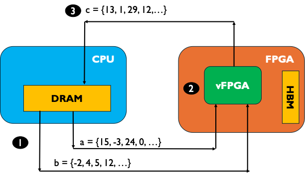
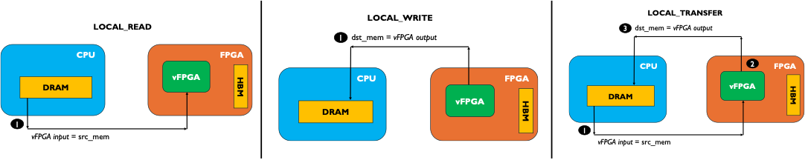

# Coyote Example 2: HLS Vector Addition
Welcome to the second Coyote example! In this example we will cover how to deploy a High-Level Synthesis (HLS) kernel to perform vector addition. As with all Coyote examples, a brief description of the core Coyote concepts covered in this example are included below.

## Table of contents
[Example Overview](#example-overview)

[Hardware Concepts](#hardware-concepts)

[Software Concepts](#software-concepts)

[Additional Information](#additional-information)

## Example overview
In this example, we cover how to deploy a simple HLS application. HLS is an FPGA programming paradigm which enables writing FPGA kernels in C/C++ with additional control over the hardware through so-called *pragmas*. In ths example, we will not cover the internals of HLS nor how to write HLS applications; for that, please refer to other online resources. 

In this example, the target application is floating-point vector additon. Similar to other Coyote examples, the input to out kernel is a 512-bit AXI stream; corresponding to 16 floating-point numbers. In the kernel, the two incoming AXI streams are read into floating-point numbers and added, in parallel, writing the final result to the outgoing AXI stream.

<div align="center">
  
</div>

## Hardware concepts
### Deploying an HLS application
Coyote will automatically synthesize and integrate HLS kernels with the rest of the shell, provided the HLS files are placed in the correct location. In this case, the top-level module of the HLS kernel is ```hls_vadd```; therefore there file: ```<hw_dir>/hls/hls_vadd/hls_vadd.cpp``` should contain a function ```hls_vadd```. Or more generally: ```<hw_dir>/hls/<hls_kernel_name>/<hls_kernel_name>.cpp```. The top-level function should appropriately define the I/O ports; in our case 2 input AXI streams and 1 output AXI stream, where ```#pragma HLS INTERFACE axis``` is used to identify the input/output as an AXI stream. Moreover, it is possible to pass other Coyote interfaces (```notify```, ```axi_ctrl``` etc.) to the kernel following the similar approach. We will cover these interfaces in other examples.

```C++
void hls_vadd (
    hls::stream<axi_s> &axi_in1,
    hls::stream<axi_s> &axi_in2,
    hls::stream<axi_s> &axi_out
) {
    #pragma HLS INTERFACE ap_ctrl_none port=return

    #pragma HLS INTERFACE axis register port=axi_in1 name=s_axi_in1
    #pragma HLS INTERFACE axis register port=axi_in2 name=s_axi_in2
    #pragma HLS INTERFACE axis register port=axi_out name=m_axi_out
    ...
}
```

To use the kernel in our top-level user logic, the syntax is:
```Verilog
hls_vadd inst_vadd(
    // First input stream from host
    .s_axi_in1_TDATA        (axis_host_recv[0].tdata),
    .s_axi_in1_TKEEP        (axis_host_recv[0].tkeep),
    .s_axi_in1_TLAST        (axis_host_recv[0].tlast),
    .s_axi_in1_TSTRB        (0),
    .s_axi_in1_TVALID       (axis_host_recv[0].tvalid),
    .s_axi_in1_TREADY       (axis_host_recv[0].tready),

    // Second input stream from host
    .s_axi_in2_TDATA        (axis_host_recv[1].tdata),
    .s_axi_in2_TKEEP        (axis_host_recv[1].tkeep),
    .s_axi_in2_TLAST        (axis_host_recv[1].tlast),
    .s_axi_in2_TSTRB        (0),
    .s_axi_in2_TVALID       (axis_host_recv[1].tvalid),
    .s_axi_in2_TREADY       (axis_host_recv[1].tready),

    // First output stream to host
    .m_axi_out_TDATA        (axis_host_send[0].tdata),
    .m_axi_out_TKEEP        (axis_host_send[0].tkeep),
    .m_axi_out_TLAST        (axis_host_send[0].tlast),
    .m_axi_out_TSTRB        (),
    .m_axi_out_TVALID       (axis_host_send[0].tvalid),
    .m_axi_out_TREADY       (axis_host_send[0].tready),

    // Clock and reset
    .ap_clk                 (aclk),
    .ap_rst_n               (aresetn)
);

// Tie off the second output interface, as it is unused
always_comb axis_host_send[1].tie_off_m();
```
Simply, it assigns all the pre-provided Coyote interfaces (```axis_host_recv```, ```axis_host_send```, covered in the previous example) to the correct HLS kernel argument. 

**IMPORTANT:** Due to partial reoncfiguration Coyote renames some the HLS kernels to include a unique ID, for e.g. ```hls_vadd_0```. However, this can sometimes cause weird bugs with ILAs. Notice how in this example, the ILA IP is called ```ila_vadd``` instead of ```ila_hls_vadd```: since Coyote iterates through the source files and looks for occurences of ```hls_vadd``` to rename them to ```hls_vadd_0``` during synthesis. This can cause ```ila_hls_vadd``` to be changed to ```ila_hls_vadd_0``` However, in the IP instantiation (```init_ip.tcl```), the ILA IP is defined as ```ila_hls_vadd``` and so the mismatch will cause synthesis errors. Therefore, whenever possible the HLS kernel name should only be contained in the HLS kernel IP and in no other IP names / instances.

### Multiple data streams and tying signals off
In the previous example, we covered how to include multiple, parallel streams for host/card memory. These are controlled by the CMake parameters: ```N_STRM_AXI``` (host) and ```N_CARD_AXI``` (card). In this example, the ```N_STRM_AXI``` parameter becomes crucial, as it enables parallel transfers of the input vector. However, setting ```N_STRM_AXI = 2```, creates two host streams for both inputs (```axis_host_recv```) and outputs (```axis_host_send```). But, in this case, the second interface is unused and therefore, needs to be tied off to avoid synthesis problems.

### Shell build flow
Compared to the previous example, we will be using the default *shell* build flow for the hardware. As explained before, Coyote consists of a static layer and a shell layer, which are linked together before the final Place-and-Route. The static layer consists of an XDMA core for communication with the host CPU as well as a few other IP blocks related to partial reconfiguration. For the same chip, the static layer always remains the same (unlike the shell, which can change based on the user requirements: number of vFPGAs, networking protocol, memory etc., but more on this in *Example 5: Shell Reconfiguration**). To enable a faster building process, we provide a pre-routed and locked static layer checkpoint which is used in the *shell* build flow (```BUILD_SHELL = 1```, ```BUILD_STATIC = 0```, ```BUILD_APP = 0```) for linking. The *shell* flow is the default as most users will never need to make changes or resynthesize the static layer. 

## Software concepts

### LOCAL_READ and LOCAL_WRITE
Notice how, compared to the previus example, we use ```LOCAL_READ``` and ```LOCAL_WRITE``` instead of ```LOCAL_TRANSFER```. This happends to the assymetric nature of data movement: there are two reads and one write. Remember, ```LOCAL_TRANSFER``` corresponds to data reading from the host/card, processing by the vFPGA and writing back to host/card; therefore one read and one write in total, which is not applicable to the HLS vector add example. 

```C++
coyote_thread->invoke(coyote::CoyoteOper::LOCAL_READ,  &sg_a);
coyote_thread->invoke(coyote::CoyoteOper::LOCAL_READ,  &sg_b);
coyote_thread->invoke(coyote::CoyoteOper::LOCAL_WRITE, &sg_c);
```

<div align="center">
  
</div>

## Additional information
### Command line parameters
- `[--size | -s] <int>` Vector size (default: 1024)