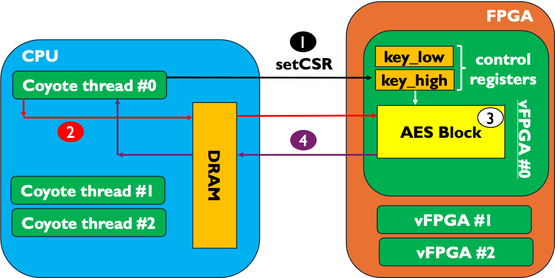
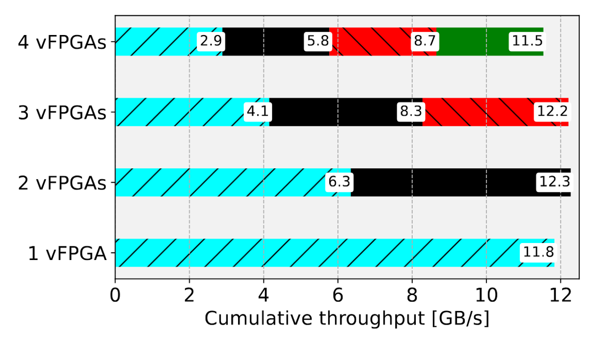

# Coyote Example 3: Multiple, Parallel AES Encryption Blocks
Welcome to the third Coyote example! In this example we will cover how to set control registers in the vFPGA from the software and also how to deploy multiple applications in parallel. As with all Coyote examples, a brief description of the core Coyote concepts covered in this example are included below.

## Table of contents
[Example Overview](#example-overview)

[Hardware Concepts](#hardware-concepts)

[Software Concepts](#software-concepts)

[Additional Information](#additional-information)

## Example overview
Advanced Encryption Standard (AES) Electronic Codeblock (ECB) is a well-known (yet simple and unsafe) algorithm for encrypting text. Due to its high parallelism and good data flow properties, implementations of AES ECB are typically memory bound. In the context of Coyote this would mean that an AES ECB block could encrypt the text at a throughput matching the PCIe data transfer speed. This makes the algorithm an interesting one to study in the context of multiple, independent users. Namely, in common data center and cloud settings, it would be detrimental if a single user would use all the memory (or network) bandwidth for their application, leaving no resources for other users. However, Coyote prevents such scenarios through a rich set of arbiters and crediters which ensuring shell resources are equally split between multiple tenants. 

To do the encryption, the hardware implementation expects an encryption key. Both of these are set from the host-side software, using only a few lines of code which propagate the changes to the vFPGA and set a control & status register (CSR). Therefore, the flow of data for this example is:
1) The encryption key is written to vFPGA registers, which can later be read during the encryption. This is done using the `axi_ctrl` interface and the `setCSR(...)` method. Note, the encryption key is 128-bits; however, Coyote registers are 64 bits (8 B); therefore we partition the key into `key_low` and `key_high`
2) Data is streamed from the host to the vFPGA, using a `LOCAL_TRANSFER`
3) The text is passed to the AES block, in chunks of 512 bits, where it's encrypted.
4) The text is written back to the host and the completion counters are updated, which the Coyote thread can poll on to ensure encryption was completed.

And of course, all of this can be performed in parallel, for each of the individual AES blocks. 
If the experiments go well, the result should look something like in the figure below: the cumulative throughput always matches the throughput of the PCIe lane; however, increasing the number of vFPGAs will show that the memory bandwidth is equally distributed among the individual applications.

<div align="center">
  
  
</div>


## Hardware concepts

### Multiple vFPGAs
To enable multiple vFPGAs (user applications), simply set the variable `N_REGIONS` in the hardware CMake configuration. In our case, it is set to 4. Then, the individual applications can be loaded using the `load_apps` macros, as shown below:

```bash
# Loads the four user applications (more on the meaning of C0 in Example 10)
# src corresponds to the folder which includes the vfpga_top.svh file and the RTL/HLS kernel
# There is absolutely no requirement that the individual applications point to different source folders.
load_apps (
    VFPGA_C0_0 "src"
    VFPGA_C0_1 "src"
    VFPGA_C0_2 "src"
    VFPGA_C0_3 "src"
)
```
**NOTE:** In this example we consider four applications of the same kind. However, the CMake configuration can be trivially modified to include more (or less) applications, each of which can represent a different workload. For example, one could deploy one application for data encryption and another one for data compression, as common off-loads to SmartNICs.

### axi_ctrl interface
`axi_ctrl` is another important Coyote interface which is available in user logic (vFPGA). Generally, it's an AXI4 Lite interface which caries control flow data from the host. Parsing the interface into some hardware registers is straight-forward and follows a typical set-up, which is briefly described below. The full code is shown `hw/src/hdl/aes_axi_ctrl_parser.sv`. First, we create a list of the control registers we want to have in hardware:

```Verilog
/////////////////////////////////////
//         REGISTER MAP           //
///////////////////////////////////

// Registers for holding the values read from/to be written to the AXI Lite interface
// These are synchronous but the outputs are combinatorial
logic [N_REGS-1:0][AXIL_DATA_BITS-1:0] ctrl_reg;

// Write, read enabled (or disabled)
logic ctrl_reg_wren, ctrl_reg_rden;

// 0 (WR)   : Low 64 bits of AES key
localparam integer KEY_LOW_REG = 0;

// 1 (WR)   : High 64 bits of AES key
localparam integer KEY_HIGH_REG = 1;
```

Then, we consider the example of writing to the registers (reads are analogous). As seen here, it's necessary to check whether certain valid signals in the `axi_ctrl` interface are asserted high and if yes, the writes can begin. Then, the address of the incoming data, which corresponds to a register ID (0, 1, 2, 3) is checked and processed. Finally, the data is written if the signal `wstrb` (byte strobe, indicating which byte is valid) is asserted high. This process is fairly standard and can be extended to any number of arbitrary registers. Later in this example, we will see how to set the registers from software.
```Verilog
/////////////////////////////////////
//         WRITE PROCESS          //
///////////////////////////////////
// Data coming in from host to the vFPGA vie PCIe and XDMA
assign ctrl_reg_wren = axi_wready && axi_ctrl.wvalid && axi_awready && axi_ctrl.awvalid;

always_ff @(posedge aclk) begin
  if (aresetn == 1'b0) begin
    ctrl_reg <= 0;
  end
  else begin
    if(ctrl_reg_wren) begin
      case (axi_awaddr[ADDR_LSB+:ADDR_MSB])
        KEY_LOW_REG:     
          for (int i = 0; i < (AXIL_DATA_BITS/8); i++) begin
            if(axi_ctrl.wstrb[i]) begin
              ctrl_reg[KEY_LOW_REG][(i*8)+:8] <= axi_ctrl.wdata[(i*8)+:8];
            end
          end
        KEY_HIGH_REG:   
          for (int i = 0; i < (AXIL_DATA_BITS/8); i++) begin
            if(axi_ctrl.wstrb[i]) begin
              ctrl_reg[KEY_HIGH_REG][(i*8)+:8] <= axi_ctrl.wdata[(i*8)+:8];
            end
          end
        default: ;
      endcase
    end
  end
end
```

## Software concepts

### Allocating multiple Coyote threads
It's possible to have multiple Coyote threads (in software), each of which can be assigned to a specific vFPGA. An example of this is shown in the following loop:
```C++
for (unsigned int i = 0; i < n_threads; i++) {
    // Note, how all the different Coyote threads point to different vFPGAs (i), hence multi-tenancy
    coyote_threads.emplace_back(new coyote::cThread<std::any>(i, getpid()));
}
```

**NOTE:** In this example, rather than creating an instance of the Coyote class, we are creating a unique pointer to it. Both approaches are valid and whether to use a `unique_ptr` or an instance of the class is a matter of personal preference.

### Setting registers
Once the `axi_ctrl` has been correctly implemented in the vFPGA logic, it can easily be set from the user software, using the method:
```C++
void setCSR(REGISTER, VALUE)
```

The passed values is always a 64-bit integer, since the `axi_ctrl` interface is parsed in 8 B chunks. Register values can be read using the method:
```C++
uint64_t getCSR(REGISTER)
```

## Additional information
### Command line parameters

- `[--runs  | -r] <uint>` Number of test runs (default: 50)
- `[--threads  | -t] <uint>` Number of Coyote threads to use (default: 1)
- `[--source_path  | -s] <string>` Path to file containing text to be encrypted (default: "../src/sample_text.txt")
