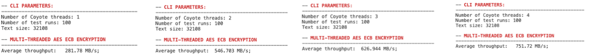

# Coyote Example 3: Multi-threaded AES encryption
Welcome to the third Coyote example! In this example we will cover how to set vFPGA control registers from software and enable the sharing of the same hardware module by multiple software threads, thus creating the illusion of multi-threading. As with all Coyote examples, a brief description of the core Coyote concepts covered in this example are included below.

## Table of contents
[Example Overview](#example-overview)

[Hardware Concepts](#hardware-concepts)

[Software Concepts](#software-concepts)

[Additional Information](#additional-information)

## Example overview
In this example, we consider a multi-threaded AES CBC encryption example. Advanced Encryption Standard (AES) Cipher Block Chaining (CBC) is a strong encryption algorithm that encrypts text in fixed-size chunks; typically 128 bits. Each chunk of text is OR'ed with the previous output before being encrypted, creating a loop dependency which limits performance scaling. Specifically, the output at time t is given by: ```output[t] = AES(input[t] XOR output[t-1]), for t = 0, output[0] = iv```, where IV is the initialization vector, which acts as the stand-in first output and is provided by the user. The hardware implementation of AES has 10 pipeline stages which would lend itself to achieve high throughput, if there were no data dependencies between the output and input. However, while part of the first text is going through the pipeline stages of the AES block, it would be perfectly feasible to pass a chunk from a second, completely unrelated, text to the same AES block. This way, there are no loop dependencies being broken, while peformance improves. An example of this is depicted in the figure below:

<div align="center">
  
    <p>Image source: Abstractions for Modern Heterogeneous Systems (2024), Dario Korlija, p. 210</p>
</div>

Alongside the IV, AES CBC requires an encryption key. Both of these are set from the host-side software, using only a few lines of code which propagate the changes to the vFPGA. Therefore, the flow of this example is:
1) The encryption key and IV are written to vFPGA registers, which can later be read during the encryption. This is done using the ```axi_ctrl``` interface and the ```setCSR(...)``` method. Note, the encryption key is 128-bits; however, Coyote registers are 64 bits (8 B); therefore we partition the key into ```key_low``` and ```key_high```. The same applies to the IV.
2) Data is streamed from the host to the vFPGA, using a ```LOCAL_TRANSFER```, where it's OR'ed with the previous output. Recall, from the previous example, it's possible to have multiple data interfaces from the host, controlled by the parameter ```N_STRM_AXI```. In this example, we set ```N_STRM_AXI``` to 4, and make sure the i-th Coyote thread uses the i-th data stream. This way, we enable multiple, parallel data transfers.
3) Since multiple Coyote threads want to encrypt their own text, it's necessary to arbitrate the requests to the single AES block. We can do this by using a Coyote provided Round Robin arbiter module, ```axisr_arbiter```.
4) Once passed through the arbiter, one chunk of 128-bit long text is passed to the AES block, where it`s encrypted.
5) The output is de-multiplexed, essentially performing an operation reverse to the arbiter and connected to the correct host stream, ```axis_host_send[i]```.
6) The completion counters are updated, which the Coyote thread can poll on to ensure encryption was completed.

<div align="center">
  
</div>


**IMPORTANT:** In this example, we are treating the AES hardware block as a black box, which provides some encryption functionality. The only hardware modules that are relavant to Coyote and show some new concepts are hw/src/vfpga_top.svh and hw/src/hdl/aes_axi_ctrl_parser.sv. The other files are encryption logic and can be safely ignored.

**IMPORTANT:** In this example, there is a sample text file which gets envrypted. It can be found inside the src folder. To make sure the relative path isn't broken, please execute the software from the build folder, by doing:
```bash
bin/test -t <nmumber-of-threads>
```
Alternatively, one can provide their own sample text to be encrypted.

## Hardware concepts
### axi_ctrl interfaces
```axi_ctrl``` is another important Coyote interface which is available in user logic (vFPGA). Generally, it's an AXI4 Lite interface which caries control flow data from the host. Parsing the interface into some hardware reigsters is straight-forward and follows a typical set-up, which is briefly described below. The full code is shown hw/src/hdl/aes_axi_ctrl_parser.sv. First, we create a list of the control registers we want to have in hardware:
```Verilog
/////////////////////////////////////
//         REGISTER MAP           //
///////////////////////////////////

// Registers for holding the values read from/to be written to the AXI Lite interface
// These are synchronous but the outputs are combinatorial
logic [N_REGS-1:0][AXIL_DATA_BITS-1:0] ctrl_reg;

// Write, read enabled (or disabled)
logic ctrl_reg_wren, ctrl_reg_rden;

// 0 (WR)   : Low 64 bits of AES key
localparam integer KEY_LOW_REG = 0;

// 1 (WR)   : High 64 bits of AES key
localparam integer KEY_HIGH_REG = 1;

// 2 (WR)   : Low 64 bits of initialization vector (IV)
localparam integer IV_LOW_REG = 2;

// 3 (WR)   : High 64 bits of initialization vector (IV)
localparam integer IV_HIGH_REG = 3;
```

Then, we consider the example of writing to the reigsters (reads are analogous). As seen here, it's necessary to check whether certain valid signals in the ``axi_ctrl`` interface are asserted high and if yes, the writes can begin. Then, the address of the incoming data, which corresponds to a register ID (0, 1, 2, 3) is checked and processed. Finally, the data is written if the signal ```wstrb``` (byte strobe, indicating which byte is valid) is asserted high. This process is fairly standard and can be extended to any number of arbitrary registers. Later in this example, we will see how to set the registers from software.
```Verilog
/////////////////////////////////////
//         WRITE PROCESS          //
///////////////////////////////////
// Data coming in from host to the vFPGA vie PCIe and XDMA
assign ctrl_reg_wren = axi_wready && axi_ctrl.wvalid && axi_awready && axi_ctrl.awvalid;

always_ff @(posedge aclk) begin
  if (aresetn == 1'b0) begin
    ctrl_reg <= 0;
  end
  else begin
    if(ctrl_reg_wren) begin
      case (axi_awaddr[ADDR_LSB+:ADDR_MSB])
        KEY_LOW_REG:     
          for (int i = 0; i < (AXIL_DATA_BITS/8); i++) begin
            if(axi_ctrl.wstrb[i]) begin
              ctrl_reg[KEY_LOW_REG][(i*8)+:8] <= axi_ctrl.wdata[(i*8)+:8];
            end
          end
        KEY_HIGH_REG:   
          for (int i = 0; i < (AXIL_DATA_BITS/8); i++) begin
            if(axi_ctrl.wstrb[i]) begin
              ctrl_reg[KEY_HIGH_REG][(i*8)+:8] <= axi_ctrl.wdata[(i*8)+:8];
            end
          end
        IV_LOW_REG:   
          for (int i = 0; i < (AXIL_DATA_BITS/8); i++) begin
            if(axi_ctrl.wstrb[i]) begin
              ctrl_reg[IV_LOW_REG][(i*8)+:8] <= axi_ctrl.wdata[(i*8)+:8];
            end
          end
        IV_HIGH_REG:   
          for (int i = 0; i < (AXIL_DATA_BITS/8); i++) begin
            if(axi_ctrl.wstrb[i]) begin
              ctrl_reg[IV_HIGH_REG][(i*8)+:8] <= axi_ctrl.wdata[(i*8)+:8];
            end
          end
        default: ;
      endcase
    end
  end
end
```

### Multiple host streams
In previous examples, we covered how to include multiple, parallel streams for host/card memory. These are controlled by the CMake parameters: ```N_STRM_AXI``` (host) and ```N_CARD_AXI``` (card). In this example, the ```N_STRM_AXI``` parameter becomes crucial, as it enables each Coyote thread to have its own unique thread. Throughout this example, the i-th Coyote thread uses the i-th data stream, by setting the ```dest``` flag in the SG entry (more on this below).

## Software concepts

### Setting registers
Once the ```axi_ctrl``` has been correctly implemented in the vFPGA logic, it can easily be set from the user software, using the method:
```C++
void setCSR(REGISTER, VALUE)
```

The passed values is always a 64-bit integer, since the ```axi_ctrl``` interface is parsed in 8 B chunks. Register values can be read using the method:
```C++
uint64_t getCSR(REGISTER)
```

### Allocating multiple Coyote threads
It's possible to have multiple Coyote threads (in software) assigned to the same vFPGA (in hardware). An example of this is shown in the following loop:
```C++
for (unsigned int i = 0; i < n_threads; i++) {
    // Note, how all the different Coyote threads point to the same vFPGA, hence multi-threading
    // Multiple software threads but one hardware instance (vFPGA)
    coyote_threads.emplace_back(new coyote::cThread<std::any>(DEFAULT_VFPGA_ID, getpid(), 0));
}
```

We can then ensure the i-th Coyote thread uses the i-th data stream by setting the ```dest``` field in the SG entry:
```C++
 sg.local = { 
    .src_addr = src_mem, .src_len = size, .src_dest = i,
    .dst_addr = dst_mems[i], .dst_len = size, .dst_dest = i
};
```

### Using non-Coyote allocated memory
In this example, we read memory from an external file, and for a change, don't use Coyote's internal ```getMem(...)``` function to allocate memory. Instead we use ```mmap``` to allocate hugepages, showing how Coyote can work with any generic memory buffer. Importantly, this method does not pre-populate the internal TLB; therefore, there will be a page fault when the buffers is first read (but not on subsequent reads).

## Additional information
### Command line parameters

- `[--runs  | -r] <uint>` Number of test runs (default: 100)
- `[--threads  | -t] <uint>` Number of Coyote threads to use (default: 1)
- `[--source_path  | -s] <string>` Path to file containing text to be encrypted (default: "../src/sample_text.txt")


### Expected results
The following results are expected when running encryption with varying number of threads, from 1 to 4 threads. Clearly, the performance scales from ~280 MB/s to ~740 MB/s.

<p align="middle">
  
</p>
