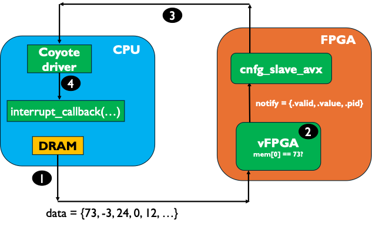

# Coyote Example 4: User Interrupts
Welcome to the fourth Coyote example! In this example we will cover how a user application (vFPGA) can issue an interrupt that can be picked up by the host application. This enables applications to take action or finish gracefully, if certain conditions on the hardware are encountered. As with all Coyote examples, a brief description of the core Coyote concepts covered in this example are included below.

## Table of contents
[Example Overview](#example-overview)

[Hardware Concepts](#hardware-concepts)

[Software Concepts](#software-concepts)

## Example overview
This example shows how a user application (vFPGA) can issue an interrupt. The interrupt is triggered when the first integer entry in the incoming AXI stream is equal to 73. Then, the interrupt is propagated from config resisters (in hardware) to the Coyote driver and finally, to the user space. From the user space, the appropriate interrupt callback function (see below) is called.

<div align="center">
  
</div>

**NOTE:** In Coyote, user interrupts are also known as *notifications*.

## Hardware concepts
### Notification interface
Each vFPGA includes a ```notify``` interface which can be used to send interrupts to the software. An interrupt is registered when ```notify.valid``` is asserted high. Moreover, the ```data``` field of the ```notify``` interface should be set correctly, including the ```pid```, corresponding to the Coyote thread ID, and the ```value```, which is propagated to the user. 

**NOTE:** Since Coyote relies on the Linux event polling mechanis, the interrupt value must be non-zero for the interrupt to be picked up by the application.

## Software concepts

### Registering an interrupt (notification) callback
When creating a ```cThread```, an optional argument representing a method which is called when a user interrupt is raised from the vFPGA. Importantly, the value of ```notify.data.pid``` must match the ```cThread``` ID. Recall from Example 1, the ID of a ```cThread``` can be obtained from the method ```getCtid()```, and normally, in Coyote the IDs of ```cThreads```start from 0 and are incremented by 1 for every new created instance. Example syntax for registering the interrupt callback:
```C++
void interrupt_callback(int value) {
    std::cout << "Hello from my interrupt callback! The interrupt received a value: " << value << std::endl;
}

std::unique_ptr<coyote::cThread<std::any>> coyote_thread(new coyote::cThread<std::any>(0, getpid(), 0, nullptr, interrupt_callback));
```

The interrupt callback method takes one argument, an integer which corresponds to the value propagated from the vFPGA via the ```notify.data.value``` signal.

### Scatter-Gather Flags (sgFlags)
In example 1, we introduced the concept of Coyote Operations, which move data and launch vFPGA kernels. Additionally, when invoking a Coyote Operation, additional flags can be passed. These are called scatter-gather flags and include:
- **last**: Whether this is the last transmission; essentially asserting ```TLAST``` in hardware; only relavant if the vFPGA logic (or any subsequent hardware blocks) rely on ```TLAST```
- **clr**: Clear the previous counter for this operation; e.g. if LOCAL_WRITE was completed 5 times before, the counter is reset to 0 before invoking the new operation.
- **poll**: Whether to poll; if ```true```, then the Coyote Operation is synchronous/blocking and program execution will not proceed before the operation is completed; otherwise it is asynchronous.