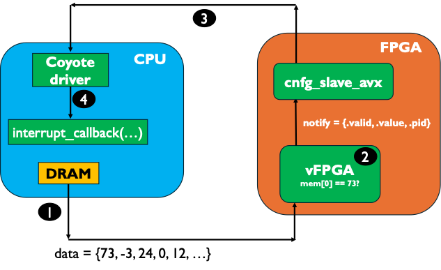

# Coyote Example 4: User Interrupts
Welcome to the fourth Coyote example! In this example we will cover how a user application (vFPGA) can issue an interrupt that can be picked up by the host application. This enables applications to take action or finish gracefully, if certain conditions on the hardware are encountered. As with all Coyote examples, a brief description of the core Coyote concepts covered in this example are included below. How to synthesize hardware, compile the examples and load the bitstream/driver is explained in the top-level example README in Coyote/examples/README.md. Please refer to that file for general Coyote guidance.

## Table of contents
[Example Overview](#example-overview)

[Hardware Concepts](#hardware-concepts)

[Software Concepts](#software-concepts)

## Example overview
This example shows how a user application (vFPGA) can issue interrupts. The vFPGA reads a buffer of notification descriptors from host memory and issues one interrupt per 512-bit descriptor: the first integer of the descriptor is the interrupt value, the second integer the Coyote thread ID (ctid) the interrupt is sent to, and the third integer enables the interrupt (non-zero). The interrupts are propagated from config resisters (in hardware) to the Coyote driver and finally, to the user space. From the user space, the appropriate interrupt callback function (see below) is called.

The software uses this to test interrupt delivery. In each round, it creates several `cThread`s, issues a burst of back-to-back interrupts to each of them, and checks that every interrupt reaches the `cThread` it was sent to exactly once and in order. The `cThread`s are destroyed after each round, so later rounds (and later runs of the program) reuse the same ctids. The number of `cThread`s, the number of interrupts per burst and the number of rounds can be set with `-t`, `-n` and `-r`.

<div align="center">
  
</div>

**NOTE:** In Coyote, user interrupts are also known as *notifications*.

## Hardware concepts
### Notification interface
Each vFPGA includes a `notify` interface which can be used to send interrupts to the software. An interrupt is registered when `notify.valid` is asserted high. Moreover, the `data` field of the `notify` interface should be set correctly, including the `pid`, corresponding to the Coyote thread ID, and the `value`, which is propagated to the user. 

**NOTE:** Since Coyote relies on the Linux event polling mechanism, the interrupt value must be non-zero for the interrupt to be picked up by the application.

## Software concepts

### Registering an interrupt (notification) callback
When creating a `cThread`, an optional argument representing a method which is called when a user interrupt is raised from the vFPGA. Importantly, the value of `notify.data.pid` must match the `cThread` ID. Recall from Example 1, the ID of a `cThread` can be obtained from the method `getCtid()`, and normally, in Coyote the IDs of `cThreads` start from 0 and are incremented by 1 for every new created instance. Example syntax for registering the interrupt callback:
```C++
void interrupt_callback(int value) {
    std::cout << "Hello from my interrupt callback! The interrupt received a value: " << value << std::endl;
}

coyote::cThread coyote_thread(DEFAULT_VFPGA_ID, getpid(), 0, interrupt_callback);
```

The interrupt callback method takes one argument, an integer which corresponds to the value propagated from the vFPGA via the `notify.data.value` signal.
