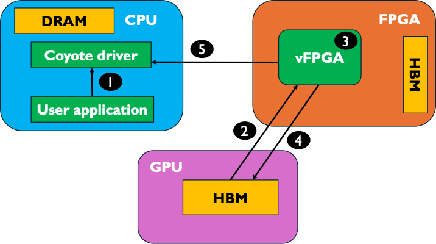

# Coyote Example 6: FPGA-GPU Peer-to-Peer Data Movement
Welcome to the sixth Coyote example! In this example we will cover how to perform direct data movement between an AMD Alveo FPGA and an AMD Instinct GPU, comletely bypassing the host (CPU) memory. As with all Coyote examples, a brief description of the core Coyote concepts covered in this example are included below.

## Table of contents
[Example overview](#example-overview)

[Hardware concepts](#hardware-concepts)

[Software concepts](#software-concepts)

[Additional information](#additional-information)

## Example overview
In this example, we cover how to move data between GPUs and FPGAs, with zero-copy. To do so, consider the following steps in the dataflow graph:
1. A user application issues a request to move data residing on the GPU to the FPGA, through for e.g., a ```LOCAL_TRANSFER``` operation
2. Since the buffer containing the GPU data has been exported via DMABuf (done during allocation), the data can be moved straight via PCIe and the XDMA core the vFPGA.
3. In the vFPGA, the data is proceesed. Recall, in example 1, the processing was quite simple: it added 1 to every integer of the incoming buffer.
4. The data is written back to the GPU, again using the notion of Linux DMABufs
5. Finally, the vFPGA issues a completion signal to the driver which can be polled from the user application.

As you will see, this example is very similar to *Example 1: Static HW Design & Data Movement Initiated by the CPU*. The only difference is the memory allocation, which we will cover below.

<div align="center">
  
</div>

## Hardware concepts
This example uses the same bitstream as the first example. Therefore, there are no new hardware concepts.

## Software concepts

### Allocating GPU memory in Coyote
To use peer-to-peer (P2P) data transfers in Coyote the GPU memory must be allocated and exported correctly. Luckily, Coyote abstracts all of the allocation, export and memory management. To allocate the memory, the syntax is:
```C++
int* mem = (int *) coyote_thread->getMem({coyote::CoyoteAlloc::GPU, size})
```

The function ```getMem()``` returns a standard pointer, and the ```CoyoteAlloc::GPU``` indicates that the memory should reside on the GPU and be exported for P2P transfers.

**IMPORTANT:** Staying consistent with standard ROCm/HIP programming paradigms, the memory is allocated on the currently selected GPU device. The GPU device can be changed used ```hipSetDevice(...)```

## Additional information

### System requirements and common pitfalls when running GPU P2P
For this example, there are a number of system and software requirements you should ensure are met. Most of these are readily available on the ETHZ HACC Boxes (hacc-box-01/02/03/04/05), which are recommended to be used for this example.
- GPU P2P is currently only supported for AMD GPUs, Instinct series. We have tested the code on AMD MI210 and MI100, but others should also work. Therefore, make sure your compute node includes an AMD Instinct GPU and a Coyote-compatible AMD Alveo card (U55C, U280, U250)
- GPU P2P works on Linux >= 6.2. While the rest of Coyote works with Linux 5, GPU P2P is built around exported DMA Buffs, which were only recently added to Linux
- The AMD GPU ROCm software stack should have a version >= 6.0 and be compatible with your Linux/Ubuntu version. For more details, check the AMD ROCm installation website for the exact requirements.
- As with the rest of Coyote, hugepages must be enabled:
- The following flags should be set (this is done by default on most systems running Linux):
```bash
grep CONFIG_PCI_P2PDMA /boot/config-<linux-kernel-version>    # expected output: CONFIG_PCI_P2PDMA=y
```

```bash
grep CONFIG_DMABUF_MOVE_NOTIFY /boot/config-<linux-kernel-version> # expected output: CONFIG_DMABUF_MOVE_NOTIFY=y
```

Tips to keep in mind when compiling and running the example:
- The hardware for this example is the same as the hardware used in the first example. When programming the FPGA, please use the bitstream from the first example. 
- When compiling this example, it's important to use the correct compiler. Under the hood, Coyote uses AMD's standard GPU libraries and run-time, included in the ROCm software stack. However, when compiling code using the ROCm software stack, it's important to set the compiler to ```hipcc```, which can be achieved using (of course making sure to set it back to your default compiler for other projects):
  ```bash
  export CXX=hipcc
  ```
- Coyote software must be compiled with GPU support; to do so, run ```cmake ../ -DEN_GPU=1```
- If you are running Coyote on the ETHZ HACC, keep in mind that the Alveo U55C nodes and the HACC Boxes have different Linux kernels. Therefore, the driver must be recompiled before inserting.
- Finally, this example is targetting the MI210 GPU, by setting the variable ```AMD_GPU=gfx90a```. While the software will compile and run on other GPUs, optimal performance is acheived by setting the correct architecture for other GPUs. Therefore, if you are targeting a different GPU, make sure to run ```cmake ../ -DEN_GPU=1 -DAMD_GPU=<target architecture>```
