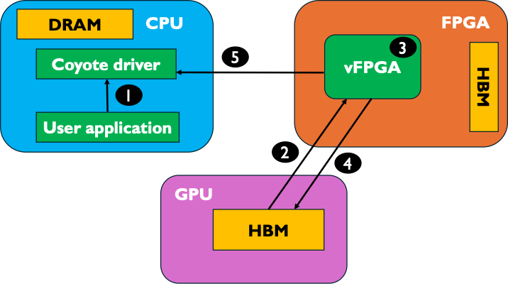

# Coyote Example 6: FPGA-GPU Peer-to-Peer Data Movement
Welcome to the sixth Coyote example! In this example we will cover how to perform direct data movement between an AMD Alveo FPGA and a GPU, completely bypassing the host (CPU) memory. Both **AMD Instinct GPUs (ROCm)** and **NVIDIA GPUs (CUDA)** are supported. As with all Coyote examples, a brief description of the core Coyote concepts covered in this example are included below. How to synthesize hardware, compile the examples and load the bitstream/driver is explained in the top-level example README in Coyote/examples/README.md. Please refer to that file for general Coyote guidance.

## Table of contents
[Example overview](#example-overview)

[Hardware concepts](#hardware-concepts)

[Software concepts](#software-concepts)

[Additional information](#additional-information)

## Example overview
In this example, we cover how to move data between GPUs and FPGAs, with zero-copy. To do so, consider the following steps in the dataflow graph:
1. A user application issues a request to move data residing on the GPU to the FPGA, through for e.g., a `LOCAL_TRANSFER` operation
2. Since the buffer containing the GPU data has been exported via DMABuf (done during allocation), the data can be moved straight via PCIe and the XDMA (UltraScale+) / QDMA (Versal) core the vFPGA.
3. In the vFPGA, the data is processed. Recall, in example 1, the processing was quite simple: it added 1 to every integer of the incoming buffer.
4. The data is written back to the GPU, again using the notion of Linux DMABufs
5. Finally, the vFPGA issues a completion signal to the driver which can be polled from the user application.

As you will see, this example is very similar to *Example 1: Hello World!*. The only difference is the memory allocation, which we will cover below.

<div align="center">
  
</div>

## Hardware concepts
This example uses the same bitstream as the first example. Therefore, there are no new hardware concepts.

## Software concepts

### Allocating GPU memory in Coyote
To use peer-to-peer (P2P) data transfers in Coyote the GPU memory must be allocated and exported correctly. Luckily, Coyote abstracts all of the allocation, export and memory management. To allocate the memory, the syntax is:
```C++
int* mem = (int *) coyote_thread.getMem({coyote::CoyoteAllocType::GPU, size})
```

The function `getMem()` returns a standard pointer, and the `CoyoteAllocType::GPU` indicates that the memory should reside on the GPU and be exported for P2P transfers.

**IMPORTANT:** The memory is allocated on the currently selected GPU device. For ROCm, the GPU device is selected with `hipSetDevice(...)`; for CUDA, with `cudaSetDevice(...)`.

## Additional information

### System requirements and common pitfalls when running GPU P2P
For this example, there are a number of system and software requirements you should ensure are met. Most of these are readily available on the ETHZ HACC Boxes (hacc-box-01/02/03/04/05), which are recommended to be used for this example.
- GPU P2P requires a Coyote-compatible AMD Alveo card (V80, U55C, U250, U280) and either an AMD Instinct GPU (tested on MI100 and MI210) with ROCm >= 6.0, or an NVIDIA GPU with CUDA >= 12.2 with the open-source driver installed, supporting `CU_MEM_RANGE_HANDLE_TYPE_DMA_BUF_FD`
- GPU P2P works on Linux >= 6.2. While the rest of Coyote works with Linux 5, GPU P2P is built around exported DMA Buffs, which were only recently added to Linux
- The following flags should be set (this is done by default on most systems running Linux):
```bash
grep CONFIG_PCI_P2PDMA /boot/config-<linux-kernel-version>    # expected output: CONFIG_PCI_P2PDMA=y
```

```bash
grep CONFIG_DMABUF_MOVE_NOTIFY /boot/config-<linux-kernel-version> # expected output: CONFIG_DMABUF_MOVE_NOTIFY=y
```

Tips to keep in mind when compiling and running the example:
- The hardware for this example is the same as the hardware used in the first example. When programming the FPGA, please use the bitstream from the first example.
- The source file is selected automatically based on the build flag: `src/rocm/main.cpp` for ROCm, `src/cuda/main.cpp` for CUDA.

**AMD (ROCm):**
- ROCm code must be compiled with `hipcc`. Set the compiler before invoking CMake:
  ```bash
  export CXX=hipcc
  cmake ../ -DEN_ROCM=1
  ```
- If you are targeting a specific GPU architecture for optimal performance, pass the target architecture to `hipcc` via `HIPFLAGS` (e.g., `gfx90a` for MI210).

**NVIDIA (CUDA):**
- Build with:
  ```bash
  cmake ../ -DEN_CUDA=1
  ```
- To target a specific GPU architecture, pass `-DCMAKE_CUDA_ARCHITECTURES=<arch>` (e.g., `86` for Ampere).

If you are running Coyote on the ETHZ HACC, keep in mind that the Alveo U55C nodes and the HACC Boxes have different Linux kernels. Therefore, the driver must be recompiled before inserting.

### Command line parameters
- `[--runs  | -r] <uint>` Number of test runs (default: 50)
- `[--min_size  | -x] <uint>` Starting (minimum) transfer size (default: 64 [B])
- `[--max_size  | -X] <uint>` Ending (maximum) transfer size (default: 4 * 1024 * 1024 [B] ~ 4 MB)
