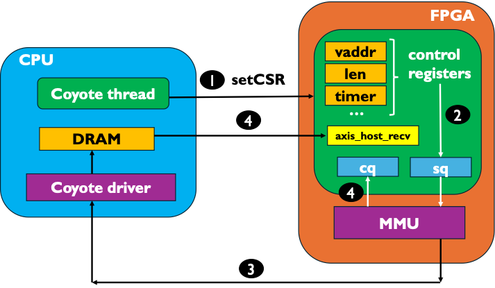
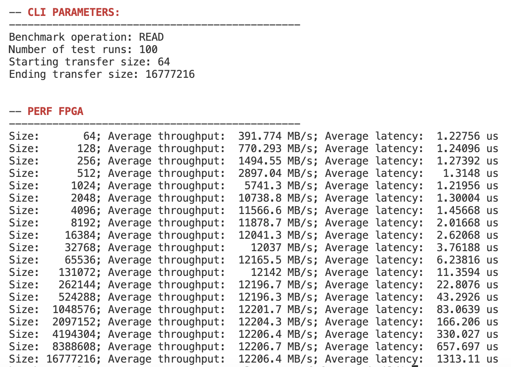
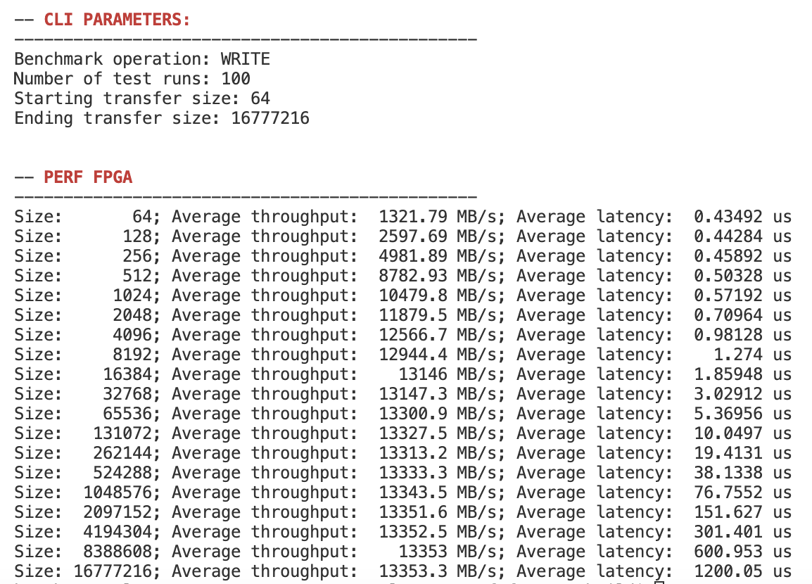

# Coyote Example 7: Data Movement Initiated by the FPGA
Welcome to the seventh Coyote example! In this example we will cover how to initiate data movement from the FPGA by using control registers. The results should (hopefully) point to the advantage the FPGA initiated transfers have over their CPU-initiated counterparts (see *Example 1: Static HW Design & Data Movement Initiated by the CPU*). As with all Coyote examples, a brief description of the core Coyote concepts covered in this example are included below.

## Table of contents
[Example Overview](#example-overview)

[Hardware Concepts](#hardware-concepts)

[Software Concepts](#software-concepts)

[Additional Information](#additional-information)

## Example overview
This example measures the throughput and latency of FPGA-initiated read and write requests. As an example, consider the process of reading from host memory, as illustrated in the figure below:
1. First, the host-side Coyote thread sets control registers in the vFPGA (for details on how control registers work in vFPGAs, see *Example 3: Multi-threaded AES encryption*). Control registers include the buffer's virtual address, buffer length (size in bytes) etc. Once the necessary registers are set, the thread sets one more register: ```BENCH_CTRL_REG```, which, when set, triggers the read process.
2. The vFPGA assigns the values from the registers to the *send queue* (```sq```) interface, which is connected with the vFPGAs MMU to initiate data transfers, both local and remote. Note, this is equivalent to a ```LOCAL_READ``` initiated from software, but with less overhead.
3. The MMU issues a request via XDMA and PCIe to the Coyote driver, requesting the target data
4. The data is written directly to the AXI Stream interface ```axis_host_recv```, bypassing the cards memory (just like in *Example 1: Static HW Design & Data Movement Initiated by the CPU*). Simultaneously, the completion queue (```cq```) interface is asserted high, indicating a data transfer is complete.

<div align="center">
  
</div>

For writes, the process is analogous (there are separate ```sq``` and ```cq``` interfaces for reads and writes).

**NOTE:** Unlike *Example 1: Static HW Design & Data Movement Initiated by the CPU*, this example doesn't work out of the box with card memory. It's possible to use both host and card memory, by adding an additional control register corresponding to the data location and the re-synthesizing the hardware with ```EN_MEM=1```.

**IMPORTANT:** On Alveo platforms completion events fired by XDMA signal only the completion within the DMA engine (weird design choice for DMA core...). This doesn't measure the time it takes to actually write the data to host memory. To measure this, writeback memory can (and should) be polled. For this reason, the results in this example will show a slightly smaller latency for write operations.

## Hardware concepts
### Send and completion queue interfaces
The last two important interfaces in Coyote are send and completion queues. In total, there are four interfaces per vFPGA:
- *send queue for reads* ```sq_rd```
- *send queue for writes* ```sq_wr```
- *completion queue for reads* ```cq_rd```
- *completion queue for writes* ```cq_wr```

The send queues are used to command data transfers from the vFPGA. As we can see in this example, they include all the neccessary fields to initiate a local or remote data transfer: ```vaddr``` (bufer virtual address), ```len``` (length), ```strm``` (stream: host or card memory), ```opcode``` (e.g. ```LOCAL_READ``` or ```REMOTE_WRITE``` etc.) and so on. For a full list of the available fields, check out the interface definiton.

The completion queues are used to indicate when a data transfer is complete. It includes similar fields, such aswhether a transfer was local or remote, the target Coyote thread ID and most importantly, a valid signal indicating a completed data transfer.

## Software concepts
There are no new software concepts covered in this example. This example is primarily built around the notion of vFPGA control registers, which have been covered in *Example 3: Multi-threaded AES encryption*. 

## Additional information
### Command line parameters
- `[--operation | -o] <bool>` Operation: READ (0) or WRITE (1) memory (default: 0)
- `[--runs  | -r] <uint>` Number of test runs (default: 100)
- `[--min_size  | -x] <uint>` Starting (minimum) transfer size (default: 64 [B])
- `[--max_size  | -X] <uint>` Ending (maximum) transfer size (default: 4 * 1024 * 1024 [B] ~ 4 MB)

### Expected results
The following results are expected for reads (left) and writes (right)

<p align="middle">
  
   
</p>