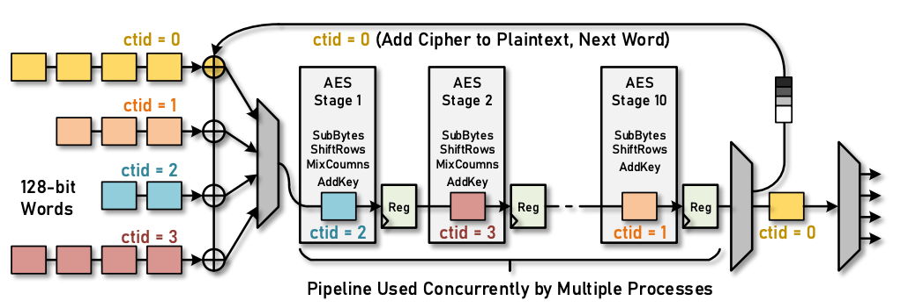
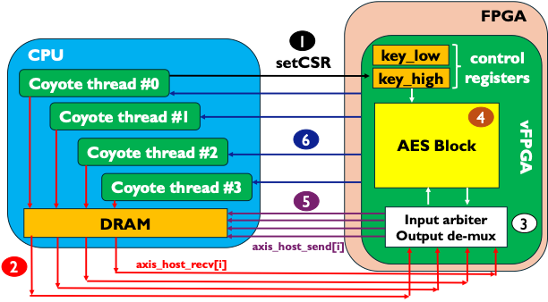

# Coyote Example 9: Multi-threaded AES encryption
Welcome to the ninth Coyote example! In this example we will cover how to enable the sharing of the same hardware module by multiple software threads, thus creating the illusion of multi-threading. As with all Coyote examples, a brief description of the core Coyote concepts covered in this example are included below. How to synthesize hardware, compile the examples and load the bitstream/driver is explained in the top-level example README in Coyote/examples/README.md. Please refer to that file for general Coyote guidance.

## Table of contents
[Example Overview](#example-overview)

[Hardware Concepts](#hardware-concepts)

[Software Concepts](#software-concepts)

[Additional Information](#additional-information)

## Example overview
In this example, we consider a multi-threaded AES CBC encryption example. While similar in nature to Example 3, in this example we focus on a different implementation of the AES encryption algorithm. Rather than focusing on multiple, parallel hardware instances like in Example 3, we focus on deploying one instance of the encryption block that can be reused by multiple users from the software, leveraging pipeline parallelism. Advanced Encryption Standard (AES) Cipher Block Chaining (CBC) is a strong encryption algorithm that encrypts text in fixed-size chunks; typically 128 bits. Each chunk of text is OR'ed with the previous output before being encrypted, creating a loop dependency which limits performance scaling. Specifically, the output at time t is given by: `output[t] = AES(input[t] XOR output[t-1]), for t = 0, output[0] = iv`, where IV is the initialization vector, which acts as the stand-in first output and is provided by the user. The hardware implementation of AES has 10 pipeline stages which would lend itself to achieve high throughput, if there were no data dependencies between the output and input. However, while part of the first text is going through the pipeline stages of the AES block, it would be perfectly feasible to pass a chunk from a second, completely unrelated, text to the same AES block. This way, there are no loop dependencies being broken, while performance improves. An example of this is depicted in the figure below:

<div align="center">
  
    <p>Image source: Abstractions for Modern Heterogeneous Systems (2024), Dario Korlija, p. 210</p>
</div>

Alongside the IV, AES CBC requires an encryption key. Both of these are set from the host-side software, using only a few lines of code which propagate the changes to the vFPGA. Therefore, the flow of this example is:
1) The encryption key and IV are written to vFPGA registers, which can later be read during the encryption. Similar to Example 3, this is done using the `axi_ctrl` interface and the `setCSR(...)` method. Note, the encryption key is 128-bits; however, Coyote registers are 64 bits (8 B); therefore we partition the key into `key_low` and `key_high`. The same applies to the IV.
2) Data is streamed from the host to the vFPGA, using a `LOCAL_TRANSFER`, where it's OR'ed with the previous output. Recall, from the previous example, it's possible to have multiple data interfaces from the host, controlled by the parameter `N_STRM_AXI`. In this example, we set `N_STRM_AXI` to 4, and make sure the i-th Coyote thread uses the i-th data stream. This way, we enable multiple, parallel data transfers.
3) Since multiple Coyote threads want to encrypt their own text, it's necessary to arbitrate the requests to the single AES block. We can do this by using a Coyote provided Round Robin arbiter module, `axisr_arbiter`.
4) Once passed through the arbiter, one chunk of 128-bit long text is passed to the AES block, where it's encrypted.
5) The output is de-multiplexed, essentially performing an operation reverse to the arbiter and connected to the correct host stream, `axis_host_send[i]`.
6) The completion counters are updated, which the Coyote thread can poll on to ensure encryption was completed.

<div align="center">
  
</div>

If the experiments go well, the result should look something like in the figure below: a single thread of execution cannot fully saturate the bandwidth of the PCIe link due to the data dependency. However, simply increasing the number of software threads can improve the overall throughput, with no overhead in hardware.
<div align="center">
  
</div>

**NOTE:** the exact numbers may vary on the exact version of Coyote you may be running, as well as the text length, target platform, clock frequency etc. However, the throughput should still scale linearly with the number if thread, as shown in the figure above.


**IMPORTANT:** In this example, we are treating the AES hardware block as a black box, which provides some encryption functionality. The only hardware modules that are relevant to Coyote and show some new concepts are `hw/src/vfpga_top.svh` and `hw/src/hdl/aes_axi_ctrl_parser.sv`. The other files are encryption logic and can be safely ignored.

**IMPORTANT:** In this example, there is a sample text file which gets encrypted. It can be found inside the `src` folder. To make sure the relative path isn't broken, please execute the software from the build folder, by doing:
```bash
./test -t <number-of-threads>
```
Alternatively, one can provide their own sample text to be encrypted.

## Hardware concepts

### Multiple host streams
In previous examples, we covered how to include multiple, parallel streams for host/card memory. These are controlled by the CMake parameters: `N_STRM_AXI` (host) and `N_CARD_AXI` (card). In this example, the `N_STRM_AXI` parameter becomes crucial, as it enables each Coyote thread to have its own unique thread. Throughout this example, the i-th Coyote thread uses the i-th data stream, by setting the `dest` flag in the SG entry (more on this below).

## Software concepts

### Allocating multiple Coyote threads
It's possible to have multiple Coyote threads (in software) assigned to the same vFPGA (in hardware). An example of this is shown in the following loop:
```C++
for (unsigned int i = 0; i < n_threads; i++) {
    // Note, how all the different Coyote threads point to the same vFPGA, hence multi-threading
    // Multiple software threads but one hardware instance (vFPGA)
    coyote_threads.emplace_back(new coyote::cThread<std::any>(DEFAULT_VFPGA_ID, getpid(), 0));
}
```

**NOTE:** In this example, rather than creating an instance of the Coyote class, we are creating a unique pointer to it. Both approaches are valid and whether to use a `unique_ptr` or an instance of the class is a matter of personal preference.

We can then ensure the i-th Coyote thread uses the i-th data stream by setting the `dest` field in the SG entry:
```C++
coyote::localSg src_sg = { .addr = src_mems[i], .len = size, .dest = i };
coyote::localSg dst_sg = { .addr = dst_mems[i], .len = size, .dest = i };
```

## Additional information
### Command line parameters

- `[--runs  | -r] <uint>` Number of test runs (default: 50)
- `[--threads  | -t] <uint>` Number of Coyote threads to use (default: 1)
- `[--source_path  | -s] <string>` Path to file containing text to be encrypted (default: "../src/sample_text.txt")
