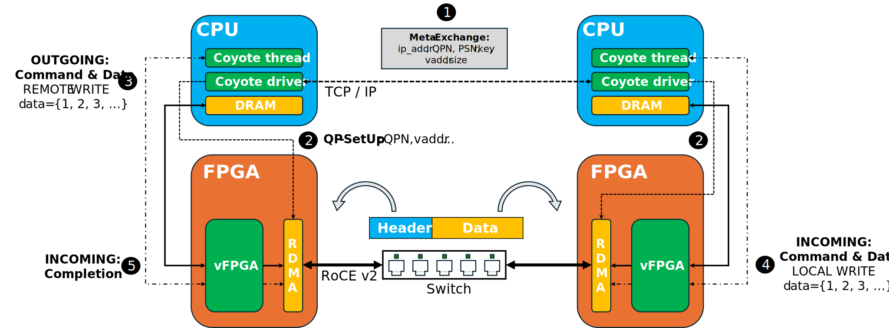
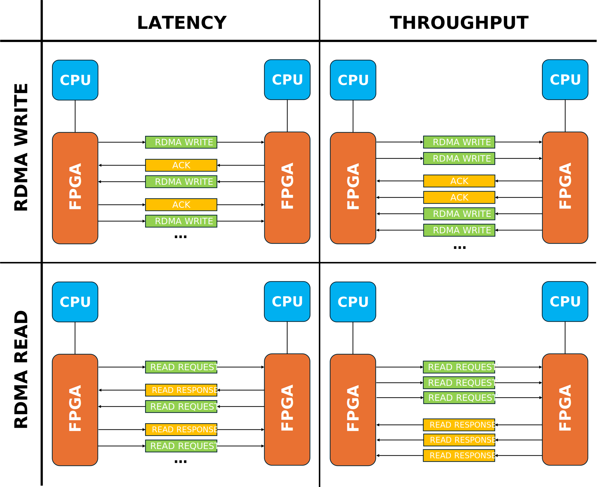

# Coyote Example 8: Using the FPGA as a SmartNIC for Remote Direct Memory Access
Welcome to the eigth Coyote example! If you've made it to this point, you've already learnt all essential concepts of FPGA-CPU-interaction for data movement and control flow. Thus, we're adding a new component by demonstrating how Coyote can be used to turn the FPGA in a SmartNIC for 100G RDMA-over-Converged-Ethernet (RoCE v2), allowing for efficient high-performance data exchange between remote processing nodes and FPGA-offloaded preprocessing of the data streams. As with all Coyote examples, a brief description of the core Coyote concepts covered in this example is included below. 

##### Table of Contents 
[RDMA Overview](#rdma-overview)

[Example Overview](#example-overview)

[Hardware Concepts](#hardware-concepts)

[Software Concepts](#software-concepts)

[Additional Information](#additional-information)

## RDMA Overview
Remote Direct Memory Access via Converged Ethernet (RoCE v2) is a high-performance networking protocol originally developed for High-Performance Computing. It aims to combine high throughput, low latency and low CPU-utilization by offloading the network stack and direct memory access to the Network Interface Card (NIC), thus grounding its performance claims on host-bypassing and zero-copy: Applications running on the host CPUs directly expose memory buffers for DMA to the NIC, so that data can be exchanged without including the host CPU or the OS running on it. In this example, we demonstrate how Coyote can be configured to use the FPGA in the role of such a NIC, allowing for fully protocol-compliant RoCE v2-traffic at 100 Gbps. 
For further understanding of the RDMA-example, we need to shed some light on the intrinsics of this network standard: 
For RDMA-communication, two nodes are connected via a so-called Queue Pair, based on previously exchanged information such as respective IP-addresses, location and size of the allocated memory buffers and access keys, and comprising of the idea of queues for work commands and data. The initial exchange of 
RDMA operations are managed through so-called InfiniBand-verbs, which basically describe the form of memory transaction between the remote nodes. We have to separate between *one-sided operations* that initiate data transfers over the network without a previous request for consent, and *two-sided operations* where every data transaction is preceeded by an additional exchange between the communicating nodes. Coyote implements the two one-sided RDMA-operations: 
- ```RDMA WRITE```: One node writes data of certain length to a remote buffer in the other node. Every sent WRITE-packet has to be explicitly acked by the receiving node. 
- ```RDMA READ```: One node requests to read data of certain length from a remote buffer in the other node. The READ-REQUEST-packet is implicitly ACK'ed when the remote node sends back RDMA-RESPONSE-packets with the requested data. 

**IMPORTANT TERMINOLOGY:**
To have a better understanding of the code-example and the following descriptions, a short overview of the RDMA-specific terminology is very helpful: 
- *QPN*: Queue Pair Number. Identifies a RDMA-connection between two remote nodes. 
- *vaddr*: Virtual Address of the remote exposed buffer. For setting up a Queue Pair, a node has to share the vaddr of its exposed buffer with the remote node. 
- *rkey*: Remote key for accessing the exposed buffer of the remote node. The rkey is communicated alongside the vaddr as a form of access control. 
- *PSN*: Packet Sequence Number used to organize and structure a communication flow between remote RDMA-nodes. Normally, PSN-sequencing is handled by the FPGA-offloaded network stack and thus not visible to the user. However, following the PSN-order is very helpful for debugging RDMA-networks. The initial PSN is agreed upon between the remote nodes as part of the initialization of the QP. 
- *MTU*: Maximum Transmission Unit, defines the maximum size of a packet. Since RDMA operates on the notion of buffer-transmission, the length of the data to be transmitted determines the number of MTU-sized packets that are required for the operation. While the MTU is a compile-time parameter in Coyote, the default-size is 4k. This means that a ```RDMA WRITE``` of a buffer of up to 4k size results in a single packet with ```RDMA WRITE ONLY``` opcode, while a buffer of 8k size would be transmitted in two packets, one carrying ```RDMA WRITE FIRST```, the other with ```RDMA WRITE LAST```. For even longer buffers, an arbitrary number of ```RDMA WRITE MIDDLE``` packets is inserted in the exchange. 

## Example Overview
This example measures throughput and latency of RDMA data exchange between two remode nodes via a 100G switched network with both ```RDMA WRITE``` and ```RDMA READ``` operations. Assuming the simpler write-functionality, we can very generally think about the process as moving of a data buffer from the host CPU to the local FPGA, where it is streamed to the FPGA-offloaded RDMA-stack and then sent via the network to the remote FPGA. There, data is received and then written to the previously specified address of the remote buffer of this remote host CPU. Different to all previous examples, this requires obviously two servers with FPGAs, which also run different SW-tasks. The active node, which initiates communication exchange, is referred to as "client", while the remote node is used as "server". An example of the dataflow is given in the figure below; and as shown in the figure, the steps are the following: 
1) *QP-Exchange*: As explained above, the RDMA-connection in form of a Queue Pair needs to be set up between the remote nodes before the actual benchmarking test can begin. Since RDMA cannot be bootstrapped, this requires out-of-band communication between the two remote CPUs via classic TCP-sockets. In the context of the HACC, we are using the 10G management network for this purpose. Using ```ifconfig```, the IP-address of the CPU determined to be the server can be evaluated and then given to the experimtn code as parameter. The two nodes follow a standardized protocol to exchange relevant start-up information such as the IP-addresses of the FPGAs in the 100G data network, the initial PSN and the address and access key of the network-exposed data buffers. 
2) *QP-Setup*: After having exchanged these essential pieces of information, both CPUs forward the aggregated QP-data to the FPGAs to create the endpoints of the RDMA-flow in the HW-offloaded network stack. This basically means making information such as target IP-address or buffer location retrievable by the QPN as essential key. 
3) *REMOTE WRITE*: In case of a WRITE-based benchmark, the client now begins with a ```REMOTE WRITE``` Coyote-operation to transmit a local buffer via the network to the remote node. For this, both data and commands traverse the RDMA-allocated vFGPA and reach the RDMA-stack on the FPGA, where RoCE v2-packets are created and then sent out via the network. 
4) *Receiving data*: In the above example, the server-FPGA receives the incoming RDMA-packets and automatically checks for correctness of the PSN-sequence and QP-specific information. If the received packet fits into the expected communication flow, it gets ACK'ed - a ```RDMA ACK``` is sent back to the client as reply. At the same time, the server FPGA sends the received data as LOCAL WRITE to the local buffer of the attached server-host CPU. 
5) *Processing ACKs & creating completions*: The client FPGA is constantly listening to the network for ACKs for its outstanding packets. If an ACK is received, the original work command for this transaction is marked as completed, which is also communicated to the local client CPU. If no ACK is received within a certain time interval after sending out a packet, a retransmission is issued. In this case, the same packet is sent again, assuming that it was originally lost in the network or not properly received by the server.  

<div align="center">
  
</div>

Generally speaking, throughput and latency tests behave vastly different, also depending on the chosen mode of operation (WRITE vs. READ). The different cases are depicted in the figure below and can be understood as following: 
- *Latency* for ```RDMA WRITE```: The client issues a single WRITE of a buffer of specified length to the remote server. Upon reception, the server ACKs and then writes back this very buffer to the client, thus creating a typical "ping-pong pattern" of communication, for which the two-way latency can be measured from sending out a buffer to receiving it back. Depending on the specified experimental arguments, this exchange is repeated for a certain number of times before the average latency of all transmissions is reported. 
- *Throughput* for ```RDMA WRITE```: The client issues *n* WRITEs (depending on specification of the argument in experiment execution) of a buffer of specified length to the remote server and waits for all required ACKs. Upon reception, the server writes back the same buffer *n* times again. 
- *Latency* for ```RDMA READ```: The client issues a single READ of a buffer of specified length from the remote server. Instead of ACK'ing the server sends the requested data via ```RDMA READ RESPONSEs```, before then requesting the same remote buffer once from the client. This again forms the typical "ping-pong pattern", which can be evaluated to get the average latency values. 
- *Throughput* for ```RDMA READ``` In this case, the client issues *n* READs (depending on specification of the argument in experiment execution) of a buffer of specified length from the remote server and waits for data delivery via ```RDMA READ RESPONSEs``` from there. The server in this case does not issue reflective READs to the client. 

<div align="center">
  
</div>

For executing all of these specified benchmarks, it's important to always start the software execution first on the server before doing the same on the client. The reason for this lies in the intrinsics of the QP-exchange: The server-software is constructed for listening to incoming TCP-connections from the client to then take the passive role in the off-channel exchange of information. 


## Hardware Concepts
The core complexity for RDMA in Coyote is hidden from the user within the network stack. The RDMA-dedicated vFPGA however is mainly used for connecting interfaces without any further user logic involved. 


## Software Concepts

## Additional Information 

### Special remarks on building Coyote for RDMA-experiments

### Command line parameters and hints on running the experiment
As said above, it's crucial to start the SW for experiments first on the node that we want to use as server, before doing the same for the client. Furthermore, it's important that the IP-address specified as argument on the client-machine belongs to the server-CPU (not the client-CPU, not the server-FPGA). The different available network interfaces can be explored with ```ifconfig```. 
The following description helps to match the relevant command line parameters to details of the experiment execution described before: 

- `[--tcpaddr | -t] <string>` IP-address of the server-CPU for out-of-band QP-exchange via TCP-sockets before the actual RDMA-experiment can begin. 
- `[--write | -w] <bool>` Decides whether the benchmark is performed for WRITE or READ operations. 
- `[--min_size | -n] <uint32_t>` Minimum size of transferred buffer in the experiment. A typical minimum size is 64 Bytes (thus *-n 64*). 
- `[--max_size | -x] <uint32_t>` Maximum size of transferred buffer in the experiment. The largest possible buffer we can currently test in the setup is 1MB (thus *-x 1048576).
- `[--reps_thr | -r] <uint32_t>` Number of throughput repetitions (i.e. how many READs / WRITEs make up the entire batch that is transmitted for throughput evaluation). 
- `[--reps_lat | -l] <uint32_t>` Numer of latency repetitions (i.e. how many READs / WRITEs are exchanged in the described ping-pong-style to evaluate the latency of the setup). 

-- Note about nstats for figuring out issues with the network transmission 