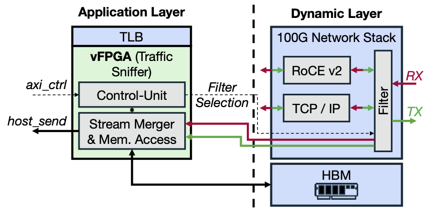
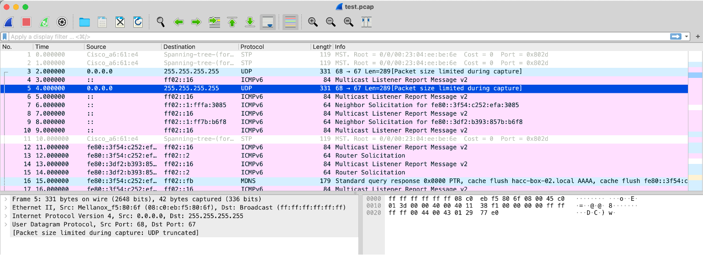

# Coyote Example 11: Packet Sniffer

This example aims to demonstrate how to enable the built-in packet filter module to build a packet sniffer and actually capture some network packets.

## Hardware

HW side includes both a vFPGA (application layer) design and corresponding logics in dynamic layer.

  

The dynamic layer contains a packet filter that is responsible for filtering the traffic based on given configuration (see [Filter Configuration](#filter-configuration) for details) and forwarding it to a designated vFPGA region. Since the filter is capable of inspecting all the incoming and outgoing traffic, instead of broadcasting to all vFPGAs, we limited the receiver to a single fixed vFPGA by a build stage CMake option.

- To enable the filter logics in dynamic layer, user needs to set the CMake option `EN_SNIFFER` to `1` when building the design.
- The vFPGA region that is allowed to see the filtered traffic is controlled by CMake option `SNIFFER_VFPGA_ID`. 

When the traffic sniffer starts, the vFPGA will pass the user-specified filter selection setting to the filter in dyanmic layer, and merge the filtered RX and TX packets into one single stream while preserving their original order. To avoid PCIe bus congestion, packets are temporarily written to onboard HBM (or DDR) memory buffer. Finally, after the sniffer stops, the onboard memory buffer will be synchronized to the host side for further processing.

## Software

SW side for examples_hw/packet_sniffer: it cooperates with the vFPGA and convert captured data into pcap file. While execution, it will show a simple prompt allowing user to start, inspect, and stop the packet sniffer.

### Parameters
#### Main Parameters
- `[--npages | -n] <uint32_t>` The number of huge pages used as packet sniffer buffer (defualt: 8).
- `[--device | -d] <uint32_t>` The ID of device (default: 0).
- `[--vfpga | -v] <uint32_t>` The ID of sniffer vFPGA (default: 0).
- `[--raw-filename | -r] <string>` Filename of raw captured data (default capture.txt).
- `[--pcap-filename | -p] <string>` Filename to save converted pcap data (default: capture.pcap).
- `[--conversion-only | -c] <bool>` Only convert previously captured data (default: false).

#### Filter Configuration
List of currently supported filter configuration.
- `[--no-ipv4] <bool>` Ignore IPv4 (defalut: false).
- `[--no-ipv6] <bool>` Ignore IPv6 (defalut: false).
- `[--no-arp] <bool>` Ignore ARP (defalut: false).
- `[--no-icmp-v4] <bool>` Ignore ICMP on IPv4 (defalut: false).
- `[--no-icmp-v6] <bool>` Ignore ICMP on IPv6 (defalut: false).
- `[--no-udp-v4] <bool>` Ignore UDP on IPv4 (defalut: false).
- `[--no-udp-payload-v4] <bool>` Ignore UDP Payload on IPv4 (defalut: false).
- `[--no-udp-v6] <bool>` Ignore UDP on IPv6 (defalut: false).
- `[--no-udp-payload-v6] <bool>` Ignore UDP Payload on IPv6 (defalut: false).
- `[--no-tcp-v4] <bool>` Ignore TCP on IPv4 (defalut: false).
- `[--no-tcp-payload-v4] <bool>` Ignore TCP Payload on IPv4 (defalut: false).
- `[--no-roce-v4] <bool>` Ignore RoCEv2 on IPv4 (defalut: false).
- `[--no-roce-payload-v4] <bool>` Ignore RoCEv2 Payload on IPv4 (defalut: false).
        
## Demonstration

Following is the result from an actual run of the packet sniffer. The sniffer was started using option `--no-udp-payload-v4 true`, so only the headers of UDP/IPv4 packets were kept (correctly recognized as "UDP truncated" in Wireshark).

  

