# Zero-In CoyoteAccelerator Milestone

This package records the first validated end-to-end `zero_in` deployment through the hls4ml `CoyoteAccelerator` backend.

## Outcome

- Built the `zero_in` hls4ml model with `backend="CoyoteAccelerator"` and `io_type="io_stream"`.
- Patched the generated AXI-stream input adapter to avoid the pathological Vitis HLS instruction explosion.
- Exported HLS IP, generated a Coyote bitstream, programmed the FPGA, and validated CPU Keras logits against FPGA logits.
- Device used: Alveo U55C on `alveo-u55c-07.inf.ethz.ch`.

Validation summary:

| Check | Result |
| --- | --- |
| Samples | 48 |
| Batch size | 16 |
| Tolerance | 0.20 logit absolute difference |
| Passed | true |
| Logit MAE | 0.049686431884765625 |
| Max absolute logit diff | 0.1455078125 |
| Prediction agreement | 0.9791666666666666 |
| Sign mismatches | 1 |
| CPU accuracy | 0.8541666666666666 |
| FPGA accuracy | 0.875 |

## Latency, Throughput, And Resources

Detailed source files:

| Data | Packaged report |
| --- | --- |
| Consolidated numbers | `results/performance_summary.json` |
| HLS top wrapper latency/resources | `results/reports/model_wrapper_csynth.rpt` |
| HLS CNN-only latency/resources | `results/reports/zero_in_coyote_accel_csynth.rpt` |
| HLS instruction count after patch | `results/reports/csynth_design_size.rpt` |
| Vivado full routed design utilization | `results/reports/shell_utilization.rpt` |
| Vivado full routed design timing | `results/reports/shell_timing_summary.rpt` |
| Vivado synthesized HLS IP utilization | `results/reports/model_wrapper_hls_ip_utilization_synth.rpt` |

HLS design estimates at 250 MHz target clock:

| Component | Latency | Interval | Notes |
| --- | ---: | ---: | --- |
| Full `model_wrapper` | 335,966 cycles / 1.344 ms | 335,967 cycles | Includes AXI input adapter, CNN, output adapter |
| `axi_stream_to_data` input adapter | 65,541 cycles / 0.262 ms | 65,540 cycles | Converts 512-bit AXI beats into scalar hls4ml stream tokens |
| `zero_in_coyote_accel` CNN | 270,416 cycles / 1.082 ms | 270,402 cycles | Dataflow region |
| `data_to_axi_stream` output adapter | 3 cycles / 12 ns | 1 cycle | Single scalar output |

HLS estimated resources, whole-device percentages:

| Component | BRAM_18K | DSP | FF | LUT | URAM |
| --- | ---: | ---: | ---: | ---: | ---: |
| Full `model_wrapper` estimate | 186 / 4% | 53 / ~0% | 136,955 / 5% | 413,895 / 31% | 0 / 0% |
| CNN-only `zero_in_coyote_accel` estimate | 185 / 4% | 53 / ~0% | 133,800 / 5% | 403,692 / 30% | 0 / 0% |
| Input adapter estimate | 0 / 0% | 0 / 0% | 2,307 / 0.09% | 9,594 / 0.74% | 0 / 0% |

The HLS report also gives SLR-local percentages. This is the tighter view: full `model_wrapper` is estimated at 95% LUT of one SLR, and CNN-only `zero_in_coyote_accel` is estimated at 92% LUT of one SLR.

Vivado implementation resources, whole-device percentages:

| Scope | LUT | FF | BRAM tile | DSP | URAM |
| --- | ---: | ---: | ---: | ---: | ---: |
| Synthesized `model_wrapper_hls_ip` | 152,844 / 11.72% | 93,281 / 3.58% | 270 / 13.39% | 1,195 / 13.24% | 11 / 1.15% |
| Full post-route `cyt_top` shell + user design | 271,321 / 20.81% | 271,832 / 10.43% | 428.5 / 21.25% | 1,195 / 13.24% | 11 / 1.15% |

Vivado post-route timing:

| WNS | TNS | Failing endpoints | Status |
| ---: | ---: | ---: | --- |
| -0.095 ns | -14.230 ns | 282 | Timing constraints are not met |

Observed FPGA runtime from the validation log:

| Batch | Batch size | Latency | Throughput |
| ---: | ---: | ---: | ---: |
| 1 | 16 | 21.636238 ms | 739.5 samples/s |
| 2 | 16 | 21.636228 ms | 739.5 samples/s |
| 3 | 16 | 21.543473 ms | 742.7 samples/s |
| Mean | 16 | 21.605313 ms | 740.5667 samples/s |

The observed per-sample latency implied by the batch timing is `21.605313 ms / 16 = 1.350332 ms/sample`, which is close to the HLS full-wrapper estimate of `1.344 ms`. The runtime measurement is the `CoyoteOverlay.predict()` timer around `coyote_lib.predict(model)` only; it excludes Python CPU inference, `set_inference_data`, `flush`, `get_inference_predictions`, validation file writes, and FPGA programming.

The patched design size report confirms the adapter issue was mitigated: after hardware transforms, `axi_stream_to_data` is 769 instructions, while the full wrapper is 97,323 instructions. Before the pragma patch, the adapter dominated the design at roughly 3.1M instructions.

## Source Baseline

| Source | Path | Revision |
| --- | --- | --- |
| Coyote / ml baseline repo | `/pub/scratch/sdeheredia/Coyote` | `d3b507d29c33136294878ab67ab77763b17962c0` on `full-dataset-ml-baseline-1d` |
| hls4ml CoyoteAccelerator checkout | `/pub/scratch/sdeheredia/hls4ml` | `d4a6a2f5bee752e5d3738f136726fea722cc65e4` on `coyote-accelerator` |
| Original CoyoteAccelerator example docs | `/pub/scratch/sdeheredia/main_Coyote/experiments/07_hls4ml` | copied snapshots in this package |

Relevant hls4ml submodules:

| Submodule | Revision |
| --- | --- |
| `example-models` | `e7a9dee394b6c1f6e0eb23178d34e55f077297fe` |
| `hls4ml/contrib/Coyote` | `292ec1521c4a9a1cc9b1335dee6b99deabb38542` |
| `hls4ml/contrib/Coyote/hw/services/network` | `9eda6ce9a55c0761ee9e66d1eba38ad5c9474aa9` |

## Pipeline

```mermaid
flowchart LR
    A["trained zero_in QKeras model<br/>model_config.json + weights"] --> B["zero_in_synth.py<br/>load model and arrays"]
    B --> C["hls4ml convert_from_keras_model<br/>CoyoteAccelerator + io_stream"]
    C --> D["generated HLS project<br/>wrapper + firmware"]
    D --> E["source patch<br/>AXI adapter loop pragmas"]
    E --> F["hls4ml compile smoke<br/>Keras CPU vs hls4ml C sim"]
    F --> G["Vitis HLS synth/export"]
    G --> H["Coyote bitstream generation"]
    H --> I["program U55C"]
    I --> J["zero_in_inference_validate.py"]
    J --> K["CPU Keras logits vs FPGA logits"]
```



## Important Files

```mermaid
flowchart TD
    R["zero_in_coyote_accel_20260510/"]
    R --> S["sources/"]
    R --> N["non_vcs_artifacts/"]
    R --> O["results/"]
    R --> M["manifest.json"]
    R --> V["verify_manifest.py"]
    S --> S1["ml_baseline/hls4ml/scripts/coyote_accelerator/<br/>build + validation scripts"]
    S --> S2["hls4ml_pr/hls4ml/backends/coyote_accelerator/<br/>backend + overlay snapshots"]
    S --> S3["generated_project/src/hls/model_wrapper/<br/>generated wrapper snapshots"]
    S --> S4["generated_project/src/hls/firmware/<br/>generated CNN + patched stream adapter"]
    S --> S5["main_Coyote/experiments/07_hls4ml/<br/>original example snapshots"]
    N --> N1["runtime_project/build/.../bitstreams/<br/>cyt_top.bit and related files"]
    N --> N2["runtime_project/build/.../cyt_sw/<br/>libCoyoteInference.so and host runtime"]
    N --> N3["model/fold_0/<br/>model JSON and weights"]
    N --> N4["prepared_inputs/<br/>x_norm.npy and labels.npy"]
    O --> O1["compile_smoke/<br/>CPU vs hls4ml compile check"]
    O --> O2["fpga_validation/<br/>CPU vs FPGA validation"]
    O --> O3["logs/<br/>build, export, bitgen, validation logs"]
```



## Artifact Paths

| Artifact | Original path | Packaged path |
| --- | --- | --- |
| Build run root | `/pub/scratch/sdeheredia/Coyote/examples/ml_baseline/hls4ml/artifacts/coyote_accelerator_zero_in_e2e/20260509_173826` | this directory |
| Bitstream | `.../20260509_173826/project/build/zero_in_coyote_accel_cyt_hw/bitstreams/cyt_top.bit` | `non_vcs_artifacts/runtime_project/build/zero_in_coyote_accel_cyt_hw/bitstreams/cyt_top.bit` |
| Host inference library | `.../20260509_173826/project/build/zero_in_coyote_accel_cyt_sw/lib/libCoyoteInference.so` | `non_vcs_artifacts/runtime_project/build/zero_in_coyote_accel_cyt_sw/lib/libCoyoteInference.so` |
| Validation summary | `.../20260509_173826/fpga_validation/validation_summary.json` | `results/fpga_validation/validation_summary.json` |
| FPGA predictions | `.../20260509_173826/fpga_validation/predictions.csv` | `results/fpga_validation/predictions.csv` |
| Prepared input array | `.../ZERO_IN_res256_layers5_W8A8_P50_RFbase_07faeca37cb7/hls_sweeps/RFbase_hls_a121fc48614f/fold_0/u55c_deployment/prepared_inputs/x_norm.npy` | `non_vcs_artifacts/prepared_inputs/x_norm.npy` |
| Labels | same prepared input directory, `labels.npy` | `non_vcs_artifacts/prepared_inputs/labels.npy` |
| Model weights | `.../ZERO_IN_res256_layers5_W8A8_P50_RFbase_07faeca37cb7/fold_0/final_weights.weights.h5` | `non_vcs_artifacts/model/fold_0/final_weights.weights.h5` |

All copied files, including ignored heavy artifacts, are listed with size and SHA-256 in `manifest.json`.

## Adapter Issue And Patch

The `zero_in` input tensor has `256 * 256 * 1 = 65536` scalar `float32` values. Coyote uses a 512-bit AXI stream, so each AXI beat carries 16 `float32` values:

```text
65536 floats / 16 floats per beat = 4096 AXI beats
```

The generated `axi_stream_to_data` adapter originally had a function-level `#pragma HLS PIPELINE` while also unrolling the inner 16-lane extraction loop. For this input size, Vitis HLS effectively expanded the adapter into a very large instruction body. The report was dominated by the adapter, with roughly 3.1M instructions.

We patched the generated `nnet_axi_utils_stream.h` to:

- remove the function-level pipeline pragma;
- add `#pragma HLS PIPELINE II=1` on the outer AXI-beat loop;
- keep the inner 16-lane loop unrolled.

The intended hardware behavior is still one 512-bit input beat per cycle after pipeline fill, while preventing full expansion of the 4096-beat loop.

Patched shape:

```cpp
for (int i = 0; i < NUM_BEATS; i++) {
    #pragma HLS PIPELINE II=1
    ap_axiu<...> axi_packet = axi_in.read();
    for (int j = 0; j < ELEMENTS_PER_AXI; j++) {
        #pragma HLS UNROLL
        ...
    }
}
```

The patched generated file snapshot is:

`sources/generated_project/src/hls/firmware/nnet_utils/nnet_axi_utils_stream.h`

The build script source that applies the patch is:

`sources/ml_baseline/hls4ml/scripts/coyote_accelerator/zero_in_synth.py`

## Runtime Data Path


The stream entering the hls4ml CNN still uses the hls4ml token type:

```cpp
typedef nnet::array<ap_fixed<16,6>, 1*1> input_t;
```

So the Coyote wrapper receives wide 512-bit AXI beats, then writes one `input_t` token per scalar pixel into the hls4ml model stream.

## Manifest Policy

Track in git:

- this report;
- `manifest.json`;
- `verify_manifest.py`;
- source snapshots under `sources/`;
- result summaries and logs under `results/`.

Do not track in git:

- `non_vcs_artifacts/runtime_project/build/.../bitstreams/`;
- `non_vcs_artifacts/runtime_project/build/.../cyt_sw/`;
- `non_vcs_artifacts/model/`;
- `non_vcs_artifacts/prepared_inputs/`.

Those ignored files are still hashed in `manifest.json` so they can be copied to a backed-up filesystem and verified later.

## Reproduce From Source

These commands assume the same machine family, Xilinx 2024.2 tools, the copied hls4ml PR checkout, and the ml_baseline repo layout used above.

```bash
set -euo pipefail

export COYOTE_ROOT=/pub/scratch/sdeheredia/Coyote
export ML_ROOT=$COYOTE_ROOT/examples/ml_baseline
export HLS4ML_PR=/pub/scratch/sdeheredia/hls4ml
export VENV=$ML_ROOT/.venv_hls4ml_coyote
export RUN_ROOT=$ML_ROOT/hls4ml/artifacts/coyote_accelerator_zero_in_e2e/$(date +%Y%m%d_%H%M%S)

cd "$HLS4ML_PR"
git submodule update --init --recursive

source "$VENV/bin/activate"
python -m pip install -e "$HLS4ML_PR"

cd /tmp
export PYTHONPATH="$HLS4ML_PR:$ML_ROOT/hls4ml/scripts/coyote_accelerator:$ML_ROOT"
python - <<PY
import runpy, sys
sys.argv = [
    "zero_in_synth.py",
    "--output-parent", "$ML_ROOT/hls4ml/artifacts/coyote_accelerator_zero_in_e2e",
    "--timestamp", "$(basename "$RUN_ROOT")",
]
runpy.run_path("$ML_ROOT/hls4ml/scripts/coyote_accelerator/zero_in_synth.py", run_name="__main__")
PY
```

The successful milestone needed a resumed export and bitstream generation after the Python build reached the generated project. The captured logs and command files are under `results/logs/`.

## Replay Validation From This Package

This uses the packaged bitstream, host library, model weights, and prepared inputs. It reprograms the local U55C and runs the same CPU-vs-FPGA comparison.

```bash
set -euo pipefail

export PKG=/pub/scratch/sdeheredia/Coyote/examples/ml_baseline/hls4ml/reproducibility/zero_in_coyote_accel_20260510
export ML_ROOT=/pub/scratch/sdeheredia/Coyote/examples/ml_baseline
export HLS4ML_PR=/pub/scratch/sdeheredia/hls4ml
export VENV=$ML_ROOT/.venv_hls4ml_coyote

source "$VENV/bin/activate"
source /tools/Xilinx/Vitis/2024.2/settings64.sh

cat > "$PKG/non_vcs_artifacts/runtime_manifest.json" <<EOF
{
  "project_dir": "$PKG/non_vcs_artifacts/runtime_project",
  "project_name": "zero_in_coyote_accel",
  "output_dir": "$PKG/replay",
  "stage": "runtime_replay"
}
EOF

cd "$PKG/non_vcs_artifacts/runtime_project/Coyote/driver"
make

cd "$PKG/non_vcs_artifacts/runtime_project/Coyote/util"
bash program_hacc_local.sh \
  "$PKG/non_vcs_artifacts/runtime_project/build/zero_in_coyote_accel_cyt_hw/bitstreams/cyt_top.bit" \
  "$PKG/non_vcs_artifacts/runtime_project/Coyote/driver/build/coyote_driver.ko"

cd /tmp
export LD_LIBRARY_PATH="$PKG/non_vcs_artifacts/runtime_project/build/zero_in_coyote_accel_cyt_sw:${LD_LIBRARY_PATH:-}"
export PYTHONPATH="$HLS4ML_PR:$PKG/sources/ml_baseline/hls4ml/scripts/coyote_accelerator:$ML_ROOT"
python - <<PY
import runpy, sys
sys.argv = [
    "zero_in_inference_validate.py",
    "--manifest", "$PKG/non_vcs_artifacts/runtime_manifest.json",
    "--config", "$PKG/sources/ml_baseline/hls4ml/configs/hls4ml_experiment/res256_layers5_W8A8_P50_RFbase.yaml",
    "--run-root", "$PKG/non_vcs_artifacts/model",
    "--input-root", "$PKG/non_vcs_artifacts/prepared_inputs",
    "--batch-size", "16",
    "--n-samples", "48",
    "--tolerance", "0.20",
]
runpy.run_path("$PKG/sources/ml_baseline/hls4ml/scripts/coyote_accelerator/zero_in_inference_validate.py", run_name="__main__")
PY
```

Verify the package hashes:

```bash
set -euo pipefail
cd /pub/scratch/sdeheredia/Coyote/examples/ml_baseline/hls4ml/reproducibility/zero_in_coyote_accel_20260510
python3 verify_manifest.py
python3 verify_manifest.py --include-non-vcs
```

The same replay flow is also captured as:

```bash
set -euo pipefail
cd /pub/scratch/sdeheredia/Coyote/examples/ml_baseline/hls4ml/reproducibility/zero_in_coyote_accel_20260510
./run_replay_validation.sh
```
