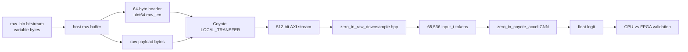
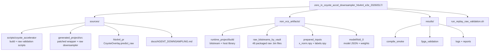

# Zero-In Raw Downsampler + hls4ml E2E Package

This package records the validated `zero_in` deployment where CoyoteAccelerator receives original raw bitstream bytes and the HLS wrapper performs downsampling before the hls4ml CNN.

## Outcome

- Built `zero_in` with `backend="CoyoteAccelerator"` and `io_type="io_stream"`.
- Added a raw-input wrapper stage before `zero_in_coyote_accel`.
- The host sends a 64-byte header beat containing little-endian `uint64 raw_len`, followed by the original raw bitstream payload.
- The FPGA downsamples/pads, inverts, normalizes, and feeds 65,536 scalar `input_t` tokens into the unchanged hls4ml CNN.
- Generated a Coyote bitstream and validated raw FPGA inference on `alveo-u55c-09.inf.ethz.ch`.

Validation summary:

| Check | Result |
| --- | ---: |
| Samples | 48 |
| Batch size | 16 |
| Tolerance | 0.20 logit absolute difference |
| Passed | true |
| Raw reference vs `x_norm.npy` max abs | 0.0 |
| Logit MAE | 0.050601959228515625 |
| Max absolute logit diff | 0.1455078125 |
| Prediction agreement | 0.9791666666666666 |
| Sign mismatches | 1 |
| CPU accuracy | 0.8541666666666666 |
| FPGA accuracy | 0.875 |

Observed FPGA runtime for raw-input validation:

| Batch | Batch size | Latency | Throughput |
| ---: | ---: | ---: | ---: |
| 1 | 16 | 62.908 ms | 254.3 samples/s |
| 2 | 16 | 62.617 ms | 255.5 samples/s |
| 3 | 16 | 64.619 ms | 247.6 samples/s |
| Mean | 16 | 63.381 ms | 252.5 samples/s |

The runtime measurement is around `CoyoteOverlay.predict_raw(...)` calling `coyote_lib.predict(model)`. It excludes CPU Keras inference, raw file loading, Python validation overhead, and FPGA programming.
The machine-readable performance summary is in `results/performance_summary.json`.

## Performance And Utilization

Headline latency:

| Metric | Value |
| --- | ---: |
| Observed mean latency | 63.381 ms / batch |
| Observed mean per sample | 3.961 ms |
| Observed mean throughput | 252.5 samples/s |
| Ideal wrapper estimate | 3.351 ms / sample |
| Raw scan estimate | 2.269 ms / sample |
| CNN HLS estimate | 1.082 ms / sample |
| Residual runtime overhead | about 9-10 ms / batch |

Headline utilization:

| Report scope | LUT | Registers | BRAM tile | URAM | DSP |
| --- | ---: | ---: | ---: | ---: | ---: |
| Synthesized user design | 12.19% | 4.03% | 14.24% | 1.15% | 13.42% |
| Full routed `cyt_top` | 20.93% | 10.51% | 21.25% | 1.15% | 13.42% |

HLS estimates show that adding the raw downsampler wrapper over the CNN costs about `+6.4k LUT`, `+4.9k FF`, `+1 BRAM`, and `+16 DSP`. The wrapper increases latency mainly because it scans the original raw bitstream; the area remains dominated by the hls4ml CNN.

Comparison against the previous prepared-input wrapper package, `../zero_in_coyote_accel_20260510`:

| Metric | Prepared-input wrapper | Raw downsampler wrapper | Change |
| --- | ---: | ---: | ---: |
| Input to FPGA | 65,536 prepared float tokens | original raw bitstream bytes | now production-like |
| Observed latency / batch | 21.605 ms | 63.381 ms | +41.776 ms, 2.93x slower |
| Observed latency / sample | 1.350 ms | 3.961 ms | +2.611 ms, 2.93x slower |
| Observed throughput | 740.6 samples/s | 252.5 samples/s | -488.1 samples/s, 0.34x |
| HLS top-wrapper estimate | 1.344 ms / sample | 3.351 ms / sample idealized | +2.007 ms, 2.49x slower |
| Input-side HLS estimate | 0.262 ms / sample | 2.269 ms / sample | +2.007 ms, 8.66x slower |
| CNN HLS estimate | 1.082 ms / sample | 1.082 ms / sample | +0.000 ms, unchanged |
| Post-route timing | not met, WNS -0.095 ns | met, WNS 0.000 ns | +0.095 ns WNS, improved |

Vivado synthesized user-design comparison:

| Resource | Prepared-input wrapper | Raw downsampler wrapper | Delta |
| --- | ---: | ---: | ---: |
| LUT | 152,844 / 11.72% | 158,972 / 12.19% | +6,128 / +0.47 pp |
| Registers | 93,281 / 3.58% | 105,010 / 4.03% | +11,729 / +0.45 pp |
| BRAM tile | 270 / 13.39% | 287 / 14.24% | +17 / +0.85 pp |
| URAM | 11 / 1.15% | 11 / 1.15% | unchanged |
| DSP | 1,195 / 13.24% | 1,211 / 13.42% | +16 / +0.18 pp |

The comparison shows the expected tradeoff: making the wrapper production-like by moving raw downsampling onto the FPGA roughly triples observed latency for these `~31-41 MB` raw bitstreams, while adding only modest device utilization. The model itself is unchanged; the difference is almost entirely the input path.

## Runtime Data Path



## Important Files



## Artifact Paths

| Artifact | Packaged path |
| --- | --- |
| Bitstream | `non_vcs_artifacts/runtime_project/build/zero_in_coyote_accel_cyt_hw/bitstreams/cyt_top.bit` |
| Host inference library | `non_vcs_artifacts/runtime_project/build/zero_in_coyote_accel_cyt_sw/lib/libCoyoteInference.so` |
| Raw validation split | `non_vcs_artifacts/raw_bitstreams_by_vault/fold_0_val.csv` |
| Raw bitstream manifest | `non_vcs_artifacts/raw_bitstreams_by_vault/raw_manifest.json` |
| Performance summary | `results/performance_summary.json` |
| Top wrapper latency deep dive | `results/top_wrapper_latency_deep_dive.md` |
| Validation summary | `results/fpga_validation/validation_summary.json` |
| FPGA predictions | `results/fpga_validation/predictions.csv` |
| Build log | `results/logs/build.log` |
| Raw FPGA validation log | `results/logs/raw_fpga_validation_20260517_205351.log` |

## Replay

From an FPGA host:

```bash
cd /pub/scratch/sdeheredia/Coyote/examples/ml_baseline/hls4ml/reproducibility/zero_in_coyote_accel_downsampler_hls4ml_e2e_20260517
./run_replay_raw_validation.sh
```

If the bitstream is already programmed and the driver is loaded:

```bash
PROGRAM=0 ./run_replay_raw_validation.sh
```

## Notes

- Heavy runtime artifacts and raw bitstreams live under `non_vcs_artifacts/` and are ignored by git.
- `manifest.json` records size and SHA-256 for all packaged files except replay outputs and the obsolete initial raw copy under `non_vcs_artifacts/raw_bitstreams/`.
- The canonical packaged raw input root is `non_vcs_artifacts/raw_bitstreams_by_vault/`.
