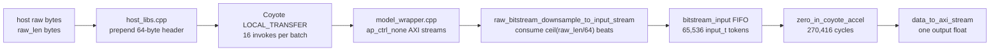

# Top Wrapper Latency Deep Dive

## Short Answer

Vitis HLS reports `model_wrapper` latency as `-` because the wrapper now consumes a runtime-sized raw bitstream. The top-level input loop trip count depends on the `raw_len` value stored in the first 64-byte header beat, so HLS cannot produce one compile-time latency number.

For our validation data, the useful estimate is:

```text
per_sample_wrapper_cycles ~= ceil(raw_len / 64) + 270416 + small constant
per_sample_wrapper_ms     ~= per_sample_wrapper_cycles * 4 ns / 1e6
```

For the 48-sample validation run, the expected FPGA-fabric work is about `52.5-55.0 ms` per 16-sample batch. The measured `CoyoteOverlay.predict_raw(...)` time is `62.6-64.6 ms`, leaving about `9-10 ms` per batch outside the ideal wrapper compute estimate.

## Relevant Code Path



Source pointers:

| Component | File |
| --- | --- |
| Top wrapper call order | `sources/generated_project/src/hls/model_wrapper/model_wrapper.cpp:20` |
| Runtime raw downsampler | `sources/generated_project/src/hls/model_wrapper/firmware/zero_in_raw_downsample.hpp:46` |
| Large raw-file loop | `sources/generated_project/src/hls/model_wrapper/firmware/zero_in_raw_downsample.hpp:112` |
| Host raw header + payload length | `sources/generated_project/src/host_libs.cpp:73` |
| Coyote batch invoke loop | `sources/generated_project/src/host_libs.cpp:53` |
| Python timing scope | `sources/hls4ml_pr/hls4ml/backends/coyote_accelerator/coyote_accelerator_overlay.py:142` |

## Why HLS Top Latency Is Variable

The top wrapper has no top-level `DATAFLOW` pragma:

```cpp
zero_in_raw::raw_bitstream_downsample_to_input_stream(data_in, bitstream_input);
zero_in_coyote_accel(bitstream_input, layer29_out);
nnet::data_to_axi_stream<...>(layer29_out, data_out);
```

That means HLS treats the top wrapper as a sequential composition:

```text
raw input/downsample stage -> CNN stage -> output stage
```

The CNN stage has a fixed reported latency:

```text
zero_in_coyote_accel = 270,416 cycles = 1.082 ms at 250 MHz
```

The raw stage does not. It reads:

```cpp
const unsigned long long num_beats =
    (raw_len + COYOTE_AXI_BYTES - 1) / COYOTE_AXI_BYTES;

for (unsigned long long beat = 0; beat < num_beats; beat++) {
    #pragma HLS PIPELINE II=1
    axi_s packet = axi_in.read();
    ...
}
```

`COYOTE_AXI_BYTES` is `512 / 8 = 64`, so the large-file path consumes one 64-byte AXI beat per cycle after pipeline fill. Since `raw_len` is only known at runtime, the loop trip count is also runtime-only.

## HLS Report Evidence

From `results/reports/model_wrapper_csynth.rpt`:

```text
model_wrapper latency: -
raw_bitstream_downsample_to_input_stream latency: -
VITIS_LOOP_112_3 latency: -, II=1, trip count -
zero_in_coyote_accel latency: 270416 cycles, interval 270402, dataflow
```

The `VITIS_LOOP_112_3` loop is the large-file raw path used by our validation samples. It has unknown trip count in HLS because its trip count is `ceil(raw_len / 64)`.

## Top Wrapper Utilization

There are two useful utilization views:

1. HLS estimates, which give the best module-level split between the raw downsampler and the CNN.
2. Vivado reports, which give the best device-level accounting after RTL synthesis and implementation.

### HLS Module Estimates

From `results/reports/model_wrapper_csynth.rpt`:

| HLS module | BRAM | DSP | FF | LUT | Notes |
| --- | ---: | ---: | ---: | ---: | --- |
| `model_wrapper` | 186 | 69 | 138,691 | 410,079 | Full HLS top wrapper |
| `zero_in_coyote_accel` | 185 | 53 | 133,800 | 403,692 | hls4ml CNN |
| `raw_bitstream_downsample_to_input_stream` | 0 | 16 | 4,043 | 5,778 | Raw byte scan + downsample + normalize |

Compared with the CNN-only HLS estimate, the raw top wrapper adds roughly:

| Added by wrapper/downsampler | BRAM | DSP | FF | LUT |
| --- | ---: | ---: | ---: | ---: |
| `model_wrapper - zero_in_coyote_accel` | +1 | +16 | +4,891 | +6,387 |

As a fraction of the HLS top:

| Component | DSP share | FF share | LUT share |
| --- | ---: | ---: | ---: |
| CNN | 76.8% | 96.5% | 98.4% |
| Raw downsampler | 23.2% | 2.9% | 1.4% |

So the top wrapper latency is dominated by raw input scanning, but the top wrapper area is still dominated by the CNN. The downsampler is small in LUT/FF terms, but it does add 16 estimated DSPs, likely from the per-token normalization path:

```cpp
token[0] = input_t::value_type((float) inverted / 255.0f);
```

If DSP pressure becomes important, this normalization is a candidate for a fixed-point multiply/shift formulation instead of float division.

### Vivado Device Utilization

From `results/reports/user_synthed_c0_0.rpt`, the synthesized user design reports:

| Resource | Used | Available | Utilization |
| --- | ---: | ---: | ---: |
| CLB LUTs | 158,972 | 1,303,680 | 12.19% |
| CLB registers | 105,010 | 2,607,360 | 4.03% |
| Block RAM tile | 287 | 2,016 | 14.24% |
| URAM | 11 | 960 | 1.15% |
| DSP | 1,211 | 9,024 | 13.42% |

From `results/reports/shell_utilization.rpt`, the full routed `cyt_top` including Coyote shell reports:

| Resource | Used | Available | Utilization |
| --- | ---: | ---: | ---: |
| CLB LUTs | 272,908 | 1,303,680 | 20.93% |
| CLB registers | 274,153 | 2,607,360 | 10.51% |
| Block RAM tile | 428.5 | 2,016 | 21.25% |
| URAM | 11 | 960 | 1.15% |
| DSP | 1,211 | 9,024 | 13.42% |

The full design is concentrated in SLR0/SLR1:

| Resource | SLR0 | SLR1 | SLR2 |
| --- | ---: | ---: | ---: |
| CLB LUTs | 213,907 | 58,985 | 16 |
| Block RAM tile | 341.5 | 87 | 0 |
| URAM | 11 | 0 | 0 |
| DSP | 1,211 | 0 | 0 |

The Vivado DSP count is much larger than the HLS DSP estimate. Treat the Vivado numbers as the source of truth for device occupancy; treat the HLS numbers as the better source for relative module attribution. HLS resource estimates are pre-RTL estimates and can differ substantially from Vivado synthesis once the generated CNN arithmetic, wrappers, and implementation choices are elaborated.

### Utilization Takeaway

The raw top wrapper increased HLS-estimated resources only modestly over the CNN:

```text
LUT:  +6.4k over ~404k CNN LUT estimate
FF:   +4.9k over ~134k CNN FF estimate
BRAM: +1 over 185 CNN BRAM estimate
DSP:  +16 over 53 CNN DSP estimate
```

The production-like raw-input path therefore hurts latency much more than area. The area-critical part remains the hls4ml CNN; the latency-critical addition is the mandatory scan of the original raw bitstream.

## Batch-Level Latency Budget

The validation used `batch_size=16`. In host code, `predict()` issues 16 Coyote `LOCAL_TRANSFER` operations and then waits for 16 completions:

```cpp
for (int i = 0 ; i < batch_size; i++) {
    coyote_thread.invoke(coyote::CoyoteOper::LOCAL_TRANSFER, src_sgs[i], dst_sgs[i]);
}
while (coyote_thread.checkCompleted(coyote::CoyoteOper::LOCAL_TRANSFER) != batch_size) {}
```

There is one synthesized `model_wrapper` instance, so the observed batch latency behaves like 16 samples queued through the same accelerator, not 16 independent CNNs running in parallel.

Assuming ideal 250 MHz fabric execution and no host/Coyote overhead:

| Batch | Raw bytes | AXI payload beats | Raw stream ms | CNN ms | Ideal wrapper ms | Observed predict ms | Residual ms |
| ---: | ---: | ---: | ---: | ---: | ---: | ---: | ---: |
| 1 | 563,878,032 | 8,810,602 | 35.242 | 17.307 | 52.549 | 62.908 | 10.359 |
| 2 | 576,725,612 | 9,011,343 | 36.045 | 17.307 | 53.352 | 62.617 | 9.265 |
| 3 | 602,356,092 | 9,411,821 | 37.647 | 17.307 | 54.954 | 64.619 | 9.665 |

The residual likely includes Coyote transfer scheduling, DMA/PCIe effects, stream backpressure, polling overhead, and any gap between operations. The current timing does not isolate those components.

## Per-Sample Interpretation

For the 48 validation samples:

```text
raw_len mean          = 36,311,661 bytes
payload beats mean    = 567,370 beats/sample
raw stream mean       = 2.269 ms/sample at II=1
CNN fixed latency     = 1.082 ms/sample
ideal wrapper mean    = 3.351 ms/sample
observed mean         = 3.961 ms/sample
```

So in the current raw-input design, the top wrapper latency is dominated by reading the original raw bitstream:

```text
raw input scan: ~68% of ideal wrapper latency
CNN:            ~32% of ideal wrapper latency
output pack:    negligible
```

## What This Means

The wrapper is not slow because of the normalized 65,536-token CNN input stream anymore. The expensive part is now scanning the original `~31-41 MB` bitstream once per sample so the FPGA can pick 65,536 downsampled bytes.

This is expected for the current production-like path: the FPGA receives the full raw bitstream, and the downsampler must inspect the stream position to select evenly spaced samples. With one 512-bit stream at 250 MHz, the theoretical raw-input bandwidth is:

```text
64 bytes/cycle * 250M cycles/s = 16 GB/s
```

A `36.3 MB` sample therefore needs about:

```text
36.3 MB / 16 GB/s ~= 2.27 ms
```

That matches the HLS loop estimate.

## Open Measurement Gap

The current measured `predict_raw` latency is not pure HLS wrapper latency. It starts before `coyote_thread.invoke(...)` calls and stops after all completions arrive. It includes the Coyote host/runtime path but excludes Python raw file loading, CPU Keras inference, raw-data copy into Coyote buffers, output copy into NumPy, and FPGA programming.

To isolate the gap, the next useful measurements would be:

1. Add timestamps inside `CoyoteInference::predict()` around the invoke loop and completion wait.
2. Run batch size 1, 2, 4, 8, 16 to see fixed overhead versus per-sample scaling.
3. Run synthetic raw buffers with controlled lengths, for example 1 MB, 8 MB, 32 MB, 64 MB.
4. Add Coyote-side counters if available for transfer start, model start, model done, and completion delivery.
