# April 15 Saved Run Summary

This summary covers only the archived selected runs preserved under `saved_runs/`:

- `cnn_medium`
- `cnn_b`
- `cnn_b_1d`

Method: ranking uses pooled **final-epoch canonical validation** metrics only. For each k-fold run, fold-level `final_canonical_val_per_sample.csv` predictions were pooled and metrics recomputed once on the combined out-of-fold set.

## Recommendations

- Best overall on pooled final metrics: **`cnn_b`** with F1 `0.9667`, MCC `0.9329`, ROC-AUC `0.9935`, and accuracy `0.9664`.
- Best conservative 2D alternative: **`cnn_medium`** with F1 `0.9474`, MCC `0.9024`, ROC-AUC `0.9915`, and accuracy `0.9496`.
- Best 1D model: **`cnn_b_1d`** with pooled final F1 `0.9177`, MCC `0.8418`, ROC-AUC `0.9742`, and accuracy `0.9202`.

## Key Plots

### `cnn_medium` final pooled evaluation

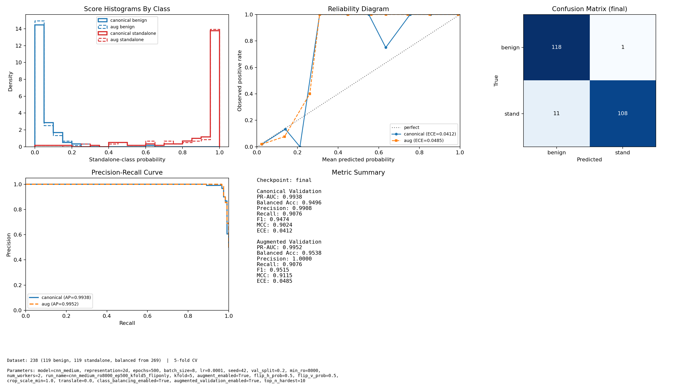

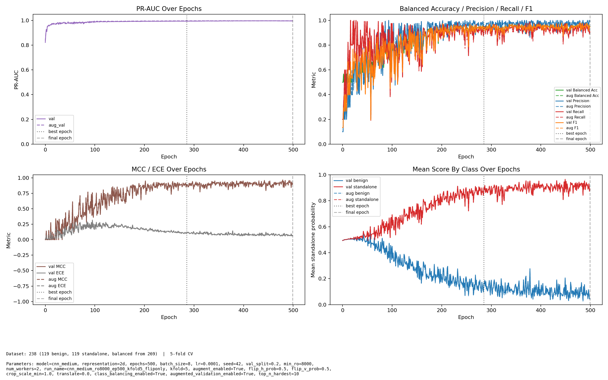

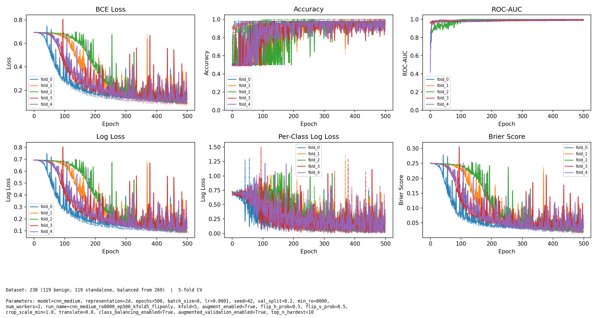

### `cnn_b` final pooled evaluation

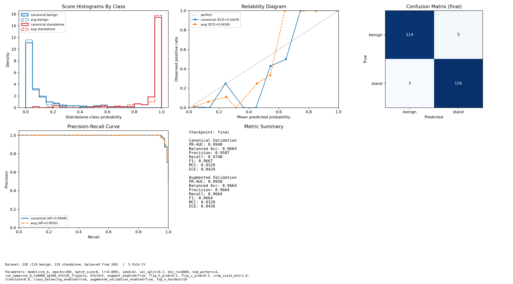

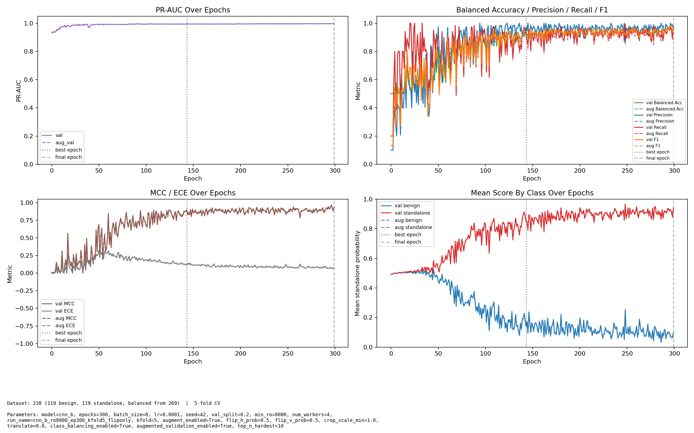

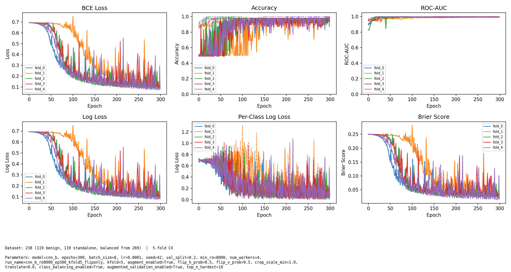

### `cnn_b_1d` final pooled evaluation

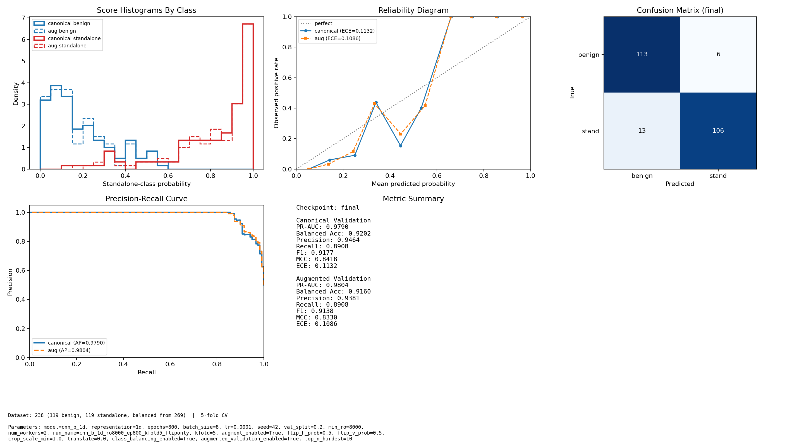

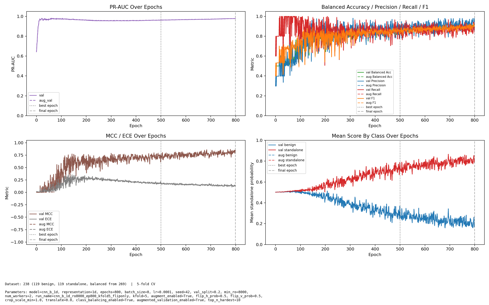

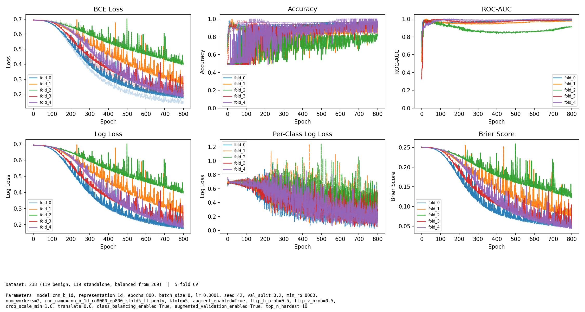

## Ranked Saved Runs

Primary ranking metric: F1.

| Rank | Model | Repr | Epochs | F1 | MCC | ROC-AUC | Acc | FN | FP | Run |
| --- | --- | --- | ---: | ---: | ---: | ---: | ---: | ---: | ---: | --- |
| 1 | **`cnn_b`** | `2d` | 300 | 0.9667 | 0.9329 | 0.9935 | 0.9664 | 3 | 5 | `20260415_021131_...` |
| 2 | `cnn_medium` | `2d` | 500 | 0.9474 | 0.9024 | 0.9915 | 0.9496 | 11 | 1 | `20260415_040251_...` |
| 3 | `cnn_b_1d` | `1d` | 800 | 0.9177 | 0.8418 | 0.9742 | 0.9202 | 13 | 6 | `20260415_045411_...` |

The full archive paths are the same run IDs under `saved_runs/`.

## Standalone Score vs RO Count

These plots use only true standalone validation samples. The y-axis is the final predicted standalone probability, the x-axis is `ro_count`, blue points are correct standalone predictions, red `x` marks are missed standalone predictions, and the black line is a rolling mean after sorting by `ro_count`.

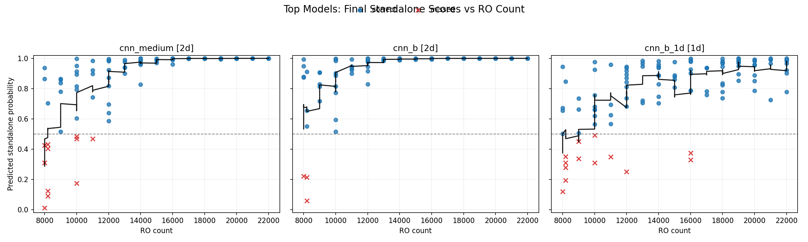

## Standalone Grad-CAM Debugging

For each model below:

- `most correctly guessed` means the true standalone validation sample with the highest final standalone probability
- `least correctly guessed` means the true standalone validation sample with the lowest final standalone probability
- `mid-confidence standalone` means the true standalone validation sample whose final standalone probability is closest to `0.75`
- the fold is shown because each sample can come from a different out-of-fold split
- only the standalone-target Grad-CAM panel is shown

### `cnn_medium` (`2d`)

Most correctly guessed standalone: `it2_S058`, `p=0.999999`, `fold_3`

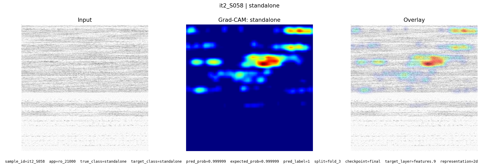

Least correctly guessed standalone: `it2_S030`, `p=0.010753`, `fold_0`

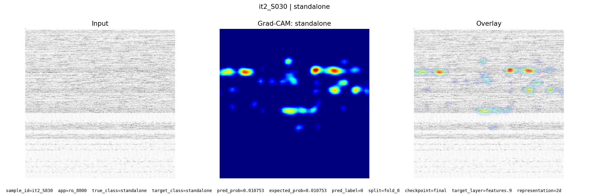

Mid-confidence standalone: `it2_S003`, `p=0.742575`, `fold_4`

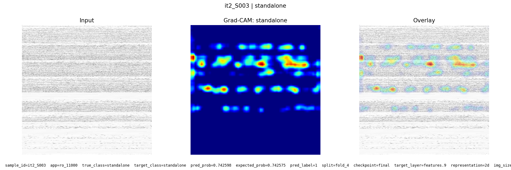

### `cnn_b` (`2d`)

Most correctly guessed standalone: `it1_S058`, `p=1.000000`, `fold_4`

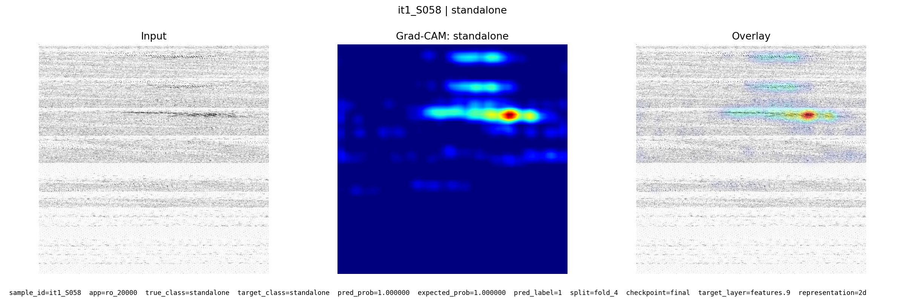

Least correctly guessed standalone: `it1_S021`, `p=0.058874`, `fold_2`

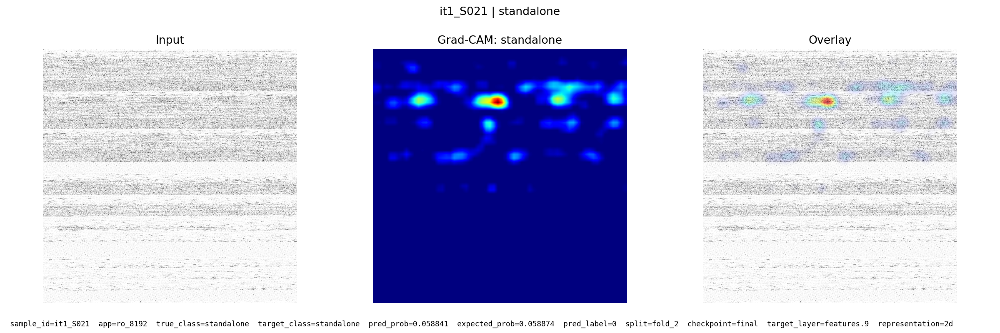

Mid-confidence standalone: `it1_S007`, `p=0.772664`, `fold_2`

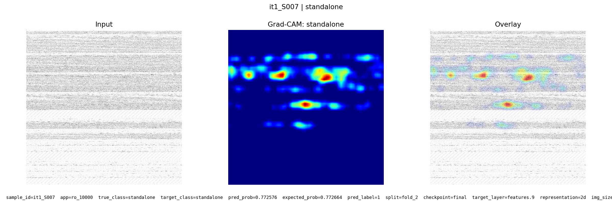

### `cnn_b_1d` (`1d`)

Most correctly guessed standalone: `it1_S027`, `p=0.999572`, `fold_0`

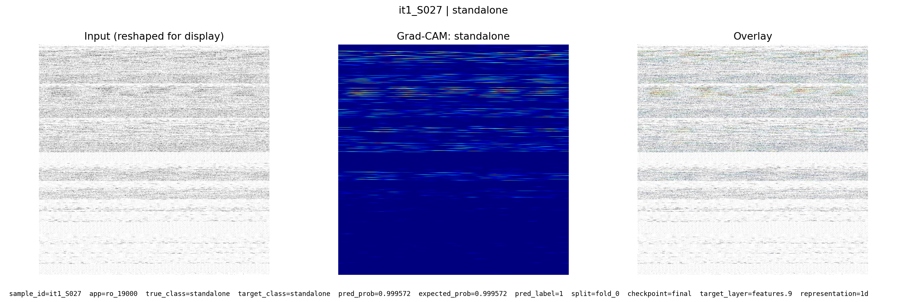

Least correctly guessed standalone: `it2_S030`, `p=0.119623`, `fold_0`

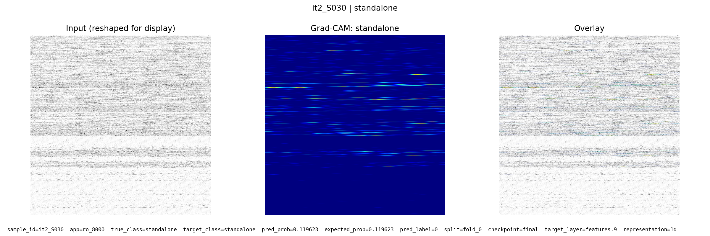

Mid-confidence standalone: `it2_S036`, `p=0.746525`, `fold_0`

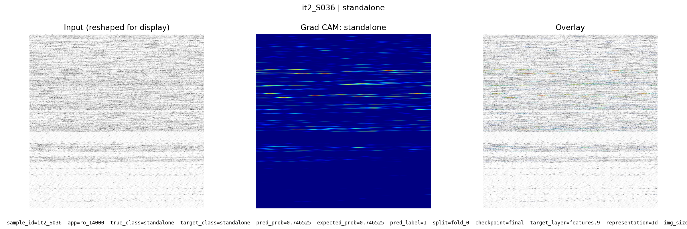

## Benign Grad-CAM Debugging

For each model below:

- `best benign` means the true benign validation sample with the lowest standalone probability
- `worst benign` means the true benign validation sample with the highest standalone probability
- `mid-confidence benign` means the true benign validation sample whose final standalone probability is closest to `0.25`
- probabilities are still reported from the standalone perspective, so high values here are the most suspicious false-positive-like benign cases
- only the standalone-target Grad-CAM panel is shown

### `cnn_medium` (`2d`)

Best benign from standalone perspective: `it2_B064`, `p=0.000258`, `fold_0`

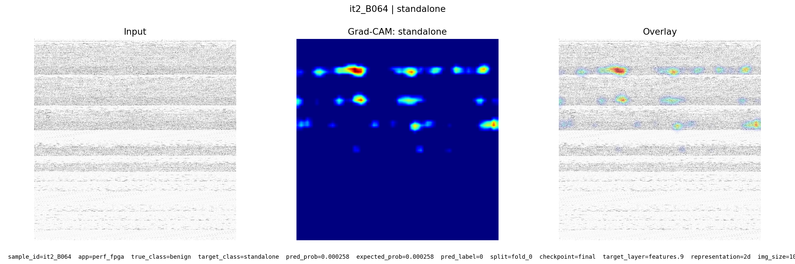

Worst benign from standalone perspective: `it2_B010`, `p=0.601554`, `fold_3`

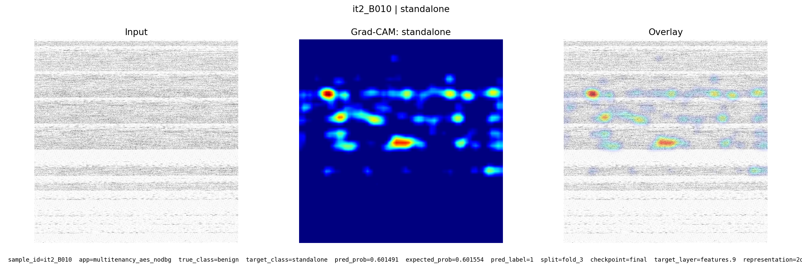

Mid-confidence benign from standalone perspective: `it2_B022`, `p=0.220760`, `fold_3`

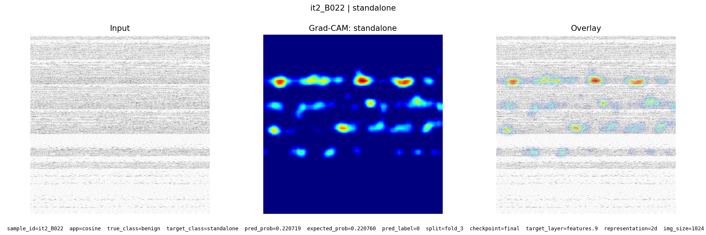

### `cnn_b` (`2d`)

Best benign from standalone perspective: `it2_B063`, `p=0.001032`, `fold_4`

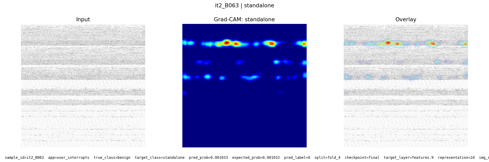

Worst benign from standalone perspective: `it1_B062`, `p=0.643051`, `fold_0`

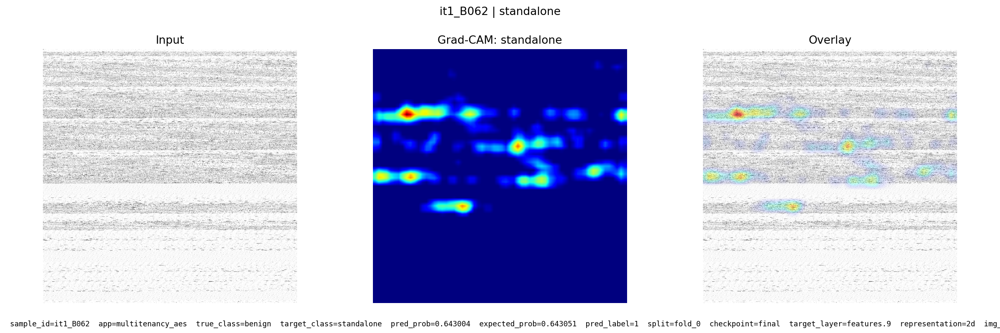

Mid-confidence benign from standalone perspective: `it2_B047`, `p=0.238108`, `fold_4`

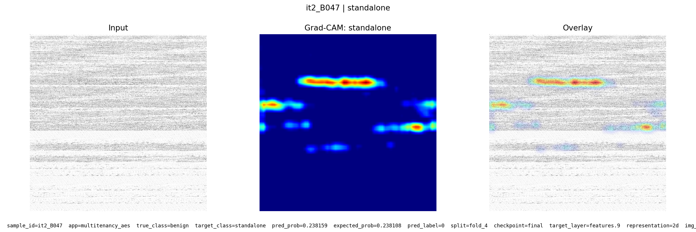

### `cnn_b_1d` (`1d`)

Best benign from standalone perspective: `it2_B063`, `p=0.006764`, `fold_4`

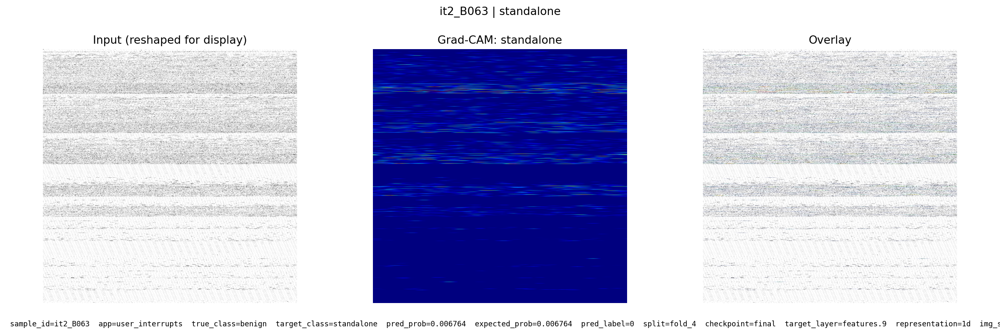

Worst benign from standalone perspective: `it2_B010`, `p=0.573042`, `fold_3`

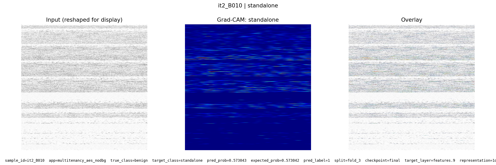

Mid-confidence benign from standalone perspective: `it2_B047`, `p=0.247896`, `fold_4`

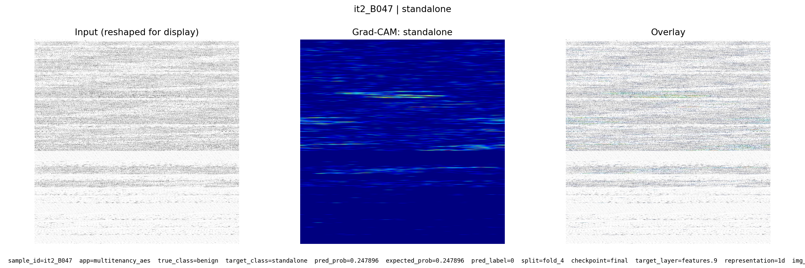

## Interpretation

- **`cnn_b` remains the strongest saved run, and the new mid-confidence examples do not change that.** The borderline standalone panels still look structured rather than random, which is consistent with the classifier separating cases by recurring banded features instead of pure noise.
- **The benign mid-confidence cases are the most informative new cases.** For `cnn_b` and `cnn_medium`, the benign samples near the decision boundary still light up the same horizontal bands and stripe-like regions that appear in the standalone panels. That makes the errors look like shared-feature ambiguity, not isolated outliers.
- **`cnn_medium` is still the conservative 2D alternative, but the new Grad-CAMs show it is not fundamentally learning a different visual story.** Its mid-confidence standalone and benign examples use the same coarse structures as `cnn_b`, just with slightly softer confidence.
- **`cnn_b_1d` stays the weakest of the three in this set.** Its mid-confidence panels are visibly more diffuse and stripy, which fits the lower pooled MCC / ROC-AUC from the ranking table above.

## Recommendation For Model Selection

- Primary pick: **`cnn_b`**
- Secondary / more conservative 2D alternative: **`cnn_medium`**
- Best 1D baseline if you want a no-2D-mapping model: **`cnn_b_1d`**
