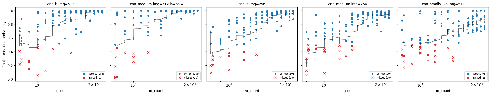

# April 19 Smaller-Model / Smaller-Input Run Summary

Generated from completed `20260419_*` run artifacts on `2026-04-19`.

This batch covers five `kfold=5`, `min_ro=8000`, flip-only, final-epoch runs probing two questions:

1. Do we lose accuracy when we shrink the input from `img=512` to `img=256`?
2. Do smaller / alternate architectures (`cnn_small512b`, plus `cnn_medium` with a higher LR) close the gap on `cnn_b @ img=512`?

Method: ranking uses **final-epoch canonical validation** metrics only. Fold-level `final_canonical_val_per_sample.csv` files were concatenated and the metrics were recomputed once on the pooled out-of-fold predictions (`n=238` per run).

Parameters shared by all five runs: `ep=300`, `batch_size=8`, `min_ro=8000`, `kfold=5`, `--augment --crop-scale-min 1.0 --translate 0.0` (flip-only), `val_split=0.2`, `seed=42`.

Per-run deltas:

| Run | Model | `img_size` | `lr` | Params |
| --- | --- | ---: | ---: | ---: |
| [`20260419_191653_...`](./20260419_191653_cnn_b_ro8000_ep300_fliponly_img512_img512_kfold5/) | `cnn_b` (`SmallCNN`) | 512 | 1e-4 | 60,545 |
| [`20260419_191657_...`](./20260419_191657_cnn_medium_ro8000_ep300_fliponly_img512_lr3e4_img512_kfold5/) | `cnn_medium` (`MediumCNN`) | 512 | **3e-4** | 34,153 |
| [`20260419_191701_...`](./20260419_191701_cnn_b_ro8000_ep300_fliponly_img256_img256_kfold5/) | `cnn_b` | **256** | 1e-4 | 60,545 |
| [`20260419_191704_...`](./20260419_191704_cnn_medium_ro8000_ep300_fliponly_img256_img256_kfold5/) | `cnn_medium` | **256** | 1e-4 | 34,153 |
| [`20260419_193120_...`](./20260419_193120_cnn_small512b_ro8000_ep300_fliponly_img512_img512_kfold5/) | `cnn_small512b` (new) | 512 | 1e-4 | **15,297** |

## Recommendations

- Best run in this batch: **`cnn_b @ img=512, ep=300`** with pooled final F1 `0.9381`, MCC `0.8869`, ROC-AUC `0.9838`. Only 1 false positive across 238 pooled samples.
- Close second: **`cnn_medium @ img=512, lr=3e-4, ep=300`** with pooled final F1 `0.9356`, MCC `0.8747`. Slightly worse F1 and MCC than `cnn_b`, but fewer false negatives (10 vs 13).
- Shrinking the input to `img=256` clearly hurts. `cnn_b @ img=256` drops to F1 `0.8945` / MCC `0.7899`; `cnn_medium @ img=256` drops further to F1 `0.8285` / MCC `0.6555`.
- The new `cnn_small512b` (15,297 params) lands at F1 `0.8276` / MCC `0.6647` — in the same bucket as `cnn_medium @ img=256`. Not competitive with the `img=512` baselines.

## Ranked Runs (Final-Epoch Pooled Validation, n=238)

| Rank | Run Label | Final F1 | Opt F1 | Final MCC | Final ROC-AUC | Final PR-AUC | Final Acc | Opt Acc | Final BCE | FN | FP |
| --- | --- | ---: | ---: | ---: | ---: | ---: | ---: | ---: | ---: | ---: | ---: |
| 1 | `cnn_b @ img=512` | **0.9381** | 0.9432 | **0.8869** | 0.9838 | 0.9864 | 0.9412 | 0.9454 | 0.1844 | 13 | 1 |
| 2 | `cnn_medium @ img=512, lr=3e-4` | 0.9356 | 0.9391 | 0.8747 | 0.9775 | 0.9825 | 0.9370 | 0.9412 | 0.1765 | 10 | 5 |
| 3 | `cnn_b @ img=256` | 0.8945 | 0.8945 | 0.7899 | 0.9518 | 0.9524 | 0.8950 | 0.8950 | 0.2904 | 13 | 12 |
| 4 | `cnn_medium @ img=256` | 0.8285 | 0.8453 | 0.6555 | 0.9212 | 0.9246 | 0.8277 | 0.8445 | 0.3600 | 20 | 21 |
| 5 | `cnn_small512b @ img=512` | 0.8276 | 0.8376 | 0.6647 | 0.9229 | 0.9327 | 0.8319 | 0.8445 | 0.3790 | 23 | 17 |

## Key Plots

### `cnn_b @ img=512` final pooled evaluation

### `cnn_medium @ img=512, lr=3e-4` final pooled evaluation

### `cnn_b @ img=256` final pooled evaluation

### `cnn_medium @ img=256` final pooled evaluation

### `cnn_small512b @ img=512` final pooled evaluation

## Standalone Score vs RO Count

This plot uses only true standalone validation samples, pooled across folds, for each of the five runs. The y-axis is the final predicted standalone probability, the x-axis is `ro_count` (log scale), blue points are correct standalone predictions, red `x` marks are missed standalone predictions, and the black line is a rolling mean after sorting by `ro_count`.

Underlying pooled data:

- [standalone_score_vs_ro_count.csv](./20260419_run_summary_assets/standalone_score_vs_ro_count.csv)

## Standalone Grad-CAM Debugging

For each run below:

- `most correctly guessed` means the true standalone validation sample with the highest final standalone probability
- `least correctly guessed` means the true standalone validation sample with the lowest final standalone probability
- `mid-confidence standalone` means the true standalone validation sample whose final standalone probability is closest to `0.75`
- the fold is shown because each sample can come from a different out-of-fold split
- only the standalone-target Grad-CAM panel is shown

Grad-CAM panels are only generated for the top-F1 runs: the two `img=512` finalists and the best `img=256` run (`cnn_b @ img=256`). The weaker `cnn_medium @ img=256` and `cnn_small512b @ img=512` runs did not qualify as "good" (MCC < 0.7, F1 < 0.83) and are omitted here.

### `cnn_b @ img=512`

Most correctly guessed standalone: `it2_S013`, `p=0.999951`, `fold_0`

Least correctly guessed standalone: `it2_S032`, `p=0.053513`, `fold_1`

Mid-confidence standalone: `it2_S000`, `p=0.743299`, `fold_3`

### `cnn_medium @ img=512, lr=3e-4`

Most correctly guessed standalone: `it1_S059`, `p=1.000000`, `fold_1`

Least correctly guessed standalone: `it2_S015`, `p=0.019150`, `fold_0`

Mid-confidence standalone: `it1_S038`, `p=0.751321`, `fold_3`

### `cnn_b @ img=256`

Most correctly guessed standalone: `it2_S074`, `p=0.998511`, `fold_4`

Least correctly guessed standalone: `it2_S045`, `p=0.087085`, `fold_0`

Mid-confidence standalone: `it2_S064`, `p=0.750088`, `fold_0`

## Benign Grad-CAM Debugging

For each run below:

- `best benign` means the true benign validation sample with the lowest standalone probability
- `worst benign` means the true benign validation sample with the highest standalone probability
- `mid-confidence benign` means the true benign validation sample whose final standalone probability is closest to `0.25`
- probabilities are still reported from the standalone perspective, so high values here are the most suspicious false-positive-like benign cases
- only the standalone-target Grad-CAM panel is shown

### `cnn_b @ img=512`

Best benign from standalone perspective: `it2_B072`, `p=0.002914`, `fold_2`

Worst benign from standalone perspective: `it1_B019`, `p=0.528651`, `fold_0`

Mid-confidence benign from standalone perspective: `it2_B052`, `p=0.249706`, `fold_0`

### `cnn_medium @ img=512, lr=3e-4`

Best benign from standalone perspective: `it2_B006`, `p=0.000857`, `fold_0`

Worst benign from standalone perspective: `it1_B047`, `p=0.919141`, `fold_2`

Mid-confidence benign from standalone perspective: `it1_B042`, `p=0.254325`, `fold_2`

### `cnn_b @ img=256`

Best benign from standalone perspective: `it1_B056`, `p=0.004298`, `fold_1`

Worst benign from standalone perspective: `it2_B025`, `p=0.917525`, `fold_4`

Mid-confidence benign from standalone perspective: `it1_B066`, `p=0.252231`, `fold_0`

## Interpretation

- **`cnn_b @ img=512` remains the strongest configuration in this batch.** It achieves the best MCC (`0.8869`) and the best F1 (`0.9381`), with only 1 false positive across the 238-sample pooled validation. Extending training from 150→300 epochs gave a small but real improvement in decision sharpness (FN=13, FP=1).
- **`cnn_medium @ img=512` with `lr=3e-4` is a real alternative**, but not an improvement. The higher LR does not beat `cnn_b`; it trades 8 FP+FN splits differently (10 FN / 5 FP vs 13 FN / 1 FP) but lands slightly behind on both F1 and MCC. Useful if recall on the standalone class matters more than precision on benign.
- **`img=256` is a clear regression.** Halving the input drops `cnn_b` by ~0.10 MCC and `cnn_medium` by ~0.22 MCC. `cnn_medium` is more sensitive to input resolution than `cnn_b` at this scale. At `img=256`, `cnn_b` is noticeably better than `cnn_medium`, which reverses part of the `img=512` behaviour.
- **`cnn_small512b` (15,297 params) does not beat the existing smaller models at `img=512`.** It lands in the same low bucket as `cnn_medium @ img=256`. Not worth promoting as a primary picker; parameter count alone was not a bottleneck.

## Recommendation For Model Selection

- **Keep `cnn_b @ img=512, ep=300`** as the current top recommendation from this batch.
- Keep `cnn_medium @ img=512, lr=3e-4` as a close second when you want higher recall on standalone.
- Do not adopt `img=256` for the main pipeline. Use it only for speed-critical ablation sweeps, and accept the ~10–20 MCC-point cost.
- Do not adopt `cnn_small512b` in its current form. If a smaller model is desired, consider deeper sweeps (LR, epoch count, mild augmentation) before concluding on the architecture.
