# April 20 cnn_small_hls_opt Run Summary

Generated from completed `20260420_*` run artifacts on `2026-04-20`.

This batch covers two `kfold=5`, `min_ro=8000`, flip-only, final-epoch runs probing the HLS-friendly CNN variant at two input sizes:

1. `cnn_small_hls_opt @ img=512`
2. `cnn_small_hls_opt @ img=256, lr=3e-4`

Method: ranking uses **final-epoch canonical validation** metrics only. Fold-level `final_canonical_val_per_sample.csv` files were concatenated and the metrics were recomputed once on the pooled out-of-fold predictions (`n=238` per run). All metrics below use the default threshold `0.5` unless labeled `Opt` (threshold chosen to maximize the metric).

Parameters shared by both runs: `ep=300`, `batch_size=8`, `min_ro=8000`, `kfold=5`, `--augment --crop-scale-min 1.0 --translate 0.0` (flip-only), `val_split=0.2`, `seed=42`.

Per-run deltas:

| Run | Model | `img_size` | `lr` | Params |
| --- | --- | ---: | ---: | ---: |
| [`20260420_001453_cnn_small_hls_opt_ro8000_ep300_fliponly_img512_img512_kfold5`](../runs/20260420_001453_cnn_small_hls_opt_ro8000_ep300_fliponly_img512_img512_kfold5/) | `cnn_small_hls_opt` | 512 | 1e-4 | 17,041 |
| [`20260420_012941_cnn_small_hls_opt_ro8000_ep300_fliponly_img256_lr3e4_img256_kfold5`](../runs/20260420_012941_cnn_small_hls_opt_ro8000_ep300_fliponly_img256_lr3e4_img256_kfold5/) | `cnn_small_hls_opt` | 256 | 3e-4 | 17,041 |

## Recommendations

- Best raw pooled metrics: **`cnn_small_hls_opt @ img=256, lr=3e-4`** with pooled final F1 `0.9664`, MCC `0.9328`, ROC-AUC `0.9942`, and only `4` FP / `4` FN.
- `cnn_small_hls_opt @ img=512` is still strong, but weaker on every pooled metric in this batch: F1 `0.9378`, MCC `0.8742`, ROC-AUC `0.9873`.
- The shortcut-learning suspicion is not cleanly supported by RO-count correlation. On true standalone validation rows, `img=512` shows the stronger monotonic RO/probability relationship (Pearson `0.606`, Spearman `0.760`) while `img=256` is weaker (Pearson `0.230`, Spearman `0.399`).
- The `img=256` run is more interesting for app-family sensitivity: its false positives cluster on a few complex benign families (`multitenancy_aes`, `multitenancy_aes_nodbg`, `multithreading_aes_nodbg`, `hls_vadd`) while `hello_world` stays trivial.

## Ranked Runs (Final-Epoch Pooled Validation, n=238)

| Rank | Run Label | Final F1 | Opt F1 | Final MCC | Final ROC-AUC | Final PR-AUC | Final Acc | Opt Acc | Final BCE | FN | FP |
| --- | --- | ---: | ---: | ---: | ---: | ---: | ---: | ---: | ---: | ---: | ---: |
| 1 | `cnn_small_hls_opt @ img=256, lr=3e-4` | 0.9664 | 0.9707 | 0.9328 | 0.9942 | 0.9941 | 0.9664 | 0.9706 | 0.1006 | 4 | 4 |
| 2 | `cnn_small_hls_opt @ img=512` | 0.9378 | 0.9447 | 0.8742 | 0.9873 | 0.9877 | 0.9370 | 0.9454 | 0.1744 | 6 | 9 |

## Key Plots

### `cnn_small_hls_opt @ img=512` final pooled evaluation

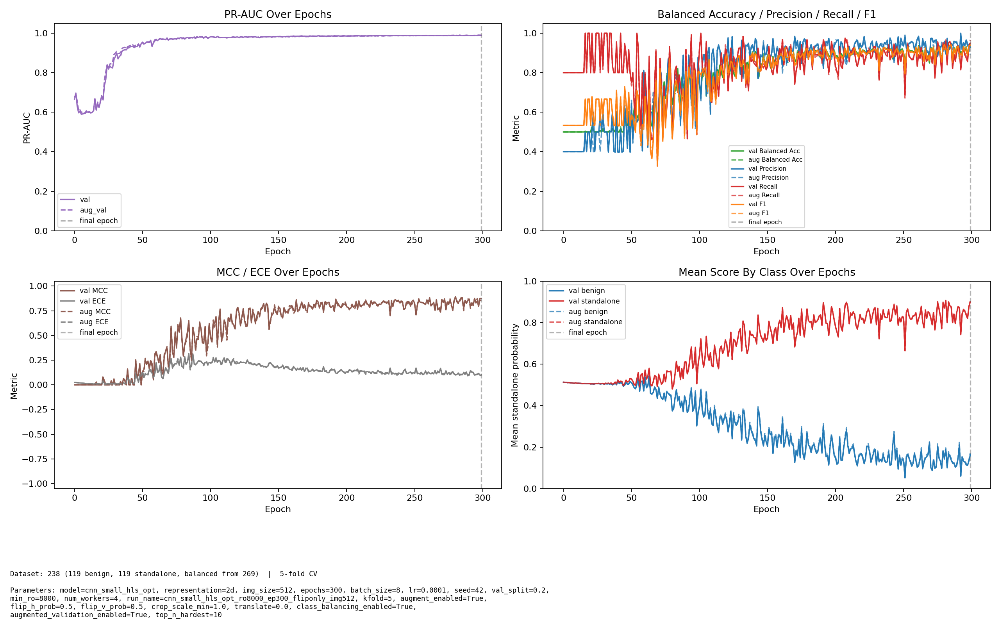

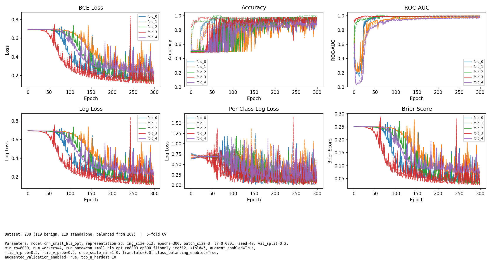

### `cnn_small_hls_opt @ img=256, lr=3e-4` final pooled evaluation

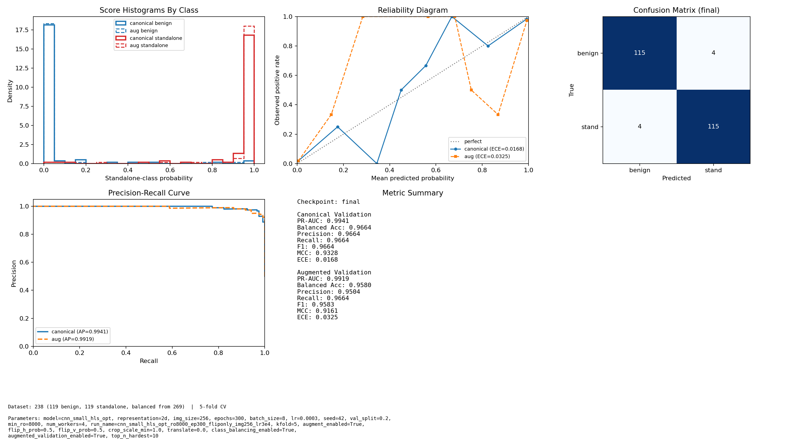

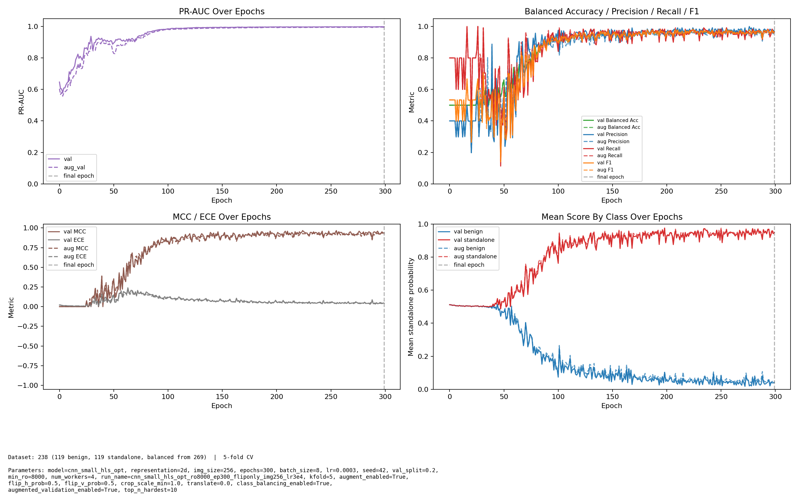

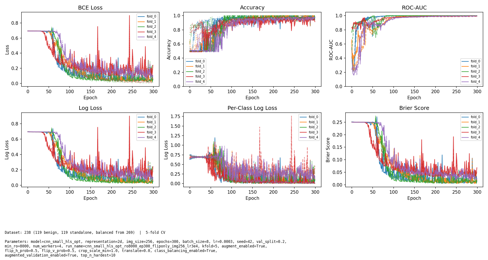

### Standalone Score vs RO Count

This plot uses only true standalone validation samples, pooled across folds, for both runs. The y-axis is the final predicted standalone probability, the x-axis is `ro_count` (log scale), blue points are correct standalone predictions, red `x` marks are missed standalone predictions, and the black line is a rolling mean after sorting by `ro_count`.

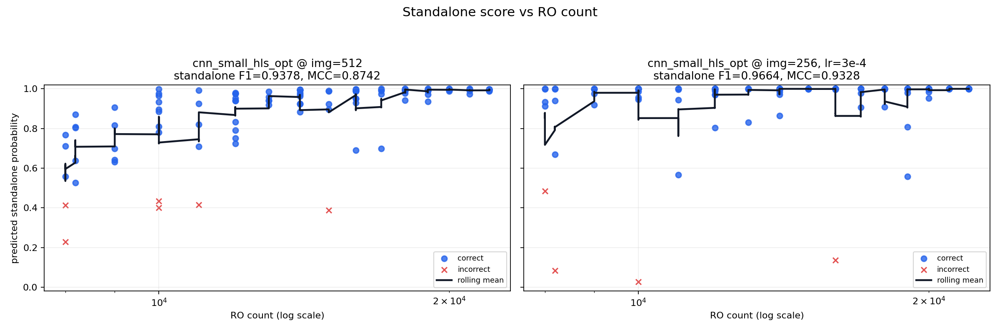

Underlying pooled data:

- [standalone_score_vs_ro_count.csv](./20260420_run_summary_assets/standalone_score_vs_ro_count.csv)

### Benign Samples by Name

This plot shows true benign validation samples grouped by `app_name`, colored by correctness. It is the clearest place to see that the `img=256` model concentrates its false positives in a few complex families rather than in `hello_world`.

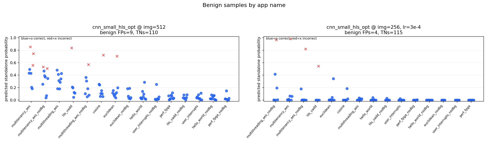

### Benign Samples by LUT Count

This plot uses the merged manifest `lut_count` field instead of `app_name`. It is zero-safe on the x-axis, so benign apps with `lut_count=0` remain visible.

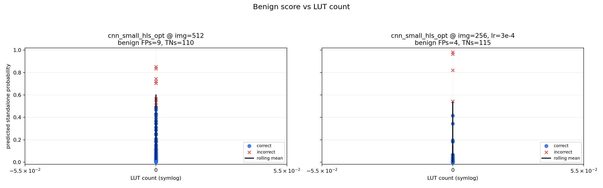

## Grad-CAM Debugging

The deep dives below now include a parallel `img=512` plot for every `img=256` plot type, then revisit the `img=256` run because that is the one under suspicion. Each montage shows both target perspectives (`benign` and `standalone`) for the same sample.

### `cnn_small_hls_opt @ img=512`

- Standalone RO extremes:
  - `it1_S073`, `ro=20000`, `p=0.999999`, `fold_3`
  - `it2_S060`, `ro=8000`, `p=0.229391`, `fold_4`

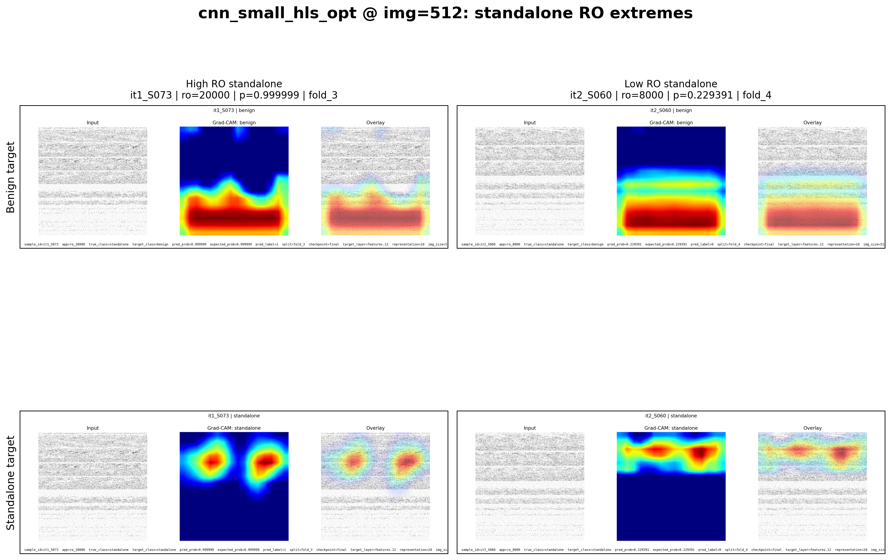

- Benign app cases:
  - `it1_B016`, `hls_vadd`, `p=0.835841`, `fold_1`
  - `it2_B068`, `hello_world_nodbg`, `p=0.000856`, `fold_4`

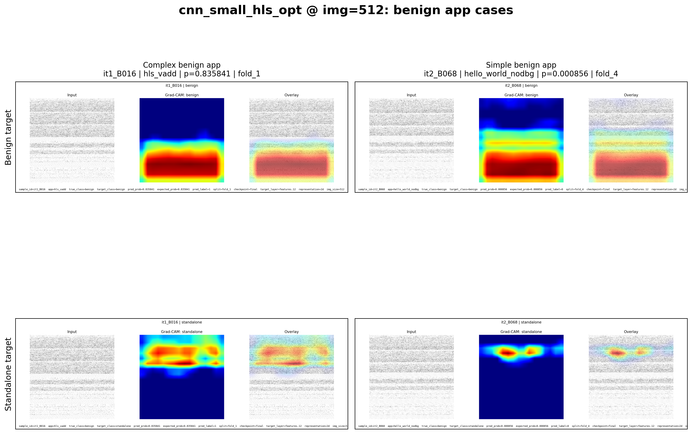

### Standalone RO Extremes

- High RO standalone: `it2_S029`, `ro=22000`, `p=1.000000`, `fold_1`
- Low RO standalone: `it2_S030`, `ro=8000`, `p=0.483551`, `fold_0`

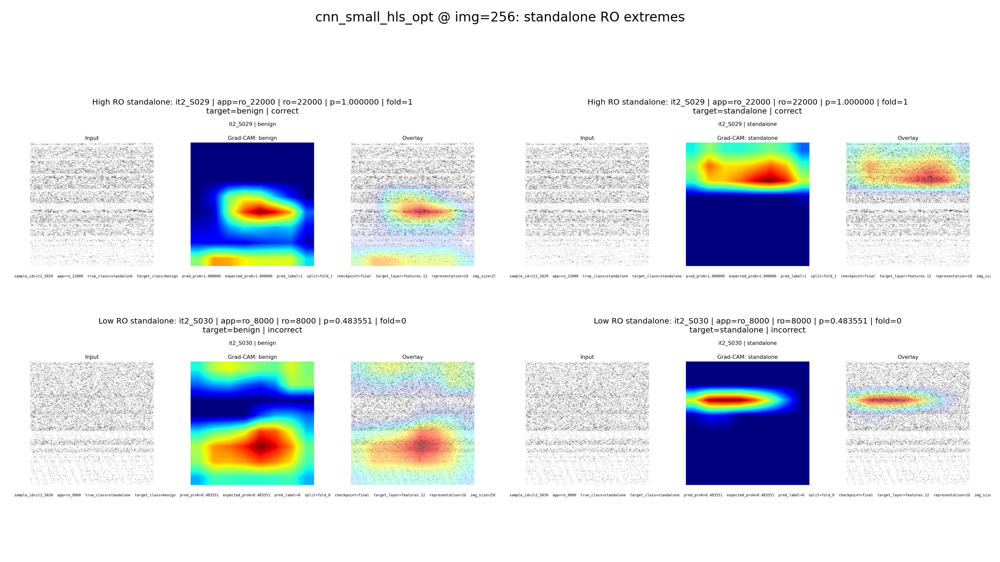

### Benign App Cases

- Complex benign app: `it2_B062`, `multitenancy_aes`, `p=0.981519`, `fold_3`
- Simple benign app: `it1_B030`, `hello_world`, `p=0.000011`, `fold_0`

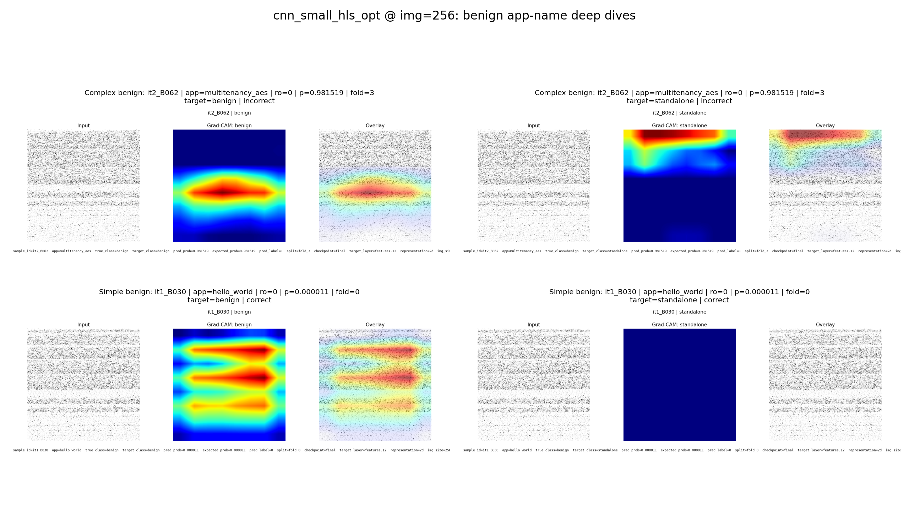

### Intermediate-Confidence Grad-CAM

These are the two closest-to-`0.5` examples I found per class, with both target perspectives shown for each sample.

#### `cnn_small_hls_opt @ img=512`

- Standalone examples:
  - `it1_S021`, `ro=8192`, `p=0.526749`, `fold_2`
  - `it2_S033`, `ro=11000`, `p=0.416074`, `fold_1`

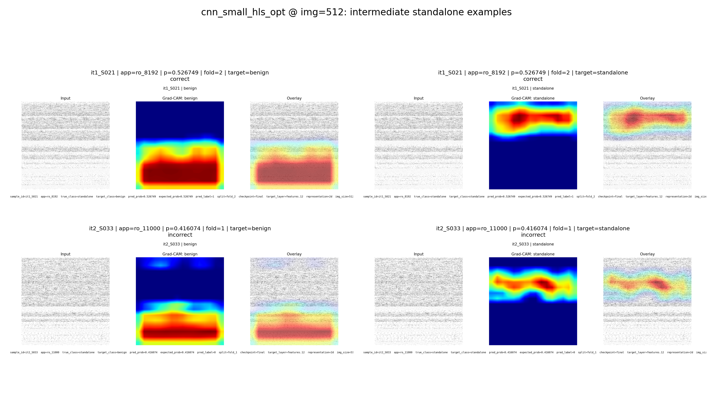

- Benign examples:
  - `it2_B002`, `multitenancy_aes`, `p=0.492731`, `fold_0`
  - `it2_B010`, `multitenancy_aes_nodbg`, `p=0.506686`, `fold_3`

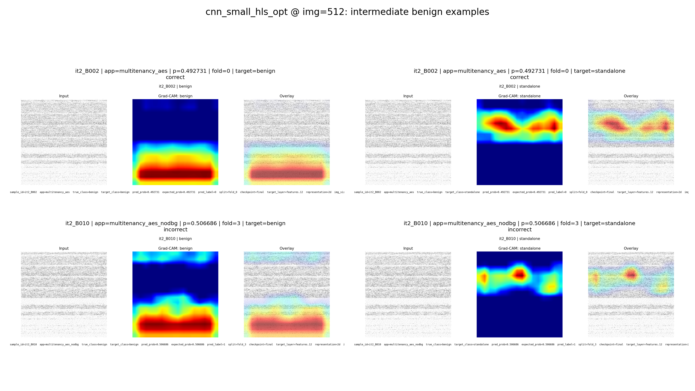

#### `cnn_small_hls_opt @ img=256, lr=3e-4`

- Standalone examples:
  - `it2_S030`, `ro=8000`, `p=0.483551`, `fold_0`
  - `it1_S027`, `ro=19000`, `p=0.558620`, `fold_0`

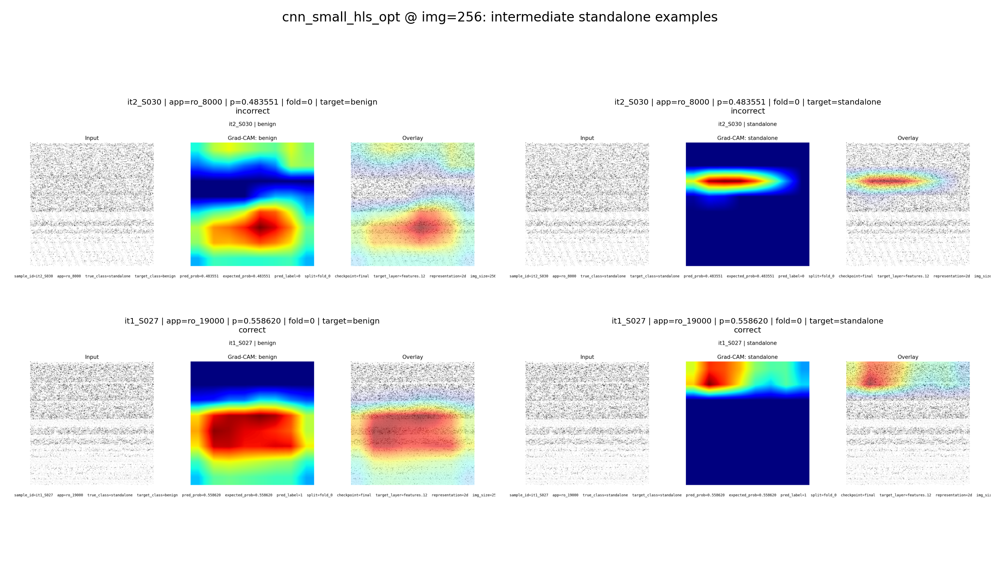

- Benign examples:
  - `it2_B061`, `hls_vadd`, `p=0.544012`, `fold_3`
  - `it1_B043`, `multithreading_aes_nodbg`, `p=0.414982`, `fold_3`

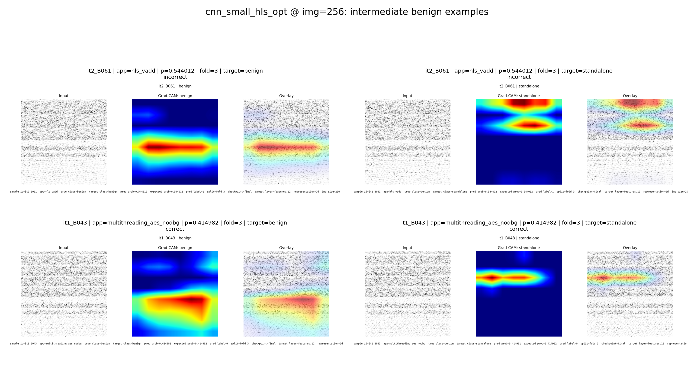

### Family-Specific Confident Benign Cases

These are the lowest standalone-probability benign examples in the two families you called out.

#### `cnn_small_hls_opt @ img=512`

- `multitenancy_aes_nodbg`
  - `it1_B010`, `p=0.071992`, `fold_3`
  - `it2_B040`, `p=0.037399`, `fold_2`

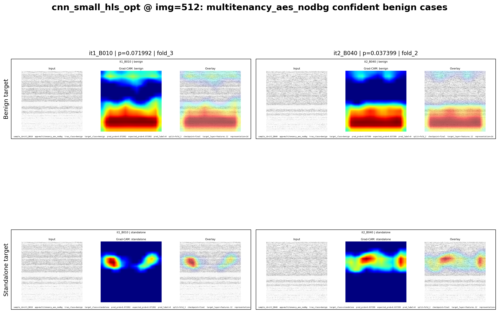

- `hls_vadd`
  - `it1_B031`, `p=0.044969`, `fold_2`
  - `it1_B046`, `p=0.112832`, `fold_4`

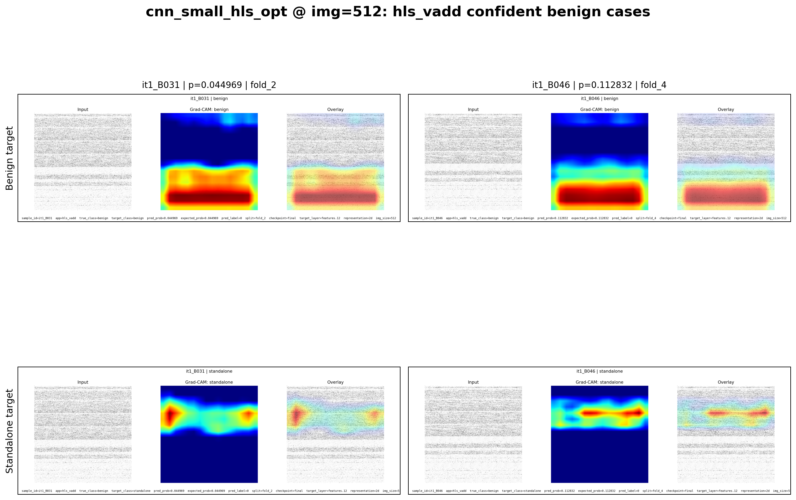

#### `multitenancy_aes_nodbg`

- `it1_B010`, `p=0.000000`, `fold_3`
- `it2_B025`, `p=0.000040`, `fold_4`

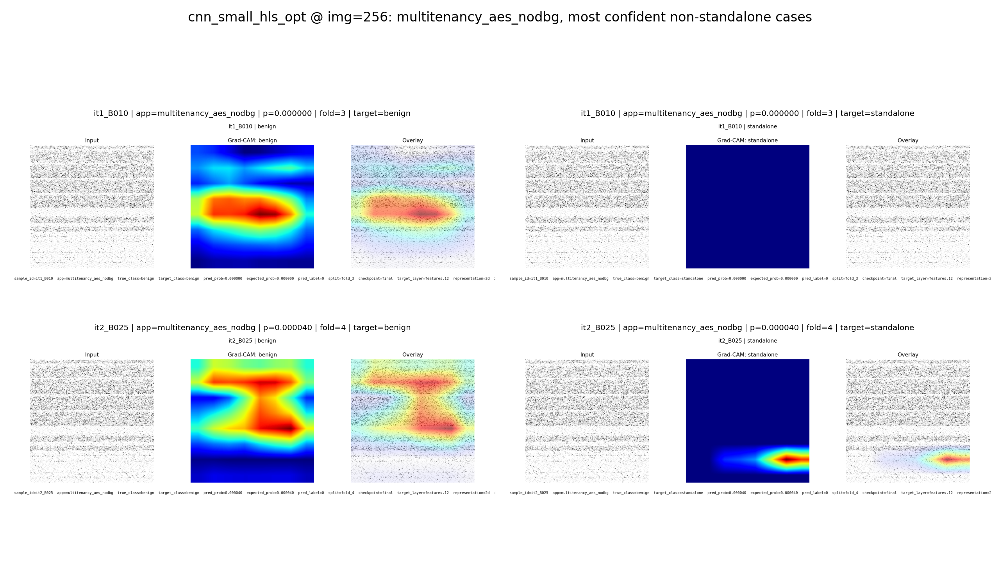

#### `perf_fpga`

- `it1_B004`, `p=0.000000`, `fold_1`
- `it1_B049`, `p=0.000000`, `fold_1`

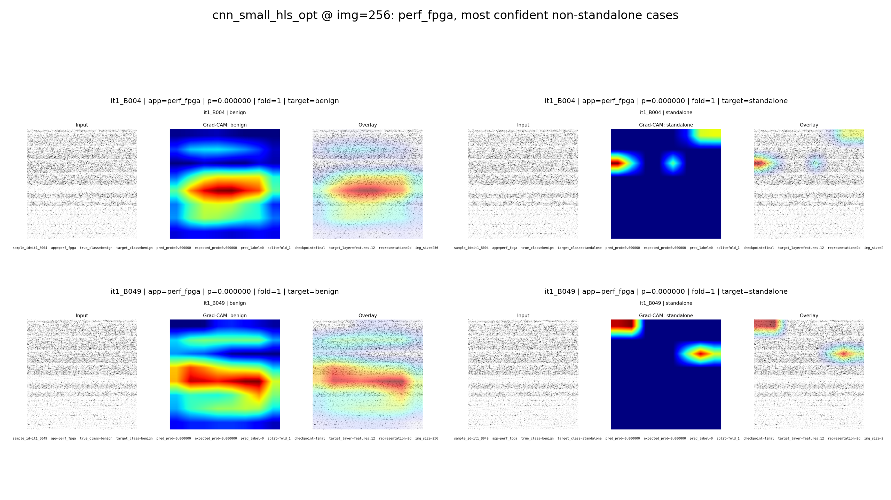

### High-Confidence `ro=8000` Standalone Cases

These are the `ro=8000` standalone samples highlighted for both input sizes, ordered from the 512 run and then the 256 run.

#### `cnn_small_hls_opt @ img=512`

- `it2_S000`, `p=0.767708`, `fold_3`
- `it2_S015`, `p=0.710778`, `fold_0`
- `it2_S045`, `p=0.557995`, `fold_0`
- `it2_S030`, `p=0.413314`, `fold_0`

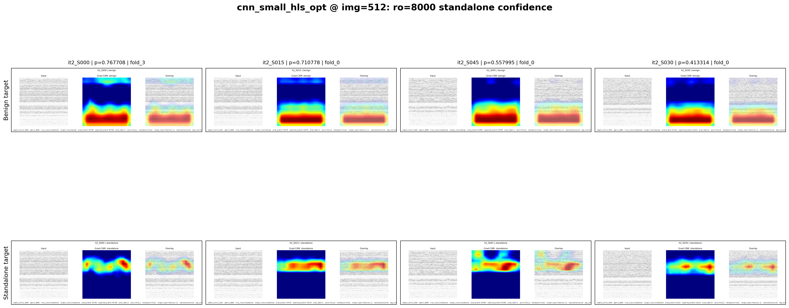

#### `cnn_small_hls_opt @ img=256`

- `it2_S000`, `p=0.999985`, `fold_3`
- `it2_S015`, `p=0.999537`, `fold_0`
- `it2_S045`, `p=0.933105`, `fold_0`
- `it2_S060`, `p=0.913645`, `fold_4`

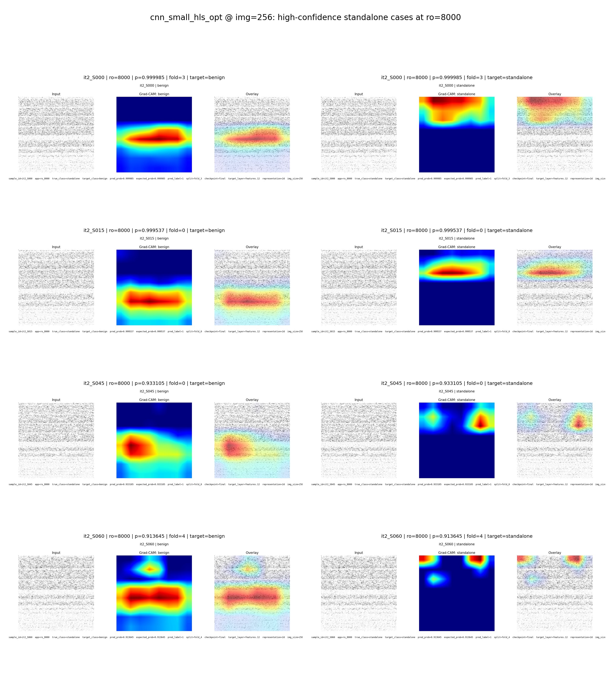

## Interpretation

- **The 512 run is already showing the same family-prior behavior, just more softly.** `hello_world_nodbg` stays near zero, but `hls_vadd` is pushed to `p=0.835841` and `multitenancy_aes` also rises into the false-positive range. That makes the 512 model look like the same failure mode as the 256 model, but with less extreme calibration drift.
- **The 512 plot set now mirrors the 256 plot set.** The same deep-dive types are available at both input sizes: RO extremes, benign-app cases, intermediate-confidence samples, family-specific benign cases, and ro=8000 confidence panels.
- **`cnn_small_hls_opt @ img=256` is the best pooled model in this batch.** It improves over `img=512` on F1 (`0.9664` vs `0.9378`), MCC (`0.9328` vs `0.8742`), ROC-AUC (`0.9942` vs `0.9873`), and BCE (`0.1006` vs `0.1744`).
- **The errors are not random.** In the 256 run, the false positives are concentrated in `multitenancy_aes`, `multitenancy_aes_nodbg`, `multithreading_aes_nodbg`, and `hls_vadd`. `hello_world` stays near zero across both runs, which is what you would expect if the model had learned a broad complexity / family prior rather than a universal benign bias.
- **The RO-count plot is mixed evidence.** Low-RO standalones are still the hardest cases, but the 256 run does not show a stronger RO/probability monotonicity than the 512 run. That makes a pure RO-count shortcut explanation less convincing than app-family sensitivity.

## Recommendation For Model Selection

- Primary pick by raw validation metrics: **`cnn_small_hls_opt @ img=256, lr=3e-4`**.
- If you want the more conservative comparison point for follow-up experiments, keep **`cnn_small_hls_opt @ img=512`** in the loop and validate both on a fresh app-family split.
- Before promoting the 256 model, recheck the false-positive families against a holdout that changes app composition, not just RO count.
