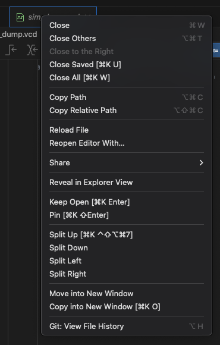

# Python unit testing framework

This is the documentation of the Coyote Python unit testing framework. The next section will introduce some prerequisites that are needed to use the framework. Afterward, the offered functionality is described.

> [!warning]
> At the moment, the test bench only supports one vFPGA. Support for several vFPGAs is not planed at the moment.

> [!warning]
> The framework gets the path to the Vivado binary from CMAKE during the build of the ```sim``` target. It will use the Vivado version you have configured in the system at the point you built this target! If you want to use a different Vivado version, you have to rebuild the ```sim``` target after changing the version in the system (e.g. via hdev).

## Repository structure

### Unit test directory
The framework is built with the assumption, that you are using coyote as a git sub-module inside a repository that contains your design to test.

By default, it is assumed that all your unit tests are located in the directory called ```unit-tests``` at the root of your repository. For example, your repository structure could look like this:

root
│   CMakeLists.txt
└───coyote
└───src
└───unit-tests

In this scenario, your design/code sits inside the src directory as specified in your CMakeLists.txt as follows:

```
load_apps (
    VFPGA_C0_0 "src"
)
```

The coyote sub-module is inside "coyote" and unit-tests can be found in "unit-tests".

If you want to use a different path for the unit-tests, define the following variable in your CMakeLists.txt to change the directory setting:

```cmake
set(UNIT_TEST_DIR "${CMAKE_SOURCE_DIR}/unit-tests")
```

Note that the path should be absolute. Please delete and rebuild your sim project after the change.

### Python imports

The functionality of the framework is provided inside the ```coyote_test``` directory inside your build folder. E.g. if you build your sim make target inside ```build_hw```, you can import the framework from ```build_hw/coyote_test```. If this directory does not exist, you might have created your sim target using an older version of Coyote. If that is the case, please delete ```build_hw``` and re-build it to get all the needed dependencies for the framework.

In order for Python to know where to find the framework, we need to add the ```build_hw``` path to the ```PYTHONPATH``` environment variable. There are several ways to do this, depending on your environment.

If you want to use Intellisense in your IDE, you might also have to add the ```coyote/sim``` path to your ```PYTHONPATH``` environment. The reason is that, due to technical reasons, the Python module inside ```build_hw/coyote_test``` re-exports all definitions from ```coyote/sim```, which cannot always be properly resolved by an IntelliSense implementation. If your coyote sub-module is not in the ```coyote``` directory, you need to adjust this path.

#### Example: VSCode
If you are using VSCode with the Microsoft-supplied Python extensions, you can create a ```.env``` file in the root of your repository with the following content:

```console
PYTHONPATH=build_hw:coyote/sim
```

This adds both the ```build_hw``` directory and the ```coyote/sim``` directory to your PYTHONPATH.

#### Other environments

If you are using other environments, please look into the documentation of your IDE on how to properly add paths to the ```PYTHONPATH``` environment variable.

## Framework

The framework is built on top of the Python [unittest](https://docs.python.org/3/library/unittest.html) unit-testing framework.

The framework offers the following, high-level features:

- Provide high-level, convenient methods to quickly define the expected in & output for a test case
- Allow fine-grained control via direct access to the simulation wire protocol
- Handle all the needed Vivado steps for you. There is no need to open Vivado by hand or to interact with Vivado directly in any way.
- "Smart" compilation handling. The framework will detect changes in your project and only re-compile when needed. This reduces run-time for tests significantly.
- Create a signal dump that can be opened with Vivado or third-party tools to allow debugging failed test cases.
- Integration into common unit-testing tooling via Python [unittest](https://docs.python.org/3/library/unittest.html). E.g. [Test explorer in VSCode](https://code.visualstudio.com/docs/debugtest/testing#_automatic-test-discovery-in-testing-view).
- Reconfiguration of your design via custom ```fpga_top.svh``` modules and defines that can control how your design behaves to trigger specific testing conditions or only test certain modules.

> [!tip]
> If you need to, you can manually open the simulation project with Vivado project at ```vivado build_hw/sim/test.xp```

> [!tip]
> If the compilation/elaboration of the design fails during simulation, the testing framework will automatically open the error files for you IF you are using VSCode!

## Test cases

The framework offers two classes that can be extended to define a test case ```FPGATestCase``` and ```FPGAPerformanceTestCase```. The first class should be used for correctness tests and the second one for performance tests. However, most functionality is shared between both. The following explains the functionality step-by-step.

### Minimum viable test

The following example declares a minimum, viable test. The test cases defines a INT32 input on stream 0, and sets an expected output on stream 0. It then triggers a blocking simulation of your design via the ```simulate_fpga()``` call and, lastly, asserts that the output was as expected.

```python
from coyote_test import fpga_test_case

class SomeFPGATestCase(fpga_test_case.FPGATestCase):

    # Method that gets executed once per test case
    def setUp(self):
        return super().setUp()
    
    # Overwrite of the parent classes simulation method.
    # Can be used to implement common behavior between tests
    def simulate_fpga(self):
        return super().simulate_fpga()

    # Example test case, following the AAA-pattern.
    # The test case shows all the methods needed to 
    # define tests and invoke the simulation.
    def test_some_case(self):
        # Arrange
        self.set_stream_input(0, Stream(StreamType.SIGNED_INT_32, [1, 2, 3]))
        self.set_expected_output(0, Stream(StreamType.SIGNED_INT_32, [1]))

        # Act
        self.simulate_fpga()

        # Assert
        self.assert_simulation_output()
```

> [!tip]
> The testing framework loads and asserts most settings from your environment automatically! For example, defining in- or output for stream 2 will fail with an assertion error, if your coyote config is not configured to use at last 3 streams!

```set_stream_input```, ```set_expected_output```, ```simulate_fpga```, and ```assert_simulation_output``` are convenience methods. In the background, they will do the following for you:

- Acquire virtual memory in the simulation to fit your input.
- Transfer the input data to the test bench into the previously acquired memory.
- Acquire virtual memory in the simulation to fit your output.
- Trigger a Coyote LOCAL_WRITE transfer via the HOST STREAM that sends the input to the FPGA.
- Trigger a Coyote LOCAL_READ transfer via the HOST STREAM to read the output of the expected length to the allocated memory.
- Starts the simulation of your design in a background thread. This starts Vivado, compiles your design, etc.
- Perform a blocking wait using a ```checkCompleted``` call to wait for the LOCAL_READ transfers to finish.
- Transfer the memory for the completed LOCAL_READS to Python.
- Check that the received output matches the one specified by you via the ```set_expected_output``` call.

As you may notice, all of these steps directly map into the functionality of the Coyote client library, or more specifically the cThread! The test bench models all of this behavior, including a virtual memory system! If you want, you can directly interact with the test bench interfaces instead of using the methods described above. See the description further down.

> [!tip]
> If you are unfamiliar with the Coyote concepts like transfers and completion, check out the [tutorials](https://github.com/fpgasystems/Coyote/tree/tutorial/examples).

Before we continue to discuss more advanced functionalities of the framework, three things should be mentioned:

1. Timing randomization

The test bench supports timing randomization. This means, that the inputs for your design and the outputs from your design will be will be read/written with a randomized delay. This is a very useful feature to detect common synchronization issues, in particular between the tvalid and tready signals of the AXI4 interface. By default, this randomization is therefore enabled for all ```FPGATestCase``` instances. If you want to disable the randomization, you can do so by setting the ```disable_input_timing_randomization``` property to ```True```.

2. Simulation time

> [!IMPORTANT]  
> By default, the simulation of your design is **run for at most ```4us```**.

The reason for this default is that without a fixed, maximum runtime, your design will run forever when there are bugs. For example, if less than the expected output is provided, your design will simply hang since Coyote will wait for the LOCAL_READ to finish. To prevent this scenario, the simulation will terminate after the mentioned ```4us```. However, this might not be enough time to execute all logic depending on the complexity of your design and the input/output size you expected.

Therefore, you can change this runtime via the ```overwrite_simulation_time``` function. This also allows you to let the design run till it finishes itself, e.g. when all expected output has been provided to Coyote.

3. Interacting with the simulation

In general, one can interact with the simulation/test bench as if it were a real device. E.g. one can start transfers and then do blocking check_completed calls in the main thread to wait for the transfers to finish. However, due to the nature of the simulation, some caution has to be placed in handling blocking calls. Especially, one needs to know that the simulation is only running while ```simulate_fpga``` is being called. Especially, no blocking calls can be made before or after this call since they will just hang up the test case. While relying on the provided convenience functions, everything should behave as expected as ```simulate_fpga``` is the only blocking call. However, if you want to e.g. read a register value, more caution has to be put into the test case. See details below at ```How do I interface directly with the test bench instead of using the provided convenience methods?``` for the threading model of the simulation to understand this behavior.

The following describes more advanced concepts shared by both testing classes. Note that the methods in the classes themselves have extensive documentation. Please read this documentation for further details. At the end of this documentation, we will also describe the ```FPGAPerformanceTestCase```.

### How can I write and read CSR register?

Use the ```write_register``` and ```read_register``` functions!

Caution: Reading a register is blocking and a stop_event can be supplied!

### How do I send data using a different stream than HOST?

Both the ```set_stream_input``` and ```set_expected_output``` provide a parameter that can be changed to send data, e.g. via the CARD stream. Note: Not all streams are supported by the test bench yet.

### How can I debug a test case that is failing?

To debug, there are two tools you can use:

1. A signal dump. This dump is automatically generated for **all** signals in the simulation and stored at ```/unit-tests/sim_dump.vcd``` (or at another path if you use a different unit test directory). See below for how to use the dump.
2. A log file. When a test fails, a Python error will be thrown that contains the whole simulation text output, including any potential ```$display``` statements used in the code. Additionally, a log file with the same output can be written to disk by calling the ```write_simulation_output_to_file()``` method on the test case. You can also set the ```debug_mode``` property to ```True``` in your test class, which will write all output immediately to your testing console. Lastly, there is the ```verbose_logging``` property, which will enable more detailed logs, if set to ```True```.
3. A diff will be created for you in your unit-test folder under ```/diff```. This folder will contain several file-pairs per stream. Each pair contains the actual and expected output of the stream. The different pairs are created to interpret the binary data in the most common data types like int32, int64, and floats to help you compare the values directly instead of needing to work on the binary level. You can create a diff between two files of the same type using common diff tools. E.g., in VSCode, mark both files, right-click, and select "Compare Selected".

If you are using VSCode, the simulation signal dump can be directly viewed in VSCode using the [VaporView](https://github.com/Lramseyer/vaporview?tab=readme-ov-file) extension. Simply install the extension and open the ```sim_dump.vcd``` file. You can then select the signals to display:


If you want to rerun the test case, you can reload the ```.vcd``` file afterward by right-clicking on the VaporView and selecting 'Reload File'. This will keep all your signal selections!



You can also save/load the selected signals by right-clicking and selecting the VaporView settings options. By default, the settings file at ```unit-tests/vapor_view.json``` is ignored.

To restrict, which signals are dumped by the testing infra, you can specify a path via the ```test_sim_dump_module``` variable. Read the documentation of the variable on how to use it!

VaporView has other great features! See the GitHub repository linked above for more info.

### I need to convert my own data to a bytearray, which byte order should I use?

All data should always be sent via little-endian.
You can import the BYTE_ORDER constant from coyote_test like so:

```python
from coyote_test import constants

BYTE_ORDER = constants.BYTE_ORDER
```

which is set to "little"!

### How can I change properties of my design (like parameter, or localparam) to test different scenarios?

The framework supports setting SystemVerilog defines for a test case. This can be done via the ```set_system_verilog_defines``` method. See the method documentation on how to use this in your design.

### When is my code re-compiled? How can I force a re-compilation?

Your code is re-compiled if one of the following is true:

- Any file changed inside the source directory of your VFPGA, the coyote test bench, or your alternative vfpga_top.
- Your alternative vfpga_top changed. E.g., to a different file or the default one in your source code.
- Your SystemVerilog defines have changed. E.g., define values have been altered, new defines have been added, or defines were removed. Note that some properties of the test framework like the input randomization are also controlled via defines. Therefore, changing those will also trigger a re-compilation.

The current compilation state is saved inside your build folder in the ```sim``` directory in a file called ```.last_change_time```. Deleting this file, or the whole build folder, will always trigger a re-compilation of your source code.

Whether the code was re-compiled or not can be seen in the log files. You will see a log message stating that ```Recompilation is required.```.

### How to use a different vpfga_top.svh for your test case

If you want to replace the default ```vpfga_top.svh``` file for your test case from the default inside ```/src```, you can specify the ```alternative_vfpga_top_file``` property. The path to the file should be relative to your unit-test folder.

> [!tip]
> Testing specific modules instead of your whole design can significantly reduce compilation times and therefore make the dev-test-fix loop much quicker.

### How do I interface directly with the test bench instead of using the provided convenience methods?

The wire protocol of the test bench is implemented in the so-called ```io-writer```. One can get an instance of this class via the ```get_io_writer``` method. This allows you to call the Coyote methods directly on the simulation. E.g. you can allocate memory, trigger transfers, read registers, etc.

> [!tip]
> The virtual memory implementation in the io-writer includes bounds checks! This is true for memory written/read in Python and also for memory written by the FPGA or via a transfer. Should any access be out of bounds, you will get an error.

However, handling these calls correctly can be tricky. Therefore, the following gives a short introduction to the threading model of the simulation.

In general, there are four threads:

1. The main thread of the test case. This thread executes your test code!
2. A background thread that runs Vivado and the simulation. This thread supplies tcl commands to Vivado via the interactive tcl mode and checks the produced output for errors. 
3. A background thread that supplies input to the simulation. Any non-blocking call (e.g. ```invoke_transfer```) is put into a thread-safe queue that is read from this thread and then written to the simulation. The communication with the simulation is done via named Unix pipes.
4. A background thread that reads output from the simulation. This works in a similar way to the input thread: The thread constantly waits for output from the simulation, parses it, and puts results into queues. These queues are waited for by the main thread, e.g. during a blocking call like ```block_till_completed```.

What is important to understand is when these threads are running. The IO threads (3 & 4) are started immediately with the simulation. However, the Vivado thread is only started once ```simulate_fpga()``` is called. The default implementation of ```simulate_fpga``` starts the thread, does a blocking wait for the completion of LOCAL_READS triggered via the ```set_expected_output``` method, and then joins the thread.

Alternatively, one can start the thread via ```simulate_non_blocking``` and join the thread via ```finish_fpga_simulation```. The start method returns an event. This event is thrown when the Vivado thread terminates. This can be because it finished or threw an error. All non-blocking methods accept this event as a parameter to terminate them should Vivado quit unexpectedly. This can, for example, happen when your design fails to compile.

If you want to perform any blocking calls yourself, you need to start the simulation via the methods mentioned above, perform your logic, and then join the simulation once you are done! However, there are two more details to consider with this approach:

1. Closing the simulation

As mentioned above, the communication with the test bench is done via named Unix pipes. The test bench continues to run until the input pipe receives an EOF. Until then, new commands can be received and, therefore, the bench cannot terminate.

This means test cases need to explicitly mark the input as done. This is usually done in the ```simulate_fpga()``` method. However, with the two methods above, you need to do this yourself whenever all input commands have been sent. To do this, simply call the ```all_input_done``` method on the IO writer.

2. Interrupts

The io_writer also allows you to register interrupt callbacks. Those are Python methods that will be called when the FPGA triggers an interrupt on the host. These callbacks are executed within the context of the output background thread. The io writer was specifically designed to allow you to execute most methods from within an interrupt handler. However, you CANNOT execute blocking functions! The reason is that those blocking functions need the output thread to make progress. However, this thread is blocked by executing the interrupt itself!

If you need to execute blocking calls from within an interrupt, you can spawn a new thread from the interrupt, which will execute the blocking calls. Here is a example, using the ```SafeThread``` class provided by coyote_test:

```python
def test(self):
    # Arrange
    def read_csr_callback(stop_event):
        # Read the CSR value
        self.required_cycles = self.get_io_writer().ctrl_read(
            NamedFPGAConfiguration.REQUIRED_CYCLES.value
        )
        # Mark all input as done
        self.get_io_writer().all_input_done()

    def read_csr_callback_entry(pid: int, interrupt_value: int):
        # Needs to spawn its own thread so we can perform blocking
        # IO operations. Otherwise, reading the output is blocked!
        self.thread = SafeThread(read_csr_callback)
        self.thread.start()

    self.get_io_writer().register_interrupt_handler(read_csr_callback_entry)

    # Act
    self.simulate_fpga()
    self.thread.join_blocking()

    # Assert
    self.assert_simulation_output()
```

### How do I assert output without using the set_expected_output method?

If you cannot use the ```set_expected_output``` method, e.g. because you don't want to do a transfer from the host side, you can set the expected output via the ```set_expected_data_at_memory_location``` function. This configures which output data is expected at which memory location and is then used by the ```assert_simulation_output``` function to compare the actual memory values with the expected ones. Note that you can also supply a stream_type to this function. When doing so, this type will be considered for the diff file creation, should your output not match the expectation. See the documentation of the function for details.

## Performance tests

While the ```FPGATestCase``` class is perfect for determining the correctness of your design, it is not suited for estimating the design's performance. The reasons are as follows:

- By default, the unit tests enable in & output timing randomization. This is great for finding common issues like tready/tvalid synchronization and determining correctness but not for evaluating the performance of your design.
- Performance test cases need to fulfill certain properties to make the measured performance correct.

To understand why certain properties are needed, we need to understand how the performance tests are implemented in the framework. Performance here refers to two properties:

1. Latency: How many cycles does it take from the input of a data beat till the corresponding output is received?
2. Throughput: How many cycles does the design need per data beat once the pipeline is full, i.e. without the latency?

As the framework cannot have an understanding of your design, performance tests are implemented in a general way:

The test bench creates log messages whenever a batch is sent or received from the design. These messages contain a timestamp that can be translated into a cycle. Based on these log messages, the latency and throughput can be inferred. However, for this to work, a performance test should adhere to the following properties to make it accurate:

1. The first input batch needs to produce an output batch. This is because the test bench records the first cycle in which output is received and this is used to calculate the latency. Otherwise, some cycles that actually do processing will be treated as latency cycles and your numbers won't be correct!
2. The last input batch needs to produce an output batch. This is due to the same reasons as above: If the design produces the last output before the last input has been processed the number of total needed cycles will not be correct.

When adhering to these principles, one can write Performance tests using the ```FPGAPerformanceTestCase``` class in the same way as any other FPGA test case. The latency and throughput in cycles will be automatically calculated and printed with the test output. Additionally, one can assert the performance of the design as follows. See the following example:

```python
from coyote_test import fpga_performance_test_case

class SomeFPGAPerformanceTestCase(fpga_performance_test_case.FPGAPerformanceTestCase):

    # Example test case, following the AAA-pattern.
    # The test case shows all the methods needed to 
    # define tests and invoke the simulation.
    def some_test_case(self):
        # Arrange
        self.set_stream_input(0, Stream("input", StreamType.SIGNED_INT_32, [1, 2, 3]))
        self.set_expected_output(0, Stream("output", StreamType.SIGNED_INT_32, [1]))
        self.set_expected_avg_cycles_per_batch(0, 1.0)
    
        # Act
        self.simulate_fpga()

        # Assert
        self.assert_simulation_output()
        self.assert_expected_performance()
```

The ```set_expected_avg_cycles_per_batch``` function can be used to set a performance expectation. One batch here refers to one data beat. E.g. in the example above, we expect each data beat to take one cycle to be processed for the stream 0. This performance is verified via the ```assert_expected_performance``` function.

The output produced by a test case will look like this:

```console
20:42:32; FPGAPerformanceTest; SIMULATION PERFORMANCE
20:42:32; FPGAPerformanceTest; Stream [0]       3840 bytes      60 data beats   60 cycle send   60 cycle recv   1.00 avg cycle per batch        1.00 avg cycle per batch with sending delay     118 cycle latency
20:42:32; FPGAPerformanceTest; Stream [1]       3840 bytes      60 data beats   60 cycle send   60 cycle recv   1.00 avg cycle per batch        1.00 avg cycle per batch with sending delay     130 cycle latency
20:42:32; FPGAPerformanceTest; Stream [2]       3840 bytes      60 data beats   60 cycle send   60 cycle recv   1.00 avg cycle per batch        1.00 avg cycle per batch with sending delay     131 cycle latency
20:42:32; FPGAPerformanceTest; Stream [3]       3840 bytes      60 data beats   60 cycle send   60 cycle recv   1.00 avg cycle per batch        1.00 avg cycle per batch with sending delay     132 cycle latency
20:42:32; FPGAPerformanceTest; Stream [4]       3840 bytes      60 data beats   60 cycle send   60 cycle recv   1.00 avg cycle per batch        1.00 avg cycle per batch with sending delay     133 cycle latency
20:42:32; FPGAPerformanceTest; Stream [5]       3840 bytes      60 data beats   60 cycle send   60 cycle recv   1.00 avg cycle per batch        1.00 avg cycle per batch with sending delay     134 cycle latency
```

It states the overall size of the input, how many cycles were spent reading the input (send), how many cycles were spent reading the output (recv), and which throughput this achieves, with and without sending delays. Lastly, the latency per stream is given!
